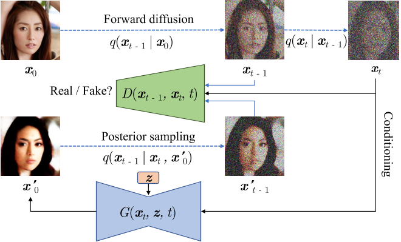

# Tackling the Generative Learning Trilemma with Denoising Diffusion GANs

## 核心问题是什么?

作者认为可以从三个维度来评价一个生成模型的好坏：

其中Diffusion based生成模型的主要问题是生成速度慢，因此需要在保持高采样质量和多样性的前提下，针对采样速度慢的问题进行加速。

## 核心贡献是什么？

Diffusion模型缓慢采样的根本原因是去噪步骤中的高斯假设，该假设仅适用于小步长。为了实现大步长的去噪，从而减少去噪步骤的总数，作者建议使用复杂的多模态分布对去噪分布进行建模。因此引入了去噪扩散生成对抗网络（去噪扩散 GAN），它使用多模态条件 GAN 对每个去噪步骤进行建模。总之，我们做出以下贡献：

1. 将扩散模型的缓慢采样归因于去噪分布中的高斯假设，并建议采用复杂的多模态去噪分布。 
2. 提出去噪扩散 GAN，这是一种扩散模型，其逆过程由条件 GAN 参数化。
3. 通过仔细的评估，我们证明，与当前图像生成和编辑的扩散模型相比，去噪扩散 GAN 实现了几个数量级的加速。

## 大致方法是什么？

## 有效

## 缺陷

## 验证

## 启发

## 遗留问题

## 参考材料