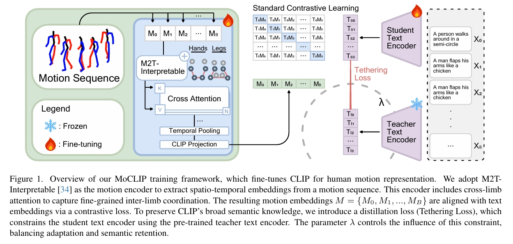

# MoCLIP: Motion-Aware Fine-Tuning and Distillation of CLIP for Human Motion Generation

## 研究背景与问题

### 要解决的问题

文生动作

### 现有方法及局限性

现有方法通常依赖于基于对比语言-图像预训练（CLIP）的文本编码器，但这些模型在文本-图像对上的训练限制了其对运动中固有时间和运动学结构的理解能力。

### 本文方法及优势

本文提出MoCLIP——一种通过附加运动编码头进行微调的CLIP模型，使用对比学习和约束损失在运动序列上进行训练。通过显式地融合运动感知表征，MoCLIP在保持与现有CLIP框架兼容性的同时提升了运动保真度，并能无缝集成到各类基于CLIP的方法中。  
实验表明，MoCLIP在保持竞争力FID指标的同时提升了Top-1、Top-2和Top-3准确率，实现了更好的文本-运动对齐效果。这些结果凸显了MoCLIP的多功能性和有效性，确立了其作为增强运动生成的稳健框架地位。

### 主要贡献

1. 增强CLIP的运动理解能力：引入经对比学习训练的附加运动头，扩展标准CLIP编码器，将运动数据的时序与运动学特征编码至文本潜空间

2. 验证跨管线有效性：将MoCLIP集成至三种不同视觉管线，在Top-1/2/3准确率上超越标准CLIP模型

3. 贡献度分析：通过消融实验，对比进阶版MoCLIP与基线模型，检验不同训练特征的影响

## 主要方法

### 目标

1. 使用蒸馏损失微调文本嵌入，约束适配过程以保留原始CLIP语义核心

2. 采用余弦相似度损失引导嵌入保持运动方向连续性，强化文本-运动空间对齐

 

1. 采用**M2T-Interpretable**作为运动编码器，从运动序列提取时空嵌入。该编码器包含**跨肢体注意力机制**以捕获细粒度肢体协调。生成的运动嵌入集合\\( M = \{M_0, M_1, ..., M_B\} \\)
2. 分别使用Teacher Text Encoder和Student Text Encoder对文件编码
3. 通过多个损失项训练Motion Encoder和Student Text Encoder

$$
\mathcal{L}_{total} = \underbrace{\mathcal{L}_{contrastive}}_{\text{对称对齐}} + \lambda_{distill} \underbrace{\mathcal{L}_{distill}}_{\text{语义锚定}} + \underbrace{\mathcal{L}_{alignment}}_{\text{运动-文本余弦对齐损失}}
$$

### 对比损失

$$
\mathcal{L}_{contrastive} = \frac{1}{2} \left[ 
\underbrace{CE(z_{motion} W z_{text}^\top, y)}_{\text{运动→文本对齐}} + 
\underbrace{CE(z_{text} W z_{motion}^\top, y)}_{\text{文本→运动对齐}} 
\right] \quad (1)
$$

其中W是可学习参数。  

### 蒸馏损失

$$
\mathcal{L}_{distill} = \frac{1}{N} \sum_{i=1}^{N} \left\| z_{text-student}^{(i)} - z_{text-teacher}^{(i)} \right\|_2^2 \quad (3)
$$  

**选择MSE作为蒸馏损失的核心考量**：  
> 它允许学生嵌入以非严格受限于教师嵌入角度（余弦相似度）的方式迁移。这种灵活性使学生嵌入能更有效地与运动嵌入对齐，同时仍受控地保持在原始CLIP嵌入空间邻近域内。  

### 运动-文本余弦对齐损失

$$
\mathcal{L}_{\mathrm{alignment}} =1- \frac{1}{N} \sum _ {i=1}^{N} \frac{ z _ {\mathrm{motion} }^{(i)} \cdot  z _ {\mathrm{text-student} }^{(i)}}{ \|z_{\mathrm{motion} }^{(i)}\| _ 2\|z_{\mathrm{text-student} }^{(i)}\| _ 2} \quad (4)
$$

$$
\mathcal{L}_{\mathrm{alignment}} =1- \frac{1}{N} \sum _ {i=1}^{N} \frac{ z _ {\mathrm{motion} }^{(i)} \cdot  z _ {\mathrm{text-student} }^{(i)}}{ ||z_{\mathrm{motion} }^{(i)}|| _ 2||z_{\mathrm{text-student} }^{(i)}|| _ 2} \quad (4)
$$

## 训练

### MoMask训练

1. 加载预训练CLIP作为学生网络，改造其接入运动编码器

2. 加载教师CLIP模型并全程冻结

3. 渐进解冻策略：

- 前35轮：冻结学生文本编码器 → 运动编码器与CLIP嵌入对齐

- 后15轮：解冻学生文本编码器 → 联合运动编码器训练（使用第3章损失函数）

- 总训练轮次：50轮

### 下游模型微调

1. 替换原CLIP为MoCLIP并冻结权重

2. 微调下游模型（学习率=1e-6，无预热阶段）,其中多阶段架构（MoMask/BAMM等模型）顺序微调T2M和残差Transformer

### 数据集

HumanML3D

## 实验

 

结论：MoCLIP在基于令牌的模型（token-based models） 中表现更为高效，而双向自回归架构（bidirectional autoregressive architectures） 可能需要额外的适配才能充分发挥其优势。

