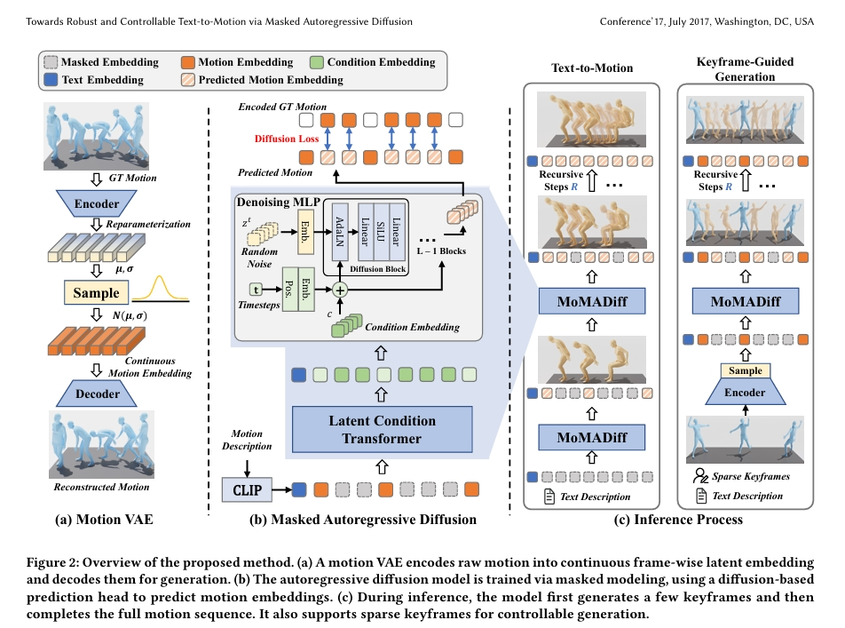
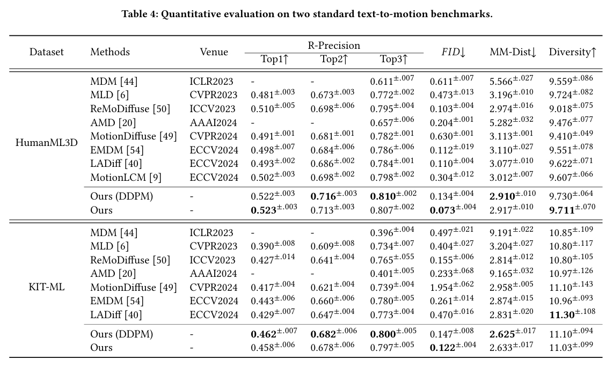

# Towards Robust and Controllable Text-to-Motion via Masked Autoregressive Diffusion

## 研究背景与问题

### 要解决的问题

文生3D Motion

### 现有方法及局限性

VQVAE类方法：离散表征难以忠实表达新动作  
扩散模型类方法：连续表征缺乏对单帧的细粒度控制

作者希望可以帧级的动作控制同时能够对训练集以及的动作有较好的泛化性。

### 本文方法及优势

提出鲁棒的动作生成框架MoMADiff
- 将掩码建模与扩散过程相结合
- 利用帧级连续表征生成动作。
  
优势：
- 支持灵活的用户自定义关键帧，可精准控制动作合成的空间与时间维度
- 在以稀疏关键帧作为动作提示的新型文本-动作数据集上，MoMADiff展现出强大的泛化能力。

### 主要贡献

- 提出帧级运动VAE，将人体动作编码为连续标记序列，在未见数据集上实现精确动作重建与强鲁棒性
- 设计掩码自回归扩散模型，基于帧级连续标记实现细粒度可控的人体动作生成
- 所提 MoMADiff 在标准文本-动作基准测试中达到领先性能，并在关键帧引导的分布外动作生成中展现强大泛化能力

## 主要方法

 

(a) 运动VAE：将原始动作编码为帧级连续隐嵌入，并解码生成动作  
(b) 自回归扩散模型训练：通过掩码建模训练，使用基于扩散的预测头预测动作嵌入  
(c) 推理过程：  
- 首先生成少量关键帧
- 递归补全完整动作序列
- 支持稀疏关键帧输入实现可控生成

### 连续的帧级运动自编码器

CNN Based VAE

连续编码：消除量化误差  
帧级编码：支持单帧编辑

损失：

|损失|公式|作用|
|---|---|---|
|负对数似然损失 (ℒₙₗₗ)|\\(ℒₙₗₗ = \mid \mid X̃ - X \mid \mid₁ / exp(logσ²) + logσ²\\)|监督重建质量，logσ² 为可学习对数方差参数。自适应加权重建误差：高方差帧 → 降低重建要求，低方差帧 → 精准重建|
|KL散度损失 (ℒₖₗ)|ℒₖₗ = -½∑(1 + logσ² - μ² - σ²)|对齐隐空间与标准正态分布|
|关节速度损失 (ℒᵥ)|\\(ℒᵥ = ∑\mid vₜ - ṽₜ\mid \\)|保障运动平滑性|

> [?] 逐帧编码哪来的速度？

### 动作掩码自回归扩散模型 (MoMADiff)的训练流程

1. 输入处理：

- 随机掩蔽隐序列 → 用可学习的连续 [MASK] 标记替换部分位置
- 文本提示经CLIP编码 → 拼接至Transformer输入序列首部

2. Transformer输出条件标记 c：

3. 轻量级Denoising结构预测motion embedding

- 含 L 个扩散块（线性层→SiLU激活→线性层）

- 通过AdaLN注入条件标记 c 和去噪步数 t

2和3联合优化

### 推理阶段策略

1. 初始化：
- 所有隐运动标记置为 [MASK]
- 文本编码后置于序列首部输入Transformer

2. 关键帧生成：

- 生成条件标记 c 并输入扩散头
- 扩散头通过 T 步去噪（从 zₜ → z₀）输出初始关键帧
- 加速技术：采用DDIM采样将去噪步缩减至 Tᵢ

3. 递归补间：
- 将生成/用户提供的自定义关键帧回填至输入序列

4. 控制增强：

对隐条件Transformer施加无分类器引导(CFG)
关键限制：CFG不作用于扩散头（避免破坏时空结构）

## 实验

数据集：Motion-X、IDEA400、Kungfu、HumanML3D、KIT-ML  
评价指标： R-Precision、Frechet Inception Distance(FID)、Multimodal Distance (MMD)、(4) Diversity (DIV) 

### Motion reconstruction

#### 横向对比

VAE类：VPoser-t、ACTOR、MLD  
VQVAE类：ParCo、MotionGPT、MoMask  
训练集：HumanML3D

1. in-domain测试数据：HumanML3D测试集

 

分析：
- [MotionGPT](./87.md)的重建能力(VQVAE)来自于[T2m-GPT](./88.md)，基于对连续编码方法，离散编码确实会有量化损失。离散编码的特点是牺牲编码容量，保留编码细节。 
- ACTOR的VAE不只是重建，还要与动作编码进行潜在高斯分布对齐，可能是因此损失了一些精
- [?] 本文逐帧embedding为什么ACCL表现这么好？

2.  out-of-domain测试数据：IDEA400、Kungfu

结果： 

分析：VQVAE只是已经数据的编码，没有插值能力，所以对out-of-domain的泛化性确实会差一些。  

### out-of-domain的关键帧插帧

训练集：HumanML3D

 

分析：
1. ParCo和MoMask使用VQVAE编码，所以对out-of-domain的泛化性确实会差一些。  
2. MDM和本文的相同的点：
- 都使用自己训练的VAE编码器对动作编码，从表2上看，MDM的编码能力略胜一筹。
- 都使用CLIP进行文本编码。
- 每一个denoise步骤之后，都会用keyframe覆盖对应的生成帧。
3. 在文生动作任务上本文更好。可能是对文本的使用和生成的pipeline的差异导致。
- MDM的denoise部分是自回归的，每一帧的生成只能参考前面帧。而本文的denoise部分，每一帧都可以看到前后帧信息。
- MDM仅使用CLIP embedding作为自回归的初始化输入，而本文中CLIP Embedding对每一帧数据的生成作用都是平等的。  

### 文生动作

 