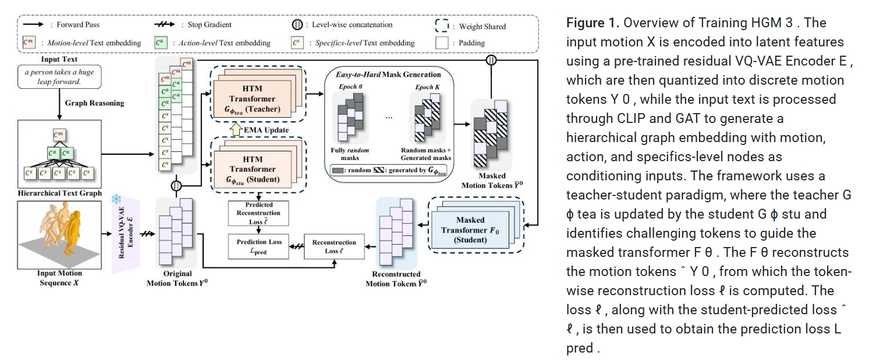
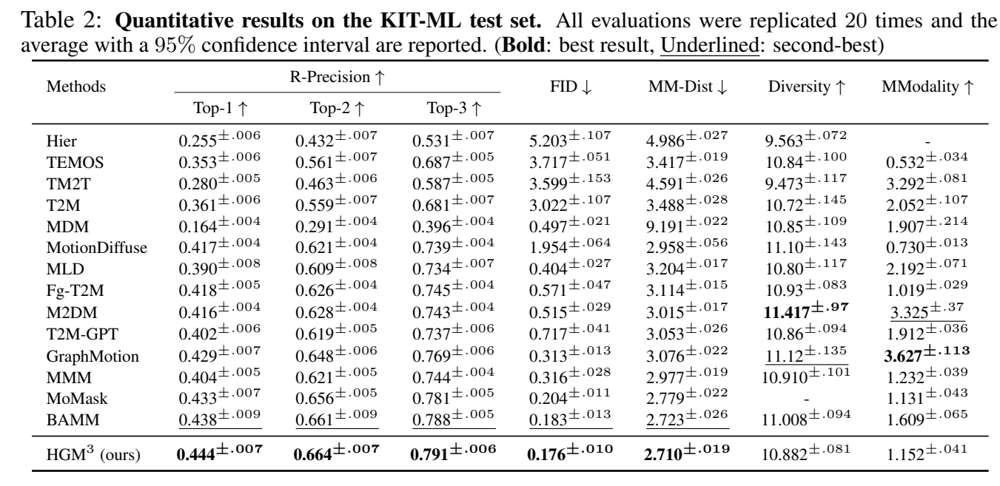

# HGM3: HIERARCHICAL GENERATIVE MASKED MOTION MODELING WITH HARD TOKEN MINING

## 研究背景与问题

### 要解决的问题

文生3D Motion

### 问题难点

*   **文本歧义性:** 相同的文本描述可能对应多种合理的动作序列（例如，“高兴地挥手”的具体幅度、速度、姿态可能有多种）。
*   **动作复杂性:** 人体动作涉及高维、连续、时序相关的复杂运动模式。

### 现有方法及局限性

1.  **早期方法：潜在表征对齐**
    *   **核心思想：** 试图在某个潜在空间中，让文本的表示和动作的表示尽可能接近。
    *   **技术手段：** 使用 **KL散度 (KL divergence)** 或**对比损失 (contrastive loss)** 来最小化文本和动作潜在分布之间的距离。
    *   **代表工作：** MotionClip, TEMOS。
    *   **主要局限：**
        *   文本和动作的本质不同（离散符号 vs. 连续时空数据）导致它们在潜在空间中的完美对齐极其困难。
        *   生成的动**作不自然**。

2.  **概率映射方法：学习随机映射**
    *   **核心思想：** 认识到文本到动作的映射不是确定性的（一对一的），而是概率性的（一对多的）。因此，模型需要学习从文本条件到可能动作分布的映射。
    *   **技术路线一：变分自编码器 (VAE)**
        *   **代表工作：T2M (Generating diverse and natural 3d human motions from text)
        *   **特点：** 使用 **时序 VAE**，专门处理序列数据，学习文本到动作序列的映射。
    *   **技术路线二：扩散模型 - 当前主流之一**
        *   **核心过程：** 通过一个逐步去噪（逆向扩散）的过程，从随机噪声中生成动作序列，该过程由文本条件引导。
        *   **代表工作与演进：**
            *   **MDM (Tevet et al., 2023):** 使用 **Transformer 编码器** 直接处理**原始动作数据 (raw motion sequences)** 进行去噪重建。
            *   **MLD (Chen et al., 2023):** 在**潜在空间 (latent space)** 进行扩散，显著**提升计算效率 (enhance computational efficiency)**。
            *   **GraphMotion (Jin et al., 2024):** 创新点在于使用**分层文本条件化 (hierarchical text conditionings - 三个语义层级)**，试图提供**更精细的控制**。这为本文的分层方法 (HGM³) 提供了铺垫。
            *   **其他扩散模型：** Kong et al. (2023), Wang et al. (2023b), Dabral et al. (2023), Zhang et al. (2024), Huang et al. (2024), Dai et al. (2025) 等，表明扩散模型是该领域非常活跃的方向。

3.  **掩码建模方法：掩码 Transformer - 当前主流之二**
    *   **核心思想：** 将动作序列**离散化** 为令牌序列（类似 NLP 中的单词）。在训练时，随机或有策略地**掩码 (Mask)** 一部分令牌，让模型基于上下文（未掩码令牌和文本条件）**预测被掩码的令牌**。
    *   **优势：** 通常比扩散模型**效率更高**，能有效学习动作的时空依赖关系。
    *   **代表工作与技术差异：**
        *   **[T2MGPT](./88.md) (Zhang et al., 2023) & MotionGPT (Jiang et al., 2023):** 采用 **自回归** 生成方式。模型像预测下一个单词一样，**逐个预测动作令牌**。通常使用**因果掩码 (causal masking)**（只能看到前面的令牌）。
        *   **MMM (Pinyoanuntapong et al., 2024b):** 对输入动作令牌进行**随机掩码**，模型基于所有未掩码令牌（上下文）同时预测所有被掩码的令牌（非自回归）。
        *   **MoMask (Guo et al., 2024):** 结合了 **VQ-VAE** 和 **残差 Transformer**。VQ-VAE 将动作编码为离散令牌，残差 Transformer 负责重建（或生成）最终的动作序列，可能涉及迭代优化（“残差”暗示了逐步修正的过程）。
        *   **BAMM (Pinyoanuntapong et al., 2024a):** 提出**双向因果掩码 (Bidirectional Causal Masking)**。这是对标准自回归（单向因果）的改进，试图结合**双向上下文信息** 的优势来**补充** 自回归 Transformer，可能提升生成质量和上下文理解能力。

### 本文方法及优势

*   **困难令牌挖掘 (HTM - Hard Token Mining):**
    *   **目标：** 提升模型的学习效率（efficacy），特别是对难学部分的学习。
    *   **方法：** 主动识别动作序列中那些对模型来说具有挑战性（“hard”）的部分，并将其掩码（mask）。
    *   **作用：** 迫使模型在训练时更集中精力去预测和恢复这些被刻意掩盖的困难部分，类似于在训练中“专攻难点”。
*   **分层生成式掩码动作模型 (HGM³ - Hierarchical Generative Masked Motion Model):**
    *   **目标：** 更好地建模文本语义与动作的对应关系，生成上下文可行的动作。
    *   **方法：**
        *   **语义图表示 (Semantic Graph Representation):** 使用语义图来结构化地表示输入文本句子，这种图可以捕捉词语在不同语义粒度上的关系（例如，整体动作意图 vs. 具体身体部位细节）。
        *   **分层条件重建 (Hierarchical Conditioning & Reconstruction):** 使用一个**共享权重**的掩码动作模型作为基础。
        *   **分层输入：** 将不同粒度的语义图（如粗粒度的整体意图、细粒度的局部细节）作为不同层次的条件输入到模型中。
        *   **共享模型重建：** 在每种条件层级下，该模型都尝试重建（或预测）**同一个**被部分掩码的动作序列。
        *   **学习效果：** 这种设计迫使模型从不同抽象层次理解文本语义如何影响动作生成，从而实现“对复杂动作模式的全面学习”。

## 主要方法

 

1. 采用基于残差 VQ-VAE (residual VQ-VAE) (MoMask) 的动作分词器 (motion tokenizer)，通过分层量化过程 (hierarchical quantization process)，将原始的3D人体动作数据转换为离散的令牌序列。
2. 通过结合 HTM策略 (HTM strategy) 的掩码 Transformer (masked transformer)学习掩码动作中具有区分性的部分，帮助模型更好地识别数据中的关键特征。
3. 为掩码 Transformer 引入了基于分层语义图的文本条件化 (hierarchical semantic graph-based textual conditioning)，将语义信息组织成多个层级，以增强模型对文本描述的理解能力。
4. 采用分层推理过程 (hierarchical inference process) 进行动作生成。在此过程中，模型迭代式地优化生成的动作，并利用一个预训练的残差 Transformer来校正量化误差。

### 动作分词器：残差 VQ-VAE

传统VQVAE通过一个单一的向量量化层将编码器的连续输出量化到离散潜在空间，这会导致信息损失。

为了更好地逼近编码器的输出，我们使用了残差 VQ-VAE在额外的 V 个量化层上量化丢失的信息。

量化与重建的过程参考MoMask:

#### 量化过程

1.  **初始层 (v=0):** 编码器输出 `Z⁰ = E(X)`。
2.  **量化:** `Ẑ⁰ = Q(Z⁰)`。`Q(·)` 操作找到码本 `v=0` 中与 `Z⁰` 的每个向量最接近的条目。
3.  **计算残差:** `Z¹ = Z⁰ - Ẑ⁰`。这个残差 `Z¹` 包含了第一层量化后丢失的信息。
4.  **下一层 (v=1):** 将残差 `Z¹` 作为输入，进行第二层量化：`Ẑ¹ = Q(Z¹)`。
5.  **再次计算残差:** `Z² = Z¹ - Ẑ¹`。
6.  **重复:** 此过程重复 `V` 次（共 `V+1` 个量化层）。

#### 重建过程

所有层的量化输出 `Ẑ⁰, Ẑ¹, ..., Ẑᵛ` **求和 \\((Σ_{v=0}^{V} Ẑᵛ)\\)** 后，输入解码器 `D` 来重建原始动作：`X̂ = D(Σ_{v=0}^{V} Ẑᵛ)`。

#### **与后续模块的连接**

* **掩码 Transformer:** 接收 `y⁰_{1:n}`（最重要的动作令牌序列）作为其主要输入，并结合文本条件进行训练（预测被掩码的令牌）。
* **残差 Transformer (用于推理):** 在推理阶段，当核心模型（掩码 Transformer + HGM³）生成了 `y⁰_{1:n}` 的预测后，这个预训练的**残差 Transformer** 会利用 `y⁰_{1:n}` 以及 *可能* 的 `y¹_{1:n}, ..., yᵛ_{1:n}`（或其预测）来生成一个**残差信号**，用于校正 VQ-VAE 解码器重建动作时产生的**量化误差**（见 3.4 节），从而得到更精细的最终动作输出。

### 掩码 Transformer 和 困难令牌挖掘策略
#### 掩码 Transformer

从预训练的residual VQVAE中取得第0层的token序列，训练掩码 Transformer 来重建原始序列。

现有方法（MoMask, MMM）随机选择要掩码的令牌，但本文**策略性地选择**要掩码的令牌。

师生机制:
- 学生模型F:掩码 Transformer，负责重建被掩码的令牌。输入带掩码的token序列和文本C，预测被mask的token。  
- 教师模型G:辅助 Transformer，通过预测重建损失的相对排序来为 Fθ(·) 识别具有挑战性的令牌。

#### 损失预测器

损失预测器以未掩码的动作序列和文本embedding C为输入，预测 argsort(ℓ)（即重建损失的排序）来识别那些更难重建的动作令牌。
该模型通过预测每一对令牌 (i, j) 中哪个令牌具有更高的重建损失来学习对重建难度进行排序。

#### 由易到难的掩码生成

*   **问题：** 如果训练一开始就只掩码最困难的令牌，模型可能因为能力不足而无法有效学习，导致训练不稳定或收敛到次优解。
*   **解决方案：** 采用**渐进式学习 (Curriculum Learning)** 思想。让模型从**简单任务（掩码随机令牌）** 开始，**逐步过渡** 到**困难任务（掩码最难令牌）**。
*   **掩码选择策略:**
    *   在每个训练轮次 `t`，确定一个**困难令牌比例 `α_t`**。
    *   从排序列表的**最前面（即最难的部分）** 选取 **`α_t` 比例** 的令牌进行掩码。
    *   剩余的 **`1 - α_t` 比例** 的掩码令牌，则从所有令牌中**随机选择**。
    * 结合上述两步选择的令牌索引，形成本轮最终的掩码集合 `M`。
*   比例调整策略
    *   困难比例：`α_t = α_0 + (t / T) * (α_T - α_0)`，线性增加
    *   总掩码比例：`γ(τ_t) = cos(π τ_t / 2)`，余弦衰减
    *   t为训练轮次

### 面向掩码 Transformer 的分层语义文本条件化

#### 分层语义文本条件

将整个文本句子压缩成一个单一的向量表示，这种方法忽略了文本的细粒度细节。  

本文将文本分解为语义上细粒度的组件，以构建一个分层图，并通过一个图注意力网络 (Graph Attention Network - GAT)来获取增强的文本嵌入。

有关语义角色解析过程的更多细节，请参阅附录 B。

分层语义文本条件最终得到三个层级的文本嵌入：  
- C^m (仅动作层)
- [C^m; C^a] (动作层 + 行为层拼接)
- [C^m; C^a; C^s] (动作层 + 行为层 + 细节层拼接)

#### 输入处理：

- 长度对齐： 使用填充令牌 (padding tokens) 使三种条件令牌序列长度一致。
- 位置编码： 对整个序列（条件令牌 + 动作令牌）应用位置编码，模型能感知顺序。
- 前置拼接： 将条件令牌序列放在动作令牌序列之前输入模型 (如图1所示)。这是一种常见的条件输入方式。

#### Loss 调整

一个令牌是否“困难” (难以被 Fθ 重建) 依赖于当前提供的文本条件层级。例如，在仅有全局信息 (C^m) 时可能很难预测的令牌，在有了细节信息 ([C^m; C^a; C^s]) 后可能变得容易预测。  
因此针对每一个条件层级都要计算一个预测损失，求和得到总预测损失。  
同样每一个层都要计算一个重建损失，求和得到总重建损失。  

不同条件下的Fθ和Gθ各自共享一套参数。  

### 推理

1.  **第一阶段 (分层迭代生成基础令牌):**
    *   **起点：** 全掩码序列。
    *   **过程：** `L` 次迭代，每次迭代：
        *   用**当前层级文本条件**预测掩码位置概率分布。
        *   **重新掩码置信度最低的预测**。
        *   **文本条件随迭代由粗(`C^m`)到细(`[C^m; C^a; C^s]`)切换** (Eq. 14)。
    *   **终点：** 完全生成的基础层令牌序列 `Y⁰`。
    *   **核心：** **迭代式置信度筛选**确保困难位置得到多次精炼；**分层文本条件**指导渐进式细节添加。

2.  **第二阶段 (残差精化):**
    *   **输入：** 基础层令牌 `Y⁰`。
    *   **过程：** 用**预训练残差 Transformer** 预测 `V` 个残差令牌序列。
    *   **输出：** 组合 `Y⁰` 和残差令牌，通过 **VQ-VAE 解码器**生成最终连续动作 `X`。
    *   **核心：** **校正量化误差**，**提升动作细节和质量**。

## 实验

 
 

分析：  
1. 本文SOTA
2. 近期工作中表现比较好的基本上都是VQVAE based。  

