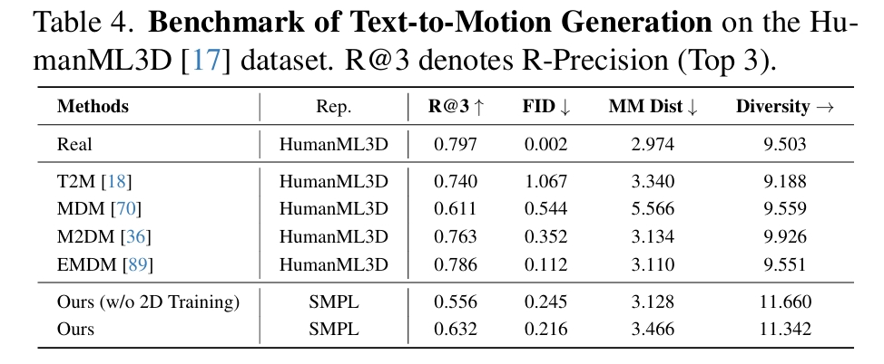

# GENMO:AGENeralist Model for Human MOtion

NVIDIA

## 研究背景与问题

### 要解决的问题

运动生成（如从文本生成动作）和运动估计（如从视频重建3D动作）

### 现有方法及局限性

视频运动估计通常关注确定性预测以追求精度，文本/音乐到运动生成则需输出多样性以覆盖可能动作，因此将运动生成和运动估计视为独立任务。  
这导致模型冗余且知识无法共享。但实际上这两类任务本质均依赖对时空运动规律的理解，而技术路线分离阻碍了性能提升。

### 本文方法

将运动估计与生成整合至单一框架中。
1. 将运动估计重新定义为受约束的运动生成，要求输出运动必须严格满足观测到的条件信号。
2. 通过结合回归与扩散模型的协同效应，既能实现精准的全局运动估计，又能支持多样化运动生成。
3. 一种估计引导的训练目标，利用带有2D标注和文本描述的野外视频数据来增强生成多样性。
4. 支持处理可变长度运动及混合多模态条件（文本、音频、视频），在不同时间区间提供灵活控制。

这种统一方法产生了协同效益：生成先验能提升遮挡等挑战性条件下的运动估计质量，而多样视频数据则增强了生成能力。

### 主要贡献

1. 首个通用模型：GENMO 首次统一了SOTA 全局运动估计与灵活的、多模态条件（视频、音乐、文本、2D 关键点、3D 关键帧）运动生成。

2. 灵活架构设计：支持可变长度运动生成，并允许任意多模态输入组合，无需复杂后处理。

3. 双模式训练范式：探索回归与扩散的协同作用，并提出估计引导的训练目标，使模型能有效利用野外视频数据。

4. 双向提升：生成先验 提升遮挡等挑战条件下的估计鲁棒性；多样化视频数据 增强生成表现力。

## 通用人体运动模型

### 多模态输入

- **条件信号集 \\(\mathcal{C}\\)**：包含一种或多种模态输入：  
  - 视频特征 \\(\mathbf{c}_ {\text{video}} \in \mathbb{R}^{N \times d_{\text{video}}}\\)  
  - 相机运动 \\(\mathbf{c}_ {\text{cam}} \in \mathbb{R}^{N \times d_{\text{cam}}}\\)  
  - 2D骨架 \\(\mathbf{c}_ {\text{2d}} \in \mathbb{R}^{N \times d_{\text{2d}}}\\)  
  - 音乐片段 \\(\mathbf{c}_ {\text{music}} \in \mathbb{R}^{N \times d_{\text{music}}}\\)  
  - 2D包围框 \\(\mathbf{c}_ {\text{bbox}} \in \mathbb{R}^{N \times d_{\text{bbox}}}\\)  
  - 自然语言描述 \\(\mathbf{c}_ {\text{text}} \in \mathbb{R}^{M \times d_{\text{text}}}\\)（\\(M\\)为文本词元数）  
- **条件掩码集 \\(\mathcal{M}\\)**：为每个条件类型 \\(\mathbf{c}_ {\star}\\) 定义二元掩码矩阵 \\(\mathbf{m}_ {\star} \in \mathbb{R}^{N \times d_ {\star}}\\)，当条件特征可用时掩码值为1，否则为0。  

### 运动序列 x 的表示

- **全局轨迹**（第 \\(i\\) 帧）：  
  - 重力视图朝向 \\(\Gamma_{i}^{\text{gv}} \in \mathbb{R}^6\\)  
  - 局部根节点速度 \\(v_{i}^{\text{root}} \in \mathbb{R}^3\\)  
- **局部运动**（第 \\(i\\) 帧）：  
  - SMPL模型参数[45]：  
    - 关节角 \\(\theta_i \in \mathbb{R}^{24 \times 6}\\)  
    - 身形参数 \\(\beta_i \in \mathbb{R}^{10}\\)  
    - 根节点位移 \\(t_{i}^{\text{root}} \in \mathbb{R}^3\\)  
- **相机位姿**（第 \\(i\\) 帧）：  
  - 相机到世界的变换 \\(\pi_i = (\Gamma_{i}^{\text{cv}}, t_{i}^{\text{cv}})\\)  
    - 相机视图朝向 \\(\Gamma_{i}^{\text{cv}} \in \mathbb{R}^6\\)  
    - 相机位移 \\(t_{i}^{\text{cv}} \in \mathbb{R}^3\\)  
- **接触标签** \\(p_i \in \mathbb{R}^6\\)（手足接触状态）  

## 统一估计与生成设计

 

输入：带噪声的运动序列 \\(x_t\\) 与条件信号 \\(C\\)、条件掩码 \\(M\\)   
输出：干净运动序列 \\(x_0\\)  

其中Multi-Text Attention为：  

 

每一个文本序列与特定窗口的x部分做cross attention。  

### 任意长度运动推理

在基于 RoPE 的 Transformer 块中引入滑动窗口注意力机制：每个令牌仅关注其前后 W 帧邻域内的令牌。  
该设计使模型能生成远超训练时长的运动序列，同时保持计算效率并确保运动过渡平滑连贯。

### 混合多模态条件处理

文本条件（无帧级对齐）→ 通过多文本注意力机制处理

时序对齐模态（视频/音乐/2D骨架）→ 通过时序掩码策略管理

## 双模式训练范式

当前的diffusion model不足以支撑与输入视频严格一致的运动重建。  
作者发现运动估计与文本生成任务存在一下差异：  
1. 运动估计结果变异性极低（确定性行为）。文本生成结果变异性显著（概率性行为）。  
2. 视频条件模型：首步预测接近最终结果，后续步变化极小。文本条件模型：各步预测方差显著。  
得出结论：首步预测精度成为关键。  
因此提出提出双模式训练范式。  

### 估计模式

对**纯噪声z**预测时间步T下的输出x0，强制模型退化为确定性映射。  
除了diffusion model本身的重建Loss意外，再增加2D/3D关节点位置的正则项约束。  

### 生成模式

1. 伪标签生成：以视频/2D骨架为条件，通过估计模式输出伪干净运动
2. 噪声注入：对伪标签执行前向扩散
3. 2D重投影损失：约束预测运动与真实2D关键点对齐
4. 物理约束：同步施加几何损失

## 实验

### 动作估计

#### Global Motion Estimation

 

global motion主要关注的是滑步与轨迹。  

分析：  
WHAM的Motion Encoder&Decoder使用纯3D数据训练，相当于是3D动作先验模型，但这个先验模型主要是为了预测local motion。它借助SLAM结果和motion latent code共同预测轨迹，这一步需要结合视频。经测试，可能轨迹主要由motion latent code决定，因此无法区分踏步与向前走的场景。    
本文根据3D动作生补全出合理的轨迹(类似WHAM)。区别在于，
1. WHAM只是借助视频-3D数据来学习这个知识，而本文借助的通过大量数据的3D生成模型，因此在这方面能力更强大。  
2. WHAM预测轨迹的另一个输入是SLAM结果，提供的额外信息有限，而且依赖于SLAM的准确性。但本文会输入完整的视频，信息更丰富。应该可能区分踏步与向前走的场景。    

WHAM和GVHMR都会显式地预测stationary并以此约束foot sliding，因此滑步问题比较小。本文只是约束了2d/3d position或速度，没有显示地预测stationary。 

TRAM没有使用纯3D数据或3D动作先验模型。它完全依靠SLAM解耦相机运动和人物运动，以获得真实的人物轨迹。

#### Local Motion Estimation

 

global motion主要关注的是动作准确度以及与视频的贴合度。

diffusion由于其泛化能力，很难约束它生成的动作跟视频完全一致，因此本文使用了双模式训练范式，从指标上看，这个训练策略非常有效。  

### 动作生成

#### Music to Dance

 

| **指标**       |**物理意义**              |  
|----------------|-------------------------|  
| **Divk**       |关键帧多样性              |  
| **Divm**       |运动序列多样性            |  
| **PFC**        |足部接触物理合理性        |  
| **BAS**        |节拍对齐精度              |  
| **FID**        |分布相似性（越低越好）    |  

#### Text-to-Motion

 
 

通过Ours (w/o 2D Training)和Ours的对比，可见引入2D训练数据确实能对模型各方面性能有提升。  

在表4中，GENMO的客观分数偏低，文中解释是因为本文所使用的动作表示与其它不同，在不同动作表示之间的迁移影响了结果的精度。  

#### Motion In-betweening

 

