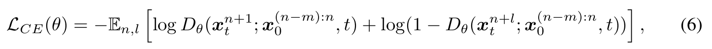
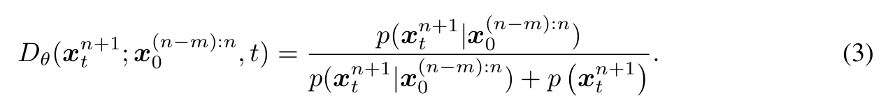
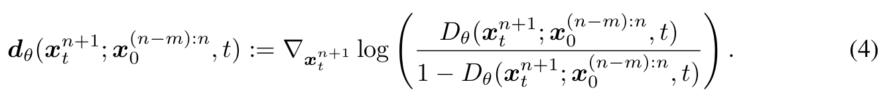
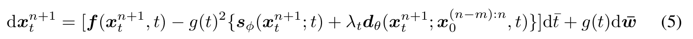

# Generating time-consistent dynamics with discriminator-guided image diffusion models

## 研究背景与问题

### 要解决的问题

基于T2I模型实现文生视频

### 现有方法及局限性

视频扩散模型 (VDMs) 是目前生成高质量时间动态的最佳技术。但从头训练 VDM 计算成本高昂且复杂。  

### 本文方法及优势

不重新训练或修改现有的大型图像扩散模型（这些模型通常资源丰富且已训练好），而是利用一个额外的时间一致性判别器。该判别器在采样推理阶段（即用训练好的图像模型生成视频序列时）引导生成过程。

1. 在时间一致性方面，新方法达到了与专门训练的 VDM 同等的水平。
2. 新方法能更好地估计其预测的不确定性。
3. 新方法生成的动态更接近真实数据，系统性误差更小。

## 主要方法

### 符号定义

 *   `{x^n_t}`: 表示一个图像序列。这是理解的关键。
     *   **上标 `n`：物理时间步 (Physical time step)**。代表视频帧或动态模拟中的时间点（`n=1` 是第一帧，`n=2` 是第二帧，依此类推）。
     *   **下标 `t`：扩散时间步 (Diffusion time step)**。代表扩散模型去噪过程中的时间（噪声水平），`t=0` 表示完全去噪（干净图像），`t=T` 表示完全噪声。
 *   `x^{(n-m):n}_0`：指代从物理时间步 `n-m` 到 `n` 的**无噪声 (t=0)** 图像序列（`m+1` 帧）。

### 时间一致性判别器的训练

构造数据对：
- 输入：`x^{(n-m):n}_0`，其中n为均匀采样
- 正样本：`{x^(n+1)_t}`
- 负样本：`{x^(n+l)_t}`，其中l使用重要性采样，因此当l接近1时任务更难

输出：

`D_θ(x^{n+1}_t; x^{(n-m):n}_0, t)`

损失函数：  

 

### 使用时间一致性判别器的时序一致性引导

根据上文可知，判别器的定义为：

 

由此计算出时序一致性引导为：  

 

代码reverse SDE的更新公式得：  

 

## 实验

## 启发

在diffusion based模型的推断过程，通过施加损失的梯度来引导生成，类似的想法在文生动作任务[OmniControl](./85.md)中也有使用，可见这种方法确实是有效的。
