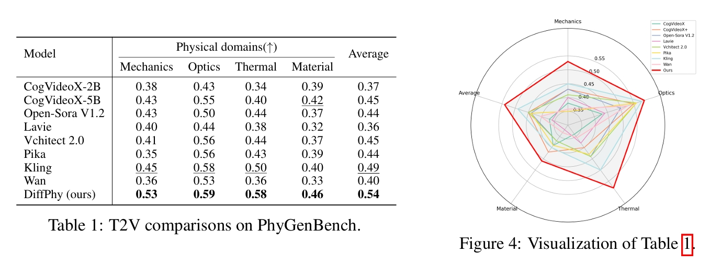

# Think Before You Diffuse: LLMs-Guided Physics-Aware Video Generation

## 研究背景与问题

### 要解决的问题

实现物理正确且照片级真实的视频生成。

### 现在有方法及其局限性

1. 现有视频扩散模型在生成视觉上吸引人的视频方面表现优异。便难以直接从海量数据中学习这些复杂的物理规律。因此在生成视频中合成正确、符合物理规律的效果方面存在困难，尤其是在处理复杂的现实世界运动、物体间相互作用和动力学时。
2. 通过神经网络从视觉输入中提取物理表示，用于下游的推理或模拟。尽管这些方法在图形学、机器人和科学计算等领域有效，但它们通常依赖于基于规则的手工求解器，这限制了其表达能力和可扩展性，并且需要大量的手动调整。此外，它们通常局限于合成数据，无法扩展到复杂的、真实世界的视频生成。

### 本文方法及优势

1. 利用LLM进行物理推理，显式地分析用户提供的文本提示，并生成一个全面的物理上下文，详细描述文本提示中隐含或涉及的物理规律（如重力、碰撞、流体、材料属性等）。
2. 将LLM推理出的物理上下文信息注入到扩散模型（即视频生成模型）中，指导其生成过程。
3. 利用MLLM监督与训练目标 
4. 构建了一个新的高质量物理视频数据集，该数据集包含多样化的物理动作和事件

## 主要方法

 

给定用户提示:
1. 利用预训练的大型语言模型 (LLM) 从文本输入中推理物理属性。
2. (a) 利用物理语境增强用户提示，并 (b) 生成一个与所描述事件相关的物理现象清单。
3. 使用增强后的提示来指导视频生成。同时，物理现象清单被用来惩罚包含不合理物理现象的输出。

### 将文本描述锚定于物理语境

利用预训练的 LLM 来推理物理语境，并获取三种类型的文本描述：
(1) 一个物理属性清单，用于捕捉角色（起因/结果）、相互作用和物理规律；
(2) 一个包含场景和物理细节的增强提示；
(3) 一个与事件相关的物理现象清单。

#### 物理属性推理

使用思维链 (Chain-of-Thought, CoT) [54] 提示技术来引导一个预训练的大型语言模型:  
(1) 识别所涉及的关键物理原理；
(2) 确定哪些实体发起动作，哪些实体受到影响；
(3) 推理这些实体如何相互作用；
(4) 记录任何由此产生的物理现象。
最终，获得一个既全面又有效的物理属性清单。

#### 增强文本提示

基于提取出的物理属性，提示 LLM “生动地描述场景，包括物体、动作和氛围”。不仅捕捉了场景的力学方面，还捕捉了其叙事深度。  
允许 LLM 通过引入新的实体（产生外力）以保证逻辑一致性。

#### 物理现象

生成一个与目标事件相关联的『物理现象』清单。其中『物理现象』是由事件状态变化引起的事实。  
这些『物理现象』清单用于指导训练过程。当事实被满足时，可以奖励扩散模型；当事实缺失或错误时，则可以惩罚它。

### 物理感知模型训练

#### 目标

如何训练扩散模型以有效利用文本描述中丰富的物理语境，并精确生成期望的物理效果:
(1)       
(2) 尊重作为自然视频的常识；
(3) 生成符合文本描述的期望内容。

#### 物理现象 Loss

验证生成的结果是否包含物理现象清单中列出的期望事实

在训练期间，在采样的时间步 t，
1. 将预测的潜在片段 xt ∈ R^{m×c×h×w}解码为像素空间视频 vt。
2. 用一个多模态大型语言模型 (MLLM) [7] 来逐一评估 vt 与物理现象集合 F = {f1, ..., fn} 中每个事实 fi 的对齐程度。

MLLM输出两个值：
1. li ∈ {0, 1}描述第i个事实是否被匹配
2. zk描述与单词k相关联的logit值。其中单词k ∈ {“未匹配”或“已匹配”}

Loss定义为：  

$$
E(li) = Σ_{l∈{0,1}}
$$

$$
L_{phen} = Σ_{f_i∈F} ||E(l_i) - 1||^2_2
$$

引入了一个额外模块来处理未匹配的事实 \\( f_i \\)，该模块：  
1. 将 \\( f_i \\) 编码为文本嵌入  
2. 以图 2-(3) 所示的方式，对DiT中的Cross Attention层使用ControlNet + LoRA的技术向原始的DiT注入条件

#### 物理常识 Loss

使用同一个预训练的多模态大型语言模型 (MLLM)来给出 1 到 5 的评分，用于评估生成的视频 vt 的合理性得分。

$$
L_{\text{com}} = \left\| \frac{E(s_{\text{com}})}{\tau} - 1 \right\|_2^2,
$$ 

#### 语义一致性损失

使用同一个预训练的多模态大型语言模型 (MLLM)来给出 1 到 5 的评分，用于评估生成的视频 vt 与输入文本提示之间的语义一致性。

$$
L_{\text{sem}} = \left\| \frac{E(s_{\text{sem}})}{\tau} - 1 \right\|_2^2,
$$ 

## 训练

### 训练目标

- **去噪分数匹配 \\( L_\epsilon \\)**：扩散模型的核心目标，通过最小化噪声预测误差来学习数据分布。  
- **现象损失 \\( L_{\text{phen}} \\)**：修正生成过程中违反物理规律的现象（例如物体穿透、重力失效）。  
- **物理常识损失 \\(L_{\text{com}} \\)**：确保生成内容符合物理常识（例如物体下落、液体流动）。  
- **语义一致性损失 \\( L_{\text{sem}} \\)**：保证生成内容与输入文本提示的语义一致（例如“猫跳上桌子”需包含猫和桌子）。  

$$
L = L_\epsilon + \beta(L_{\text{phen}} + L_{\text{com}} + L_{\text{sem}}).
$$  

### 训练策略

1. 冻结原始 DIT，仅训LoRA部分
2. 当检测到失败事实，基于该事实的文本嵌入重新注入扩散步骤，强制模型修正错误。
3. 随机不激活注入分支的训练，防止模型过度依赖注入的监督信号，保留原始扩散模型的生成能力。

### 基模型

Wan2.1-14B，一种基于 DiT 的开源文生视频模型

*DiffPhy 支持多种模型架构（backbones），此处以 Wan2.1-14B 为例进行展示。*

## 实验

### 数据集

训练数据：  
通过对VIDGEN-1M数据集加工得到的HQ-Phy数据集  

测试数据：  
VideoPhy2、PhyGenBench

### 评估指标

PhyGenBench 基准的评估指标:
- **关键现象检测（Key Phenomena Detection）**：检测生成视频中是否包含符合物理规律的关键现象（如重力、弹性等）。  
- **物理顺序验证（Physical Order Verification）**：验证事件的时间顺序是否符合物理因果关系（如“物体先下落再碎裂”）。  
- **平均质量评分（Average Scores）**：使用 GPT-4o [1] 和开源模型（如 CLIP [43]、InternVideo2 [53]、LLaVA [32]）综合评估视频整体质量。  

VideoPhy2中的 VideoCon-Physics 评估器:
- **物理常识（PC, Physical Commonsense）**：评分范围 1-5，评估视频的物理合理性。  
- **语义一致性（SA, Semantic Adherence）**：评分范围 1-5，衡量视频与输入提示的语义对齐程度。  

人工评估

### 横向对比

开源模型：Wan2.1-14B [50]、CogVideoX5B [63]、VideoCrafter2 [10]、HunyuanVideo-13B [27]、Cosmos-Diffusion-7B [2]。  
闭源模型：OpenAI Sora [40]、Luma Ray2 [35]、LaVie [52]、Vchitect [13]、Pika [42]、Kling [26]。

官方 PhyGenBench 排行榜:  

 

作者自己测的客观评分：  

 

