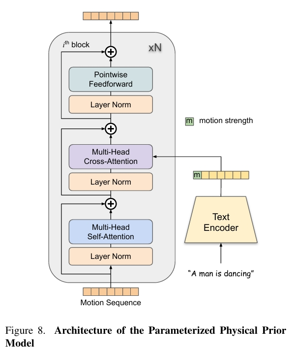

# ReVision: High-Quality, Low-Cost Video Generation with Explicit 3D Physics Modeling for Complex Motion and Interaction

## 研究背景与问题

### 要解决的问题

生成包含复杂动作和交互的视频

### 本文方法及优势

首先，使用一个视频扩散模型生成一个粗糙的视频。  
接着，从该粗略视频中提取一组 2D 和 3D 特征，构建一个以对象为中心的 3D 表示，并通过我们提出的参数化物理先验模型对其进行优化，生成精确的 3D 动作序列。  
最后，这一优化后的动作序列被反馈到同一个视频扩散模型中作为额外的条件输入，使得即使在涉及复杂动作和交互的情况下，也能生成运动一致的视频。

## 主要方法

### 基于运动条件的视频生成

 

从预训练的 SVD 模型出发，在原始条件输入中额外拼接了两个通道：
- 3D 运动序列的部件级分割掩码
- 该掩码可靠性的置信度图

|场景|数据来源|占训练样本百分比|置信度分数|
|---|---|---|---|
|场景一|运动序列的部件级掩码由从 3D 参数化网格模型投影的所有 2D 部件分割掩码合并生成|40|1|
|场景二|用户通过简单的草图（如圆形或椭圆形）指示特定目标或部件（如手或手臂）的最终位置|30|0.5|
|场景三|空部件掩码|30|0|

### ReVision

 

#### S1：粗略视频生成

输入：第一帧和可选的用户指定的目标姿态（最终帧中的运动）  
输出： 视频

由于生成过程仅依赖于最终帧的目标运动或空运动，而非完整的运动序列，因此生成的视频通常运动质量较差，存在改进空间。因此，称此阶段为粗略视频生成。

#### S2：以对象为中心的 3D 优化

利用 3D 参数化网格模型（用于人类和动物 [32, 49, 80]）、边界框 [57]、分割掩码 [40, 71] 和深度估计 [69]（用于通用对象）对目标进行 3D 参数化。

3D参数化方法：
- 人使用SMPL
- 动作使用SMAL
- 其它物体使用BBox、分割掩码和深度估计。  

使用**参数化物理先验模型（PPPM）**，基于文本信息和运动强度对 3D 运动序列进行优化。

 

PPPM把 3D 参数化运动序列 变为优化后的 3D 参数化运动序列，再转为 3D 网格序列，并投影为 2D 部件分割掩码和置信度图。

#### S3：细粒度视频生成

以S2输出的在 3D 空间中优化的完整运动序列作为部件掩码为condition生成视频。  

## 训练

### 数据集

作者自己标注了object-centric annotations的视频数据集。  

|输入|输出|方法|
|---|---|---|
|视频|筛选高质量运动视频、人和动物的分割掩码|大型语言模型(Qwen2) 和开放词汇分割模型(Convolutions die hard)|
|所选视频、字幕|字幕是提到的对象|边界框检测（Yolov8）、掩码分割(Convolutions die hard)|
|包含人类的视频|精确的人体掩码|YOLOv8|
|包含人类的视频|每个人的面部关键点|RTMPose|
|包含人类的视频|SMPL参数、MANO参数|4D-Human 和 HaMeR|
|SMPL参数、MANO参数|SMPLX参数|整合|
|3D SMPL-X 人体Mesh|部件掩码及标签|投影|
|以上人体标注输出|质量验证和过滤|
|包含动物的视频|动物掩码|Grounded SAM 2|
|包含动物的视频|视频中相机的内参和外参|VGGSfM，同时过渡低质量数据|
|包含动物的视频|SMAL参数|AnimalAvatar、Animal3D|
|以上动物标注输出|质量验证和过滤|

优点：
1. 利用现成模型（如 YOLOv8、RTMPose、SMPL-X、AnimalAvatar）生成高质量标注，而非人工标注。
2. 结合语言模型（LLMs）筛选含运动的视频，提升数据相关性。
3. 多阶段的过滤筛选
4. 从视频筛选到标注生成的全流程自动化。

### 训练

基础模型：[Stable video diffusion](./50.md)

不同的条件输入策略：
- 40% 的视频片段包含每帧的精确部件掩码
- 30% 包含最终帧中随机部件的多边形掩码
- 剩余片段无额外条件输入。

## 实验

### 实验一：现通用生成模型对比

- SVD：使用GPT-4o生成『人类和动物从事日常活动』的文本描述。再用GPT-4o对描述生成参考图像。以此作为输入生成视频。
- HunyuanVideo：直接使用相同的文件提示生成视频。  
- ReVision：使用相同的文件提示，使用HunyuanVideo生成视频的首帧作为reference，以此作为输入生成视频。

 

结论：  
ReVision显著提升了 SVD 的运动生成能力，生成的视频在运动量、一致性和真实感上均优于 SVD。甚至在运动质量上超越了 13B 参数 的 SOTA 模型 HunyuanVideo。这些结果证明了ReVision在复杂动作和交互生成中的有效性。

 

尽管 ReVision 采用了三步流程（pipeline），但额外的 3D 检测和运动优化模块在单张 A100 显卡上仅增加了 5 秒 的推理时间。因此 ReVision 仍显著更快。

### 实验二：与人体图像动画化模型对比

ReVision：使用 TikTok Dancing 数据集微调原始SVD  

 

1. ReVision在所有指标上SOTA。
2. FVD（Fréchet Video Distance） 指标上观察到了显著的提升，表明视频生成质量有明显改善。
3. 其它基线方法都依赖于真实的运动序列（ground truth motion sequences），而在实际场景中获取这些数据是相当困难的，这限制了它们的实用性。相比之下，但ReVision需提供输入图像和目标姿态，即可生成真实且高质量的视频。

### Ablation Study

1. 通过引入来自 3D 网格模型的人类和动物先验知识，可以大幅缓解这些结构上的(例如“一个人有三条手臂”)不准确性，从而实现对目标更精确的表示。
2. Stage3的主观效果与客观指标均明显优于Stage1

[TODO] 表3

## 相似工作对比（原创）

[FinePhys](./99.md)也是类似的想法，都是在3D空间优化人体动作，然后以优化后的人体动作作为控制信号进行视频生成。  

区别在于

||本文|FinePhys|
|---|---|---|
|输入|参考图像+目标动作，因此是图生视频任务|视频提供参考动作，生成视频，因此是2D动作驱动的视频生成任务|
|物理先验的来源|没有显式地提取物理参数，仍然是从视频数据中学习物理先验|显示地使用了物理公式，通过提取物理参数再运用物理参数的过程，强制优化后的动作是物理的|
|适用范围|使用了SMPL、SMAL、bbox等不同的方法来把2D内容参数化，因此适用范围更广|依赖于2D关键点检测与2D->3D lifting，只能用于人的优化|
|结果可控性|从数据是自动地学习物理先验，结果更可控，但依赖高质量数据。|依赖物理参数的优化，如果参数没优化好，结果就不对，因此可控性差一点|

相同点：
1. 物理优化的过程是可导的，因为可以把物理优化作为其中一个环节进行端到端训练。  

