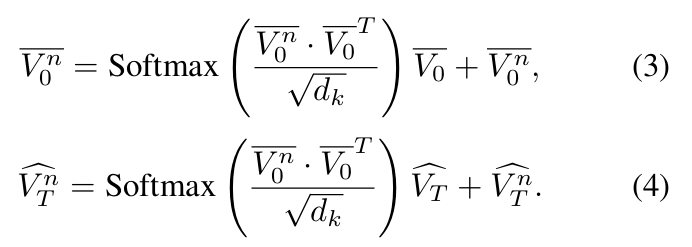
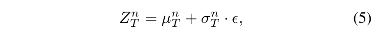
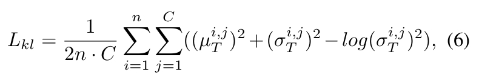
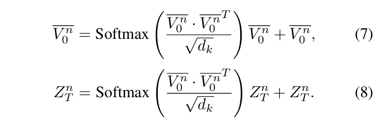
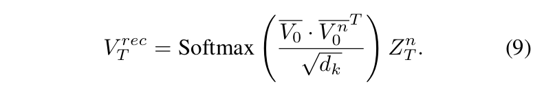
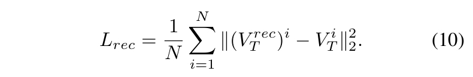
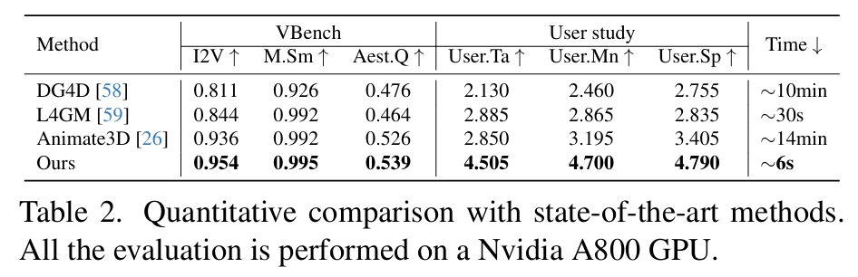

# AnimateAnyMesh: A Feed-Forward 4D Foundation Model for Text-Driven Universal Mesh Animation

## 研究背景与问题

### 要解决的问题

根据文本驱动对任意3D网格进行动画化

### 本文方法及优势

1. 采用了一种新颖的 DyMeshVAE 架构，通过将空间特征和时间特征解耦，并保留局部拓扑结构，从而有效地压缩并重建动态网格序列。
2. 为了实现高质量的文本条件生成，我们在压缩后的潜在空间中采用了一种基于修正流（Rectified Flow） 的训练策略。
贡献了一个名为 DyMesh Dataset 的大规模数据集，包含超过400万个带有文本标注的多样化动态网格序列。

实验结果表明，AnimateAnyMesh能够在几秒钟内生成语义准确且时间连贯的网格动画，在质量和效率方面均显著优于现有方法。

## 主要方法

### DyMeshVAE

 

#### 顶点编码

给定一个动态网格序列 \\( \mathcal{D} \subset \{ F \in \mathbb{R}^{M\times3},\ V \in \mathbb{R}^{T\times N\times3} \} \\)

首先将顶点序列 \\( V \\) 分解为初始帧顶点 \\( V_0 \in \mathbb{R}^{N\times3} \\) 和相对运动轨迹 \\( V_T \in \mathbb{R}^{N\times(T\cdot3)} \\)，满足以下关系：

$$
V^t = V^0_t + V^t_T,\quad \text{其中 } t = 1, 2, \dots, T
$$

其中 \\( t \\) 表示时间序列的索引。

**将顶点序列 V 拆分为 V0 和 VT 是DyMeshVAE 的关键建模思想之一。这种分解方式有助于实现形状与运动的解耦建模，同时使得运动分布更接近一个均值为零的正态分布。**

#### 位置编码

目的：增强轨迹重建的稳定性并防止粘连效应

方法：对 \\( V_0 \\) 和 \\( V_T \\) 使用**不同的位置编码策略**，从而得到编码后的特征 \\( \hat V_{0} \\) 和 \\( \hat V_{T} \\)。

#### 拓扑编码

从输入网格的面片信息 F 中构建一个邻接矩阵 Adj。该邻接矩阵随后作为自注意力层中的注意力掩码，使每个顶点能够聚合其相邻顶点的信息：

$$
\bar V_0 = \text{Softmax}\left( \frac{\hat V_{0} \cdot \hat V_{0}^T \odot \text{Adj}}{\sqrt{d_k}} \right)\hat V_{0} + \hat V_{0}
\tag{2}
$$

#### 捕捉运动模式之间的相关性

对拓扑感知顶点特征 \\(\bar \V_0\\)应用最远点采样（Farthest Point Sampling, FPS）[55]，得到\\(\bar \V_0^n\\)

> [55]: Pointnet++

#### attention map

 

#### KL Regularization

目的：对相对轨迹 \\(\hat \V_T^n\\) 的分布进行建模。

1. 在潜空间采用 KL 正则化以调控特征多样性。即：  
   通过两个全连接层对 \\(\hat \V_T^n\\) 进行线性投影，预测其分布的均值和标准差
2. 随后按以下方式对 VAE 潜变量进行采样：

 

3. 正则化约束为：  

 

#### DyMeshVAE Decoder

 
 
 

### 形状引导的文本到轨迹模型

 

目的：在给定初始网格和文本提示的条件下估计相对轨迹的后验分布。

每个动态网格序列 \\( \mathcal{D} \\) 被编码为一对潜表示 \\( \{V_n^0, Z_n^T\} \\)。  
1. 使用全局统计量（均值 \\( \mu_0, \mu_T \\) 和标准差 \\( \sigma_0, \sigma_T \\)）标准化潜变量以消除数值差异  
2. 沿通道维度拼接标准化特征 → 形成**综合轨迹嵌入**  
3. 通过预训练CLIP文本编码器获取**文本嵌入**  
4. 采用时间步 \\( t \\) 相关的独立自适应层归一化（AdaLN）参数分别调制轨迹嵌入和文本嵌入  
5. 重缩放后的特征拼接进行自注意力计算  
6. 多注意力块处理后，分解输出特征并基于保存的统计量 \\( \mu_0, \mu_T, \sigma_0, \sigma_T \\) 还原原始尺度  

## 训练

### 训练

遵循修正流（Rectified Flow, RF）[42]的扩散范式，我们旨在最小化预测流与真实流之间的均方误差。

> 修正流：Flow straight and fast: Learning to generate and transfer data with rectified flow

### 推断

基于流式的常微分方程（ODE）公式实现修正流的采样过程。  
采样完成后，将生成的轨迹特征 \\( Z_n^T \\) 与拓扑感知顶点特征 \\( V_n^0 \\) 输入解码器生成相对轨迹，最终通过将解码的顶点位移应用于给定网格，生成动态网格序列。  

## 实验

### 估计指标

- 重建质量评估：计算重建顶点轨迹与真实轨迹间的逐帧平均 L2 距离
- 从固定视角渲染动画网格，并从视觉质量上评估
- 人工评估

### 横向对比

1. [DG4D](./111.md) [58]：基于微分几何的变形模型
2. L4GM [59]：潜在空间网格运动生成器（使用 DynamiCrafter [86] 作为视频生成组件）
3. Animate3D [26]：神经渲染驱动的动画框架

| **方法** | 技术缺陷 | 本方案解决策略 |  
|----------|----------|----------------|  
| **DG4D** | 视频蒸馏导致**3D表示退化** • 高斯球参数无法精确描述拓扑变化 | ✅ **直接操作网格顶点** • 保留显式几何结构 |  
| **L4GM** | **视频生成依赖背景信息** • 孤立物体缺乏纹理线索 → 运动估计失真 | ✅ **端到端轨迹学习** • 无需中间视频表示 |  
| **Animate3D** | **多阶段误差传递** 网格→高斯→视频→轨迹的转换损失 | ✅ **单阶段预测框架** • 消除累计误差 |  

 

### 消融实验

 

| **组件**       | 输入对象               | 核心功能                                                                 | 失效后果                  |  
|----------------|------------------------|--------------------------------------------------------------------------|-------------------------|  
| **Adj**        | 网格边连接关系         | 建立顶点语义边界（如手指关节 vs 手掌）                                    | 跨语义区域粘连（图 7）    |  
| **PE₀**        | 初始顶点坐标           | 编码空间位置信息 → 增强静态特征区分度                                     | 对称部位运动混淆          |  
| **PEₜ**        | 轨迹向量               | 描述运动方向/幅度 → 提升时序建模能力                                      | 运动轨迹抖动（图 8）      |  
| **Sep Attn**   | 初始特征 \\(V_n^0\\)     | 仅基于拓扑计算注意力 → 强化 "结构-运动" 关联规则                          | 局部运动协调性下降 23%    |  
| **Emb FPS**    | 邻域增强特征           | 保留语义信息的采样 → 512 令牌覆盖关键运动区域                             | 重建误差上升 15.7%        |  
