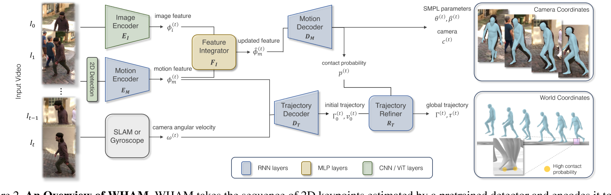

# WHAM: Reconstructing World-grounded Humans with Accurate 3D Motion

## 核心问题是什么?

视频动捕，3D人体运动重建。
单目，复杂背景，运动背景，单人

## 核心贡献是什么？

1. WHAM（World-grounded Humans with Accurate Motion）方法成功结合3D人体运动和视频背景，实现精准的全球坐标下3D人体运动重建。

2. 该方法通过模型自由和基于模型的方法，利用深度学习技术，有效地从单眼视频中准确估计3D人体姿态和形状。

3. WHAM在全球坐标系下取得了令人瞩目的成果，通过融合运动上下文和足地接触信息，最小化足滑动，提高国际协调性。

## 大致方法是什么？

Feature Integrator：由于2D信息不充分或者识别不可靠等原因，导致2D到3D的lifing可能存在错误。此模块提取了图像信息来弥补2D信息的不足。通过使用此模型与不使用此模型的效果对比，结果如下：  
（自）遮挡场景：有效  
2D关键点位置出错，置信度低：有效  
深度歧义：部分有效   
2D关键点识别错误（例如左腿识别成右腿）：无效

### 3D动作估计

|模块|先验知识|输入数据|预测信息|
|---|---|---|---|
|2D Detection|已有的2D关键点检测技术|图像|2D关键点。|
|HmrRegressor|SMPL参数化模型|图像|初始的SMPL的shape参数和rotation参数。|  
|MotionEncoder|采用单向RNN，学习人体运动数据的时序关系|上一帧的RNN状态，2D关键点|结合上下文进行在线推断SMPL参数、足地接触概率、**运动特征**。|  
|FeatureIntegrator|图像特征、运动特征|捕捉和整合图像特征与运动特征|新的运动特征。|
|MotionDecoder|采用单向RNN，学习人体运动数据的时序关系|运动特征|当前帧相机坐标系下的SMPL参数，上一帧的RNN状态|

没有使用额外的传感器，如惯性传感器，因为它们可能会产生侵扰。  

Hmr2.0直接可以提取出相机坐标系下的SMPL参数，为什么只用于提取第一帧的参数和后续的图像特征，然后通过2D点来liftting出SMPL参数？  
答：1. Hmr2.0是逐帧的，需要扩展到视频上。2. 使用2D-to-3D可以充分利用纯3D数据，可以提升decoder的泛化性。3. 下面的轨迹分支需要基于2D的运动特征。  

### 相机标定

|模块|先验知识|输入数据|预测信息|
|---|---|---|---|
|TrajectoryDecoder|人运动时身体保持基本向上的特点|相机视角下人体动作|世界坐标系下的人的全局旋转。|  
|坐标系对齐|坐标系变换|通过相机视角下的人物的全局旋转与世界坐标系下的人物全局旋转的对齐|计算出相机坐标系与世界坐标系的投影关系。|  

### 运动轨迹与滑步的一致性

|模块|先验知识|输入信息|预测信息|
|---|---|---|---|
|TrajectoryDecoder|从人体运动数据中运动轨迹与动作之间关系|相机坐标系下的人体动作|人在世界坐标系下的运动轨迹|
||脚步触地时不应该出现滑步|当前帧的触地概率，上一帧脚步在世界坐标系的位置，当前帧脚步在世界坐标系的概率|如果触地，通过调整运动轨迹，消除脚步移动|
|TrajectoryRefiner|人体运动数据|世界坐系下的人体动作，世界坐标系下运动轨迹，通过相机标定，根据相机坐标系下的脚步位置换算出的世界坐标系下的脚步位置|最终的人体动作、运动轨迹|

## 有效

WHAM超越了当前的最先进方法，在逐帧和基于视频的3D人体姿势和形状估计中表现出卓越的准确性。通过利用运动上下文和足地接触信息实现了精确的全球轨迹估计，最小化了足滑动，并提高了国际协调性。该方法整合了2D关键点和像素的特征，提高了3D人体运动重建的准确性。在野外基准测试中，WHAM在MPJPE、PA-MPJPE和PVE等指标上展现出卓越的性能。轨迹细化技术进一步提升了全局轨迹估计，并通过改善的误差指标证明了减少足滑动的效果。

## 缺陷

|现象|可能的原因|
|---|---|
|做快速运动时，捕出来的动作跟不上|1. Motion Encoder & Decoder没有很好地对动作编解码 2. 使用RNN网络，导致输出结果跟输入相比有延迟|
|TrajectoryDecoder预测的世界坐标系下的人的全局旋转不准|单纯从动作不足以预测人的全局旋转。人在轻微歪斜的动作下也能保持平衡|
|TrajectoryDecoder预测的世界坐标系下的人的全局轨迹不准|单纯从动作不足以预测人的全局轨迹。因为原地踏步或向前走或上楼梯，可能表现出的动作是一样的。还应该结合背影信息。|
|部分动作不能较好地恢复|HmrRegressor估计smpl参数不准|
|人的全局位置会移动|没有真正地学到地面的信息，而只是强制在遇到触地标签时把脚的位置锁住|

## 验证

数据集：AMASS运动捕捉和视频数据集

## 启发

1. 人物动作与人物轨迹解耦
2. 相机坐标系与世界坐标系解耦
3. 利用运动先验信息代替相机标定
4. 利用上下文信息来解决2D到3D的歧义性

## 遗留问题

## 参考材料

- https://arxiv.org/pdf/2312.07531.pdf
- http://wham.is.tue.mpg.de/
- https://arxiv.org/abs/2312.07531
- https://ar5iv.labs.arxiv.org/html/2312.07531
- https://accesspath.com/ai/5891344/