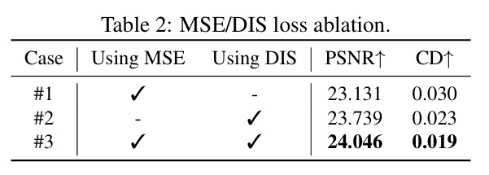

# Drive Any Mesh: 4D Latent Diffusion for Mesh Deformation from Video

## 研究背景与问题

### 要解决的问题

对现有 3D Mesh进行动画化

### 本文方法及优势

*   **输入 1：初始几何** - 一个表示目标物体的**初始点云 `P1`**。它包含 `N` 个三维点 `(pi ∈ R³)`，通常通过对用户提供的静态 3D 网格进行采样获得。`P1` 定义了物体的**初始形状**。
*   **输入 2：运动参考** - 一个**单目视频 `V`**。它包含 `T` 帧图像 `(It)`，由固定相机拍摄。视频提供了期望的**运动模式或姿态序列参考**。
*   **输出：运动轨迹序列** - 一个点云序列 `P = {P1, P2, ..., PT}`。
*   **实现手段：** 使用一个 **4D 潜在扩散模型** 来建模和学习这个条件分布 `p(P|P1, V)`。该模型的核心功能是进行**条件去噪**：从一个噪声版本的点云序列开始，在 `P1` 和 `V` 的引导下，逐步去噪，最终得到干净的、代表目标动画的点云轨迹序列 `P`。

## 主要贡献

一种新颖的 4D 生成方法，利用单目视频为 3D 资产生成动画；

一个大规模 4D 资产数据集，包含多视角视频和网格顶点序列；

一种新的基于潜在扩散模型的方法，配备了专为 4D 生成设计的新型 VAE 架构和扩散结构。

## 主要方法

 

### 数据准备

从庞大的 Objaverse 数据集 [5, 4] 中精心策划了一个新的 4D 数据集，该数据集包含大量带标注的 3D 对象。

### 基于点云轨迹的运动表示

核心思想： 将物体的运动表示为其网格顶点随时间的移动路径（轨迹）。  
优点： 输出是显式的点云序列 {Pt}，其中 Pt 是时间 t 时的顶点位置。这种表示天然兼容所有现代渲染引擎，因为引擎可以直接读取和渲染顶点位置序列定义的网格动画。  
关键挑战：不同 3D 网格模型的顶点数量 (N) 差异很大。  
解决方案：潜在集 (Latent Sets)  
>  3DShape2VecSets

#### 基于 Transformer 的 VAE

目标： 学习一个紧凑的 4D 潜在表示（即潜在集 F），它能充分编码形状和运动信息，并能被高效地生成和重建。  

 

- 4D 运动编码器: 输入初始点云 P1（几何形状）和多视角动画图像序列（视觉外观和运动信息）。压缩这些时空信息，输出潜在集 F。
- KL 正则化块: 在训练过程中，它约束学习到的潜在集 F 的分布接近一个先验分布（通常是标准正态分布）。(VAE标准操作)。
- 4D 运动解码器: 输入是潜在集 F。响应查询（顶点索引 i 和时间 t），输出顶点 i 在时间 t 的位置，从而重建或生成对应的点云轨迹序列。  

### 使用扩散模型进行运动生成

输入： 用户提供 P₁ (初始网格点云) 和 V (单目参考视频)。

Denoiser 利用空间、条件（几何+外观）和时间注意力机制，预测出更干净的潜在序列{Ẑₜ}ᵗ⁼₁ᵀ。  
VAE 将 {Ẑₜ}ᵗ⁼₁ᵀ 输入到 VAE 的解码器中。输出预测的点云轨迹序列 P = {P₁, P₂, ..., Pₜ}，即最终的 4D 网格动画。

### 后处理

基于欧氏距离的阈值滤波机制，用于消除抖动。  

## 实验

### 测试指标

从视觉质量上评估：  
峰值信噪比 (PSNR)、结构相似性指数 (SSIM) 和学习感知图像块相似度 (LPIPS)

### 横向对比

[DreamGaussian4D](./111.md) [27],
Consistent4D [12],
STAG4D [36],
DreamMesh4D [18]

 

### 消融实验

在训练变分自编码器 (VAE) 时，仅使用均方误差 (MSE) 损失无法快速收敛到令人满意的结果。因此引入欧氏距离损失 (DIS)。 在相同的优化时间内，结合两种损失函数能得到更好的结果。

 

## 相似工作对比（原创）

[AnimateAnyMesh](./109.md)是同期相似的工作。相同点：
1. 驱动任意拓扑与内容的Mesh。
2. 把Mesh序列分解为初始点云和每个顶点的运动路径，通过重建顶点的运动路径，叠加到初始点云后，得到被驱动的Mesh。
3. 以顶点顺序、数量无关的方法对Mesh进行编码，表达为隐空间向量。生成模型在隐空间是完成。
4. 提供了一个4D Mesh数据集。  

不同点：

||本文|[AnimateAnyMesh](./109.md)|
|---|---|---|
|Mesh编码方式|Self Attention + Cross Attention + VAE|Latent Set + Transformer VAE|
|生成模型|修正流|diffusion|