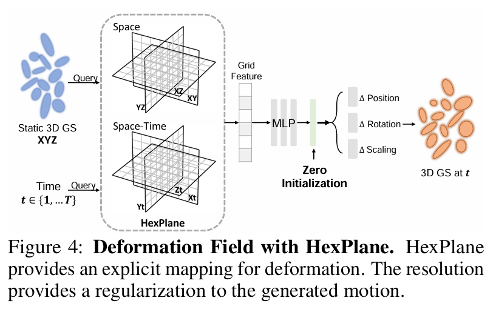
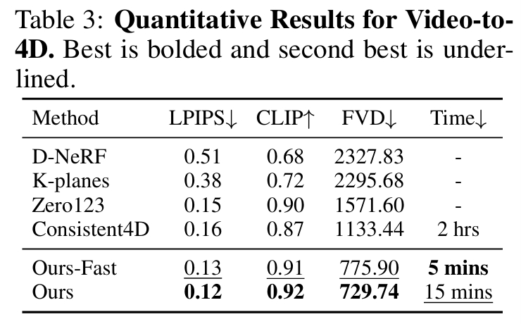

# Dreamgaussian4d: Generative 4d gaussian splatting

近日，四维内容生成领域取得了显著进展。然而，现有方法仍存在优化耗时过长、运动可控性不足以及细节质量欠佳等问题。本文提出DreamGaussian4D（DG4D）——一个基于高斯溅射（GS）的高效四维生成框架。我们的核心思路是：将空间变换的显式建模与静态GS相结合，构建出高效且强大的四维生成表征。此外，视频生成方法能够提供有价值的时空先验，从而提升四维生成的质量。具体而言，我们提出了包含两大核心模块的完整框架：1）图像到四维GS转换——首先生成静态GS，随后通过基于HexPlane的动态生成与高斯形变实现动态建模；2）视频到视频纹理优化——利用预训练的图像到视频扩散模型对生成的UV空间纹理图进行时序一致性优化。值得关注的是，DG4D将优化时间从数小时缩短至几分钟，实现了生成三维运动的可视化控制，并产出了可在三维引擎中实现逼真渲染的动画网格。

开源

## 研究背景与问题

### 任务

输入：单张图像  
输出：4D内容生成

### 本文方法及优势

|要解决的问题|当前方法及存在的问题|本文方法及优势|
|---|---|---|
|表示方式|隐式表示 (NeRF) 场景重建与驱动都非常低效。|用 3D GS 显式、高效地表示静态基础，用 HexPlane 显式、高效地表示动态位移。  [3DGS相对于Nerf的优缺点](https://caterpillarstudygroup.github.io/ImportantArticles/3DGSAnimation/3DGSAnimation.html)|
|运动信息来自|依赖 Video SDS (视频分数蒸馏) 来从视频扩散模型中“蒸馏”运动信息。 这种方法具有固有的随机性和不稳定性。|直接从一段“驱动视频”中学习运动模式。 监督方式还是SDS|
|静态几何与动态运动之间的关系|耦合关系：动态几何建模Nerf 优化慢、运动不规则|解耦关系：静态几何建模（GS）+ 动态运动建模（HexPlane位移） 通过优化HexPlane预测每个高斯点在时间轴上的位移，将运动高效地“注入”到高质量的静态场景中|
|纹理优化|未涉及|利用预训练的图像到视频扩散模型，对生成的UV空间纹理贴图进行优化，同时增强其时间一致性。|

## 主要贡献

1. **一个系统性的图像到4D生成框架**，它协同利用了图像条件化的3D生成模型和视频生成模型。这允许直接控制和选择期望的3D内容及其运动，从而实现高质量且多样化的4D生成。
2. 显式地表示4D场景：使用 3D GS 表示基础场景，并使用 HexPlane 表示不同时间戳下的形变。这种空间变换的显式建模将4D生成时间从数小时显著缩短至仅需几分钟。
3. 一种视频到视频纹理优化策略，通过保持时间一致性，进一步提升了导出的动画网格的质量，使得该框架在实际应用部署中更加友好。

## 主要方法

 

### 阶段1 从图像生成动态几何

#### DreamGaussianHD 生成静态3D GS

输入： 单张图像。  
输出：使用 DreamGaussianHD 从输入图像生成高质量的静态 3D GS。

#### Gaussian Deformation for Dynamic Generation

在静态 GS 基础上，优化一个时间相关的形变场（核心是 HexPlane）。预测每个高斯点在每个时间戳的形变。

##### 生成driving video

 

driving video来源： 图像到视频模型（如 SVD/Sora）根据同一张输入图像生成
使用driving video可避免了 SDS 的随机性和低效。

##### 用于 4D 表示的 HexPlane

 

输入：x,y,z,t  
输出：delta positon, delta rotation, delta scaling at t

HexPlane 将一个 4D 场分解为六个特征平面，这些平面跨越每一对坐标轴（例如 XY, XZ, XT, YZ, YT, ZT）。

> Hexplane: A fast representation for dynamic scenes

这种分解将 4D 场表示为一组可学习的 4D 基函数的加权和。  

##### 静态到动态的初始化

形变模型应被初始化为在训练开始时预测零形变。

为了预测零形变，同时不影响梯度更新，我们采用以下策略：
1. 对最后几个线性层进行零初始化（zero-initialization）。
2. 采用若干残差连接。

##### 形变场优化

优化目标：

1. 参考视角监督：渲染图像与驱动视频对应帧之间的均方误差
2. 多视角监督：SDS

为了将运动从参考视角传播到整个 3D 模型（特别是参考视角下被遮挡的部分），我们利用 Zero-1-to-3-XL 来预测未见部分的形变。

优化参数(两种策略)：
1. 冻结静态 3D GS 的参数，只优化形变场 ϕ
2. 选择性地在优化过程中对静态 3D GS 进行微调

输出： 动画网格序列

### 阶段2 Video-to-Video Texture Refinement

Base Model: SVD

## 实验

### 图像 TO 4D

 

### 视频 TO 4D

 