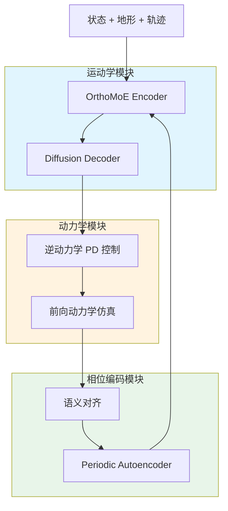
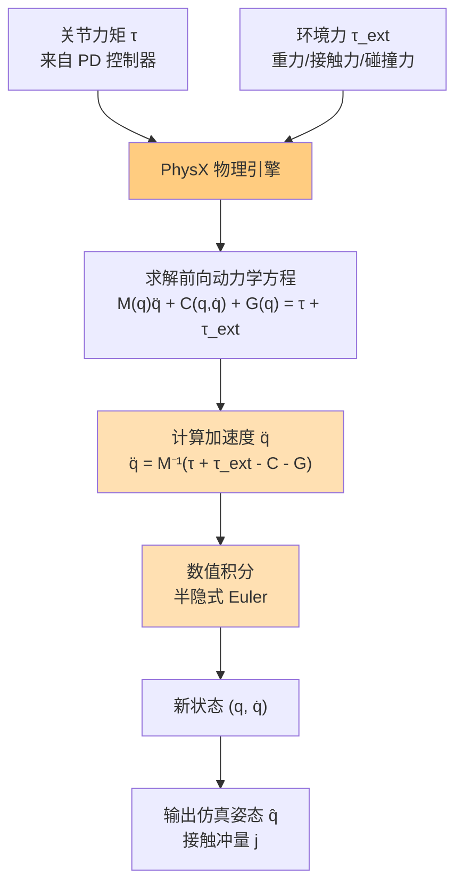

# POMP: Physics-consistent Human Motion Prior through Phase Manifolds

**论文信息**: CVPR 2024, Bin Ji et al., Shanghai Jiao Tong University/Zhejiang University

**Link**: [CVF Open Access](https://openaccess.thecvf.com/content/CVPR2024/html/Ji_POMP_Physics-constrainable_Motion_Generative_Model_through_Phase_Manifolds_CVPR_2024_paper.html)

---

## 一、核心问题

### 1.1 研究背景

大量关于实时运动生成的研究主要聚焦于运动学层面，这常常导致物理上失真的结果（如脚部滑动、漂浮、穿透）。

现有方法主要分为两类：
1. **运动学方法**：易于整合生成模型（VAE、Flow、Diffusion），但缺乏物理约束
2. **物理仿真方法**：基于强化学习或优化，但计算复杂度高，难以训练和应用

最近 DROP 方法尝试将物理仿真器插入预训练的运动学模型，但由于领域鸿沟（domain gap），常常产生不真实的结果。

### 1.2 核心问题

**如何实现物理一致的实时人体运动生成，同时解决领域鸿沟问题？**

### 1.3 本文方法

论文提出了 **POMP** ("**P**hysics-cOnstrainable **M**otion Generative Model through Phase Manifolds"，即"**通过相流形实现物理约束的运动生成模型**")。

**核心思想**：
1. 利用相流形来对齐运动先验与物理约束
2. 合成物理一致且运动学合理的运动
3. 将计算密集型的动力学模块置于训练循环之外

**关键创新**：
- 基于扩散的运动学模块 + 基于仿真的动力学模块 + 相位编码模块
- 首次采用基于相位的语义对齐解决领域鸿沟
- 从 MoCap 数据中提取地形图和全身运动冲量的流程

---

## 二、核心贡献

1. **物理一致的运动生成**
   - 实时对物理扰动进行主动和被动响应
   - 将动力学模块置于基于梯度的训练循环之外，降低计算复杂度

2. **相位语义对齐**
   - 首次采用基于相位的语义对齐方法
   - 解决运动学运动先验与仿真姿态之间的领域鸿沟

3. **地形和冲量数据生成流程**
   - 开发地形重建流程
   - 从动捕数据集中提取全身运动冲量

---

## 三、大致方法

### 3.1 框架概述

POMP 通过循环过程运行，如图 2(a) 所示：

1. **运动学模块**：基于当前运动变量 $x_i$ 生成目标姿态 $\tilde{q}_i$
2. **动力学模块**：
   - PD 控制器计算关节力向量 $\tau_i$
   - 物理引擎执行前向动力学，生成物理合理姿态 $q_i$ 和全身接触冲量 $j_{i+1}$
3. **相位编码模块**：提取对应于仿真姿态 $q_i$ 的相位变量 $p_i$
4. 相位变量与更新的运动变量 $x_{i+1}$ 一起作为下一帧的输入

**关键设计**：POMP 仅需训练运动学生成器和相位编码模块，物理仿真器作为固定的、不可微分组件运行。

**三模块协作**：
1. **运动学模块**：基于扩散的运动先验生成初始目标姿态
2. **动力学模块**：强制执行动态约束，产生仿真姿态（不可微）
3. **相位编码模块**：将仿真姿态投影回运动先验，获取相位位置编码

### 3.2 物理仿真角色建模

**刚体系统**：
- 使用 15 个盒形或胶囊形肢体碰撞器（Unity）
- 比实际肢体数量少，但可适配更复杂的关节结构
- 基于 CMU 数据库的模型尺寸
- 质量根据碰撞器体积和人体平均密度计算
- 实现关节限制，使运动更像人类

**刚体动力学**：
动力学模块执行两种计算：
1. **逆动力学**：运动控制器计算施加到刚体系统的力
2. **前向动力学**：物理仿真器确定角色对环境力的加速度响应

---

### 3.3 运动表示

第 $i$ 帧的运动变量 $x_i$ 由四部分组成：

| 组成部分 | 内容 | 维度 |
|---------|------|------|
| **角色状态** | 关节位置、速度、根关节速度、角速度、步态 one-hot | - |
| **环境信息** | 地形高度、全身接触冲量 | - |
| **相位变量** | 时间窗口上的相位编码、未来输出相位 | - |
| **轨迹位置** | 用户控制轨迹、预测轨迹（2D x-z 平面投影） | - |

---

## 四、详细方法

### 4.1 运动学模块

#### OrthoMoE-based Encoder

- **输入**：$x_i$（541 维，包含全部运动表示信息）
- **输出**：$w_k$（1024 维相位编码）

| 输入 | 输出 | 方法 |
|------|------|------|
| $x_i$ 中的相位变量 | 混合系数 $\alpha$ | 门控网络 $E_g$ |
| $x_i$ | 相位编码 $w_k$ | $E_m$ 中的八个专家网络 |
| 相位编码 + 混合系数 | 加权求和输出 | $\sum_{k=1}^8 \alpha_k w_k$ |

**约束**：各个专家网络的输出互相正交

#### Diffusion-based Decoder

- **输入**：$w$（1024 维条件）
- **输出**：$z_i$（8 × 388 维）

$$
y_i = \sum_{k=1}^8 \alpha_k z_k
$$

为了加速逆向过程，从 Analytic-DPM 获得灵感，将协方差项替换为解析估计。

---

### 4.2 动力学模块 ⭐

动力学模块的核心作用是**强制执行物理约束**，确保生成的动作符合物理定律。包含两个步骤：

#### 4.2.1 逆动力学 (控制)

使用**比例微分（PD）控制器**，根据目标姿态和当前状态计算关节力矩：

$$
\tau = k_p (q^* - q) + k_d (\dot{q}^* - \dot{q})
$$

其中：
- $k_p$: 比例增益
- $k_d$: 微分增益
- $q^*$: 目标姿态（来自运动学模块）
- $q$: 当前姿态（来自仿真）
- $\dot{q}^*$: 目标速度（通常设为 0）
- $\dot{q}$: 当前速度（来自仿真）

#### 4.2.2 前向动力学 (仿真)

**目标**：根据关节力矩 $\tau$ 和环境力，计算加速度并更新状态。

**前向动力学方程**：

$$
M(q)\ddot{q} + C(q, \dot{q}) + G(q) = \tau + \tau_{ext}
$$

**求解加速度**：

$$
\ddot{q} = M(q)^{-1} (\tau + \tau_{ext} - C(q, \dot{q}) - G(q))
$$

**数值积分**：

$$
\dot{q}^{t+\Delta t} = \dot{q}^t + \ddot{q}^t \cdot \Delta t
$$
$$
q^{t+\Delta t} = q^t + \dot{q}^{t+\Delta t} \cdot \Delta t
$$

**物理引擎**：POMP 使用 **Unity PhysX** 进行仿真，选择 Unity 而非 Mujoco 或 IsaacGym 的原因：
1. 支持半自动方法匹配 MoCap 数据的地形
2. 能够收集全身接触力的冲量数据，反馈给运动学模块学习主动响应
3. 与游戏和 VR/AR 应用兼容，便于部署

**仿真流程**（Unity PhysX）：
1. **碰撞检测**：15 个盒形/胶囊形碰撞器与地形和其他物体检测碰撞
2. **接触力计算**：基于碰撞深度和材料属性计算接触力和摩擦力
3. **约束求解**：求解关节约束和接触约束
4. **状态积分**：使用半隐式 Euler（semi-implicit Euler）进行数值积分
   - 先更新速度：$\dot{q}^{t+\Delta t} = \dot{q}^t + \ddot{q}^t \cdot \Delta t$
   - 再更新位置：$q^{t+\Delta t} = q^t + \dot{q}^{t+\Delta t} \cdot \Delta t$

**仿真流程图**：

**为什么需要仿真**：
1. **物理一致性**：确保动作符合牛顿力学、角动量守恒
2. **环境交互**：正确处理与地形、障碍物的接触和碰撞
3. **扰动响应**：对外力扰动做出物理合理的反应
4. **可行性保证**：生成的动作在物理上是可执行的

**挑战与解决**：

| 挑战 | POMP 解决方案 | 动机 |
|------|-------------|------|
| 运动学失真 | 相位编码模块投影回相流形 | 仿真姿态可能落在运动学先验之外 |
| 误差累积 | 语义对齐保证连续性 | 直接仿真结果用于后续帧预测会导致失败 |
| 领域鸿沟 | 相位空间对齐 | 物理仿真与运动学生成之间的差异 |
| 计算复杂度 | 动力学模块置于训练循环外 | 避免对物理仿真器进行昂贵的梯度计算 |

---

### 4.3 相位编码模块

**动机**：仿真姿态可能落在运动学先验之外，导致后续预测破坏运动连续性。

#### Periodic Autoencoder (PAE)

学习紧凑的相流形表示：

| 输入 | 输出 | 方法 |
|------|------|------|
| MoCap 速度序列 $T \times 3NJ$ | - | - |
| 速度序列 ($T=121$) | Latent embedding $T \times 5$ | 1D 卷积 |
| Latent embedding | $a_i, f_i, b_i$ | 可微 FFT |
| Latent embedding | $s_i$ (相移) | MLP |
| $a_i, f_i, b_i, s_i$ | 重构 latent | $L_i = a_i \cdot \sin(2\pi(f_i T - s_i)) + b_i$ |
| 重构 latent | 速度曲线 | 1D 反卷积 |

**相位编码计算**：

$$
pe_i(2t) = a_i^{(t)} \cdot \cos(2\pi \cdot s_i^{(t)})
$$
$$
pe_i(2t+1) = a_i^{(t)} \cdot \sin(2\pi \cdot s_i^{(t)})
$$

其中 $t = 0, 1, 2, 3, 4$。

---

## 五、训练

### 5.1 数据增强

#### 地形重建

采用 PFNN 的地形拟合方法：
1. 计算每帧角色周围的轨迹高度
2. 初始化零值高度图
3. 用运动轨迹逐步"扫描"更新
4. 形成全面的地形数据

#### 接触力获取和姿态仿真

将 MoCap 数据导入 Unity：
1. 收集真实接触冲量 $j_i$（用于训练运动学模块）
2. 生成真实仿真姿态 $\hat{q}_i$（用于训练相位编码模块）

---

## 六、推断

运动学模块预测的输出相位变量 $p_i$ 包含：
1. $pe \in 2 \times C \times T$，$C=5$，$T=0.5L+1=7$
2. $\{f, a, b\} \in 3 \times C \times T$

**输入 PAE 的速度序列**由三部分组成：
- **过去** $(i-60:i)$：使用真实仿真速度
- **近期未来** $(i+1:i+20)$：使用人工仿真速度
- **较远未来** $(i+21:i+60)$：使用目标速度

**人工仿真速度**：基于物理仿真的加速度计算得到的速度。

---

## 七、实验与结论

### 7.1 定量结果

### 7.2 应用场景

1. **VR/AR 虚拟化身**：实时响应物理扰动
2. **游戏角色控制**：适应复杂地形
3. **物理交互动画**：自然的环境交互

---

## 八、局限性

1. **依赖训练数据**：只能生成训练过的动作类型
2. **地形适应性**：复杂地形处理有限
3. **计算成本**：物理仿真仍需一定计算资源

---

## 九、启发

### 9.1 方法学启发

1. **动力学模块外置**：将物理仿真置于训练循环外，避免昂贵的梯度计算
2. **相位语义对齐**：在相流形中解决领域鸿沟问题
3. **准物理效果**：无需特定模拟器专业知识

### 9.2 与相关工作对比

| 方法 | 物理仿真 | 实时性 | 领域对齐 |
|------|---------|-------|---------|
| DeepMimic | 是 | ✓ | 无需 |
| AMP | 是 | ✓ | 对抗学习 |
| POMP | 是 | ✓ | 相位对齐 |

---

## 十、遗留问题

1. **更复杂的地形**：能否处理动态变化的地形？
2. **多角色交互**：能否扩展到多角色物理交互？
3. **更高效仿真**：能否使用更轻量的物理引擎？

---

**笔记说明**：本文是 CVPR 2024 关于物理一致运动生成的工作。核心创新包括：
1. **动力学模块外置**：将物理仿真（逆动力学 + 前向动力学）置于训练循环外，避免昂贵的梯度计算
2. **相位语义对齐**：通过 aligned-PAE 在相流形中解决领域鸿沟问题
3. **前向动力学实现**：使用 Unity PhysX 引擎，求解 $M(q)\ddot{q} + C(q, \dot{q}) + G(q) = \tau + \tau_{ext}$ 方程，通过半隐式 Euler 数值积分更新状态

理解本文有助于学习物理感知的运动生成方法，特别是如何在保持计算效率的同时实现物理一致性。
