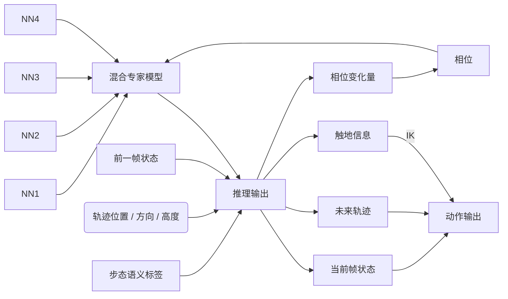
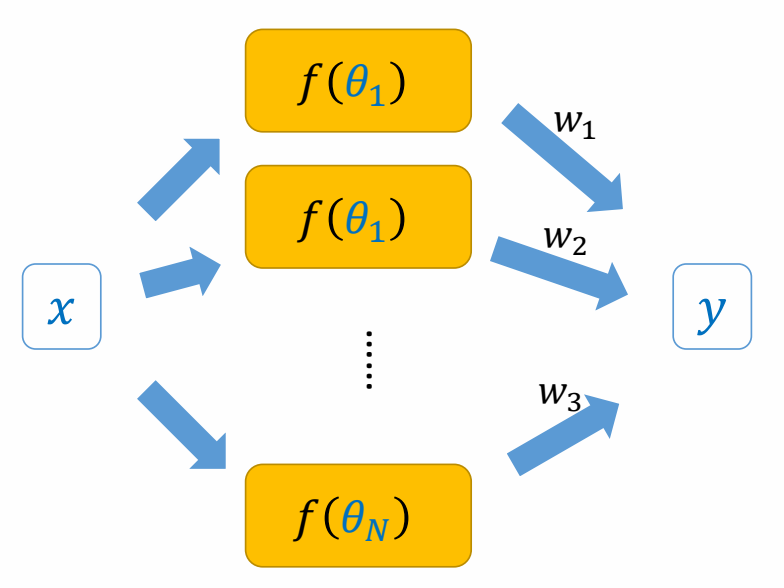
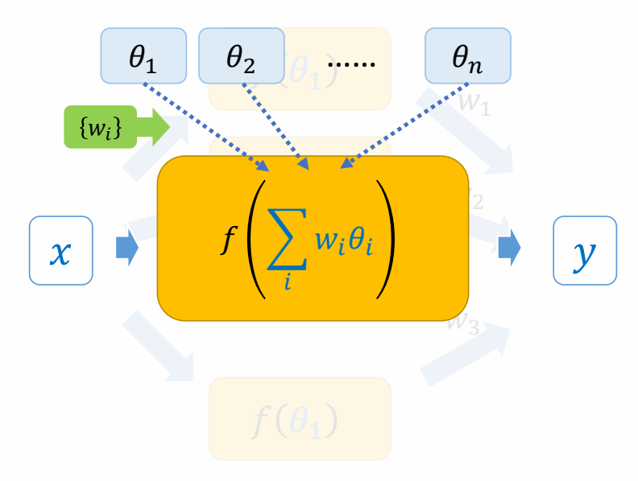
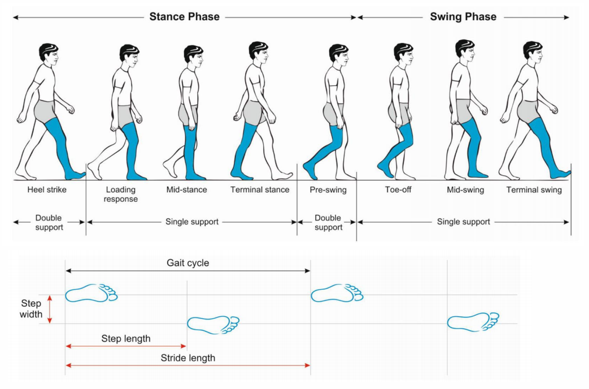
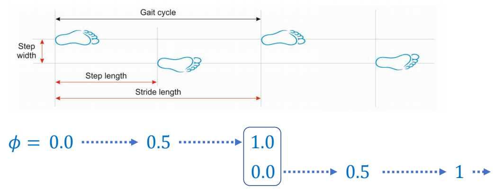
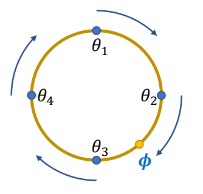
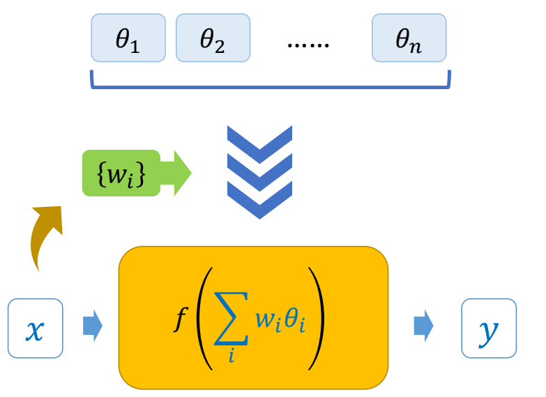
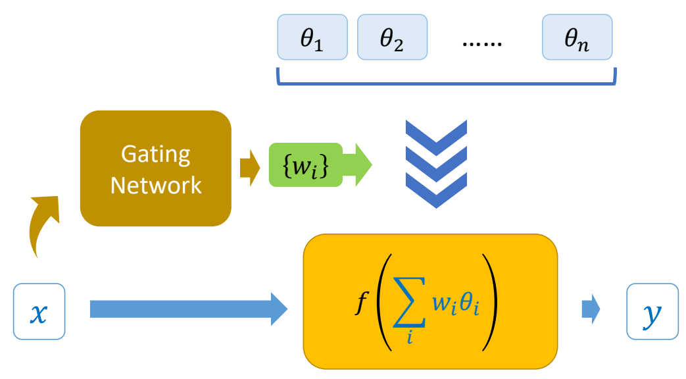

# PFNN: Phase-Functioned Neural Networks for character control

## 研究背景与问题

### 当前方法及存在的问题

1. 传统数据驱动方法（如 Motion Matching）：依赖海量动捕数据，运行时最近邻检索成本高、内存占用大，复杂环境下泛化能力弱，需要大量人工预处理。
2. 自回归模型（RNN/LSTM/ERD）：虽适配实时场景，但长序列运动生成会出现误差累积，导致动作「逐渐消失」「噪声爆炸」、角色漂浮、姿态僵硬等伪影，且静止起步时存在相位歧义问题。
3. CNN 类模型：属于离线框架，需要提前输入完整的控制序列，无法适配游戏中玩家实时输入的动态交互场景。
基于物理的控制方法：可控性极差，调参难度极高，难以同时保证动作自然度和实时响应性。
4. 同时，传统动捕数据均在平地采集，无法支撑角色在复杂地形的运动生成，也是行业的核心瓶颈之一。

### 本文主要创新点

1. 架构创新：相位函数神经网络（PFNN）
首次将运动相位从「网络输入特征」升级为「网络权重的全局参数化变量」，通过周期相位函数动态计算每帧的网络权重，从根源上避免了不同相位的动作混合，彻底解决了自回归模型的误差累积问题，同时保证了相位对运动的强影响力，不会出现传统方法中相位信息被稀释的问题。
2. 数据创新：动捕 - 环境耦合的训练数据流水线
提出了一套全自动的动捕数据与虚拟环境高度图适配方案，从游戏引擎场景中提取高度图，通过误差函数匹配与网格编辑，将平地动捕数据与复杂地形耦合，生成了400 万条带环境信息的训练数据点，让模型学会了根据地形自动调整动作。

## 主要方法

```mermaid
flowchart LR
NN1 & NN2 & NN3 & NN4 & 相位 --> 混合专家模型
混合专家模型 & 前一帧状态 & 目标(轨迹位置 / 方向 / 高度) & 步态语义标签 --> 推理输出
推理输出 --> 当前帧状态 & 未来轨迹 & 触地信息 & 相位变化量
相位变化量 --> 相位
触地信息  -->|IK| 动作输出
当前帧状态 & 未来轨迹 --> 动作输出
```

### 混合专家模型 Mixture of Experts

|对专家结果混合。|对专家模型参数混合。|
|---|---|
| |     |
|\\(y=\sum_{i}^{} w_if(x;\theta _i)\\) | \\(y=f(x;\sum_{i}^{} w_i\theta _i)\\)  &#x2705; PFNN 使用的是这种。 |

> &#x2705; 专家混合的权重由 phase 决定。  
> &#x2705; 让每个专家专一地学特定的 phase.   

$$
x_t = f (x_{t-1}; c_t, \theta _ t = \sum _ {i}^{} w_i(\phi _t) \theta _i)
$$

#### 相位

 

> &#x1F446; phases of a walking gait cycle   

   

> &#x2705; 调整相位与时间的对应关系，可影响走路速度。   

#### 权重：Cubic Catmull-Rom Spline的混合计算方式

   

Cubic Catmull-Rom Spline:   

$$
\begin{align*}
 \theta _t & = \theta _2 \\\\
  & +\phi (-\frac{1}{2} \theta _1 + \frac{1}{2} \theta _3) \\\\
  & +\phi^2 (\theta _1-\frac{5}{2} \theta _2 + 2\theta _3-\frac{1}{2} \theta _4)\\\\
  & +\phi^3 (-\frac{1}{2} \theta _1+\frac{3}{2} \theta _2 - \frac{3}{2} \theta _3+\frac{1}{2} \theta _4)
\end{align*}
$$

### 模型推理

#### 输入输出参数化

输入：
- 前一帧状态：前一帧关节位置 / 速度
- 轨迹控制与环境特征：轨迹位置 / 方向 / 高度、
- 步态语义标签

步态语义标签是5 维二进制向量，标识用户期望的是动作是站立、行走	、慢跑、跳跃、俯身中的一种，由人工标注得到。

轨迹控制与环境特征及步态语义标签，覆盖过去 1 秒、未来 0.9 秒的 12 个采样帧；

前一帧状态仅覆盖过去一帧。

输出：
- 当前帧状态：当前帧关节姿态 / 速度 / 角度、根节点运动速度、
- 相位变化量
- 足部接触标签
- 下一帧轨迹预测。

## 关键问题与解答

### 为什么 PFNN 选择将相位作为网络权重的参数化变量，而非像传统方法一样作为普通的输入特征？

1. 更好地将不同相位的运动信息解耦，避免相位混合导致的Artifacts。
2. 避免Dropout导致训练中相位的影响被稀释
3. 通过相位动态生成权重，仅用 4 个控制点的样条，就让极简的 3 层全连接网络具备了海量运动数据的拟合能力，同时保持了 10MB 的极小内存占用，实现了表达能力与轻量化的平衡，这是固定权重的传统网络无法实现的。

### 地形匹配的核心的逻辑

人体移动的核心逻辑：无论平地还是崎岖地形，人类行走的「触地 - 抬脚 - 腾空 - 落地」的周期时序规律是完全一致的，地形仅改变「落地位置的高度」，不改变运动的核心时序逻辑。这就为平地动作与地形的匹配，提供了唯一且精准的锚点。

动捕数据不仅包含平地行走，还覆盖了慢跑、奔跑、不同高度的跳跃、不同幅度的俯身等动作，这些动作本身就包含了「腿部抬高 / 降低、身体重心调整」的能力，只是在平地采集时没有触发，而地形匹配的过程，就是把这些能力和地形高度做了对应。

P53   
## Advanced Phase Functions

|改进前|改进后|
|---|---|
|    |   |

> &#x2705; PFNN 有确定的象位及对应的权重，但打篮球等动作，或动物走路，没有确定的象位。  
> &#x2705; 因此不再显示地定义相位和权重，权重由当前状态与用户输入算出来。   
