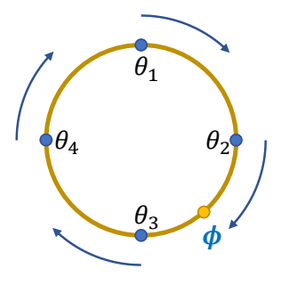
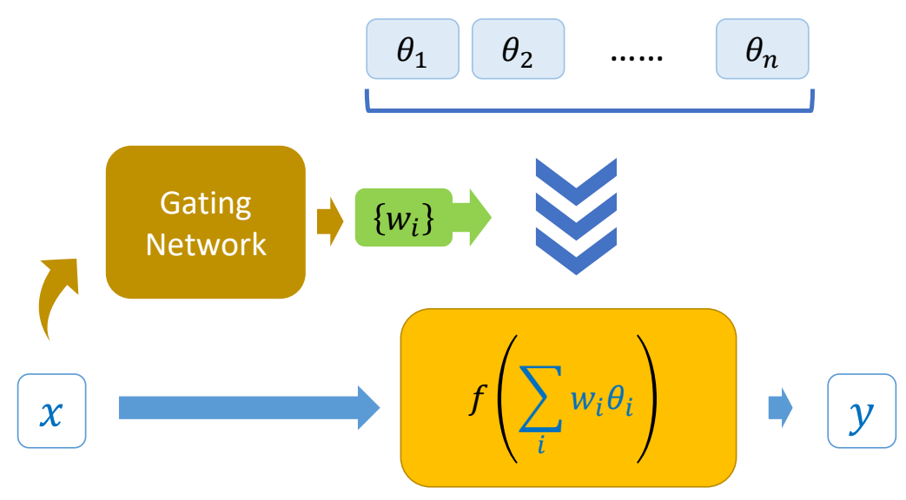

# PFNN: Phase-Functioned Neural Networks

P43  
## 控制信号

  

> &#x2705; 控制参数，表明用户希望角色怎么走。相位参数，表明当前的状态。     

P44  
## 相位参数

### 相位参数的定义

 

> &#x1F446; phases of a walking gait cycle   

> &#x1F50E; *Gait disorders in adults and the elderly*   
Pirker and Katzenschlager 2017.    

P45  

$$
x_t=f(x_{t-1};z_t)  \quad \quad z_t=(c_t,\phi _t)
$$

   

> &#x2705; 调整相位与时间的对应关系，可影响走路速度。   

P47    
### Mixture of Experts

|对专家结果混合。|对专家模型参数混合。|
|---|---|
| |     |
|\\(y=\sum_{i}^{} w_if(x;\theta _i)\\) | \\(y=f(x;\sum_{i}^{} w_i\theta _i)\\)  &#x2705; PFNN 使用的是这种。 |

P49   
$$
x_t = f (x_{t-1}; c_t, \theta _ t = \sum _ {i}^{} w_i(\phi _t) \theta _i)
$$

   

> &#x2705; 专家混合的权重由 phase 决定。  
> &#x2705; 让每个专家专一地学特定的 phase.   

P50   
### Cubic Catmull-Rom Spline的混合计算方式

   

Cubic Catmull-Rom Spline:   

$$
\begin{align*}
 \theta _t & = \theta _2 \\\\
  & +\phi (-\frac{1}{2} \theta _1 + \frac{1}{2} \theta _3) \\\\
  & +\phi^2 (\theta _1-\frac{5}{2} \theta _2 + 2\theta _3-\frac{1}{2} \theta _4)\\\\
  & +\phi^3 (-\frac{1}{2} \theta _1+\frac{3}{2} \theta _2 - \frac{3}{2} \theta _3+\frac{1}{2} \theta _4)
\end{align*}
$$

> &#x2705; PFNN 缺点 （1）轻微滑步  （2）急转身时无减速。   

P53   
## Advanced Phase Functions

|改进前|改进后|
|---|---|
|    |   |

> &#x2705; PFNN 有确定的象位及对应的权重，但打篮球等动作，或动物走路，没有确定的象位。  
> &#x2705; 因此不再显示地定义相位和权重，权重由当前状态与用户输入算出来。   
