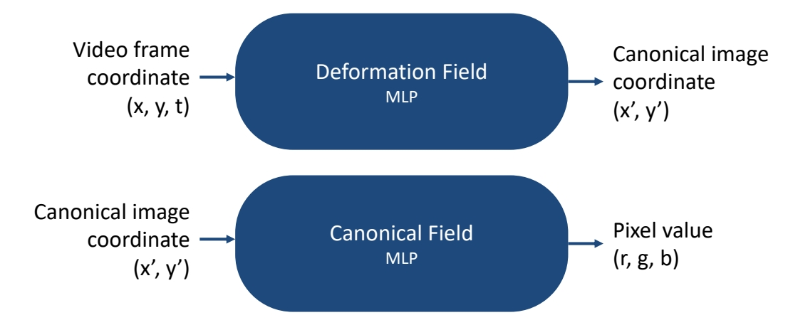
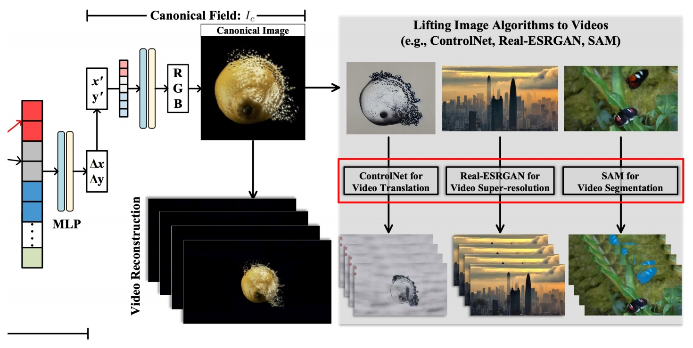
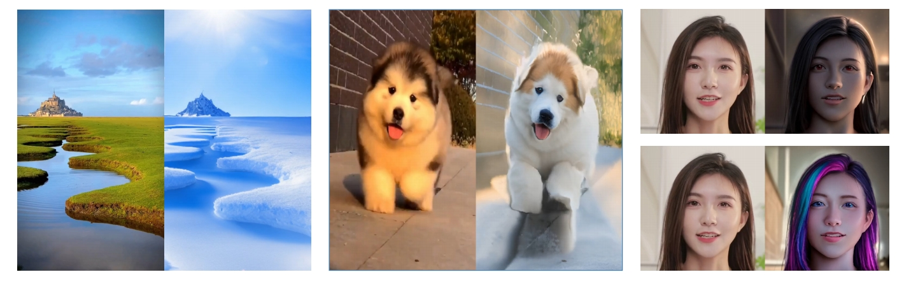

# Content Deformation Fields for Temporally Consistent Video Processing

## Content Deformation Field (CoDeF)

Edit a video = edit a canonical image + learned deformaeon field

 - Limitations of Neural Layered Atlases   
    - Limited capacity for faithfully reconstructing intricate video details, missing subtle motion features like blinking eyes and slight smiles   
    - Distorted nature of the estimated atlas leads to impaired semantic information   

 - Content Deformation Field: inspired by dynamic NeRF works, a new way of representing video, as a 2d canonical image + 3D deformation field over time   

**Problem Formulation**

 - Decode a video into a 2D canonical field and a 3D temporal deformation field   
 - Deformation Field: video (x, y, t) → canonical image coordinate (x’, y’)   
 - Canonical Field: (x’, y’) → (r, g, b), like a “2D image”   

 

P251    

**CoDeF compared to Atlas**

 - Superior robustness to non-rigid motion   
 - Effective reconstruction of subtle movements (e.g. eyes blinking)    
 - More accurate reconstruction: 4.4dB higher PSNR   

> &#x2705; CoDef 把 3D 视频压缩为 2D Image，因此可以利用很多 2D 算法，再把 deformation 传递到整个视频。    

P252   
 

> &#x2705; 在时序上有比较好的一致性。   
> &#x2705; 由于使用了 control net，与原视频在 Spatial level 也保持得非常好。   

P253   
 