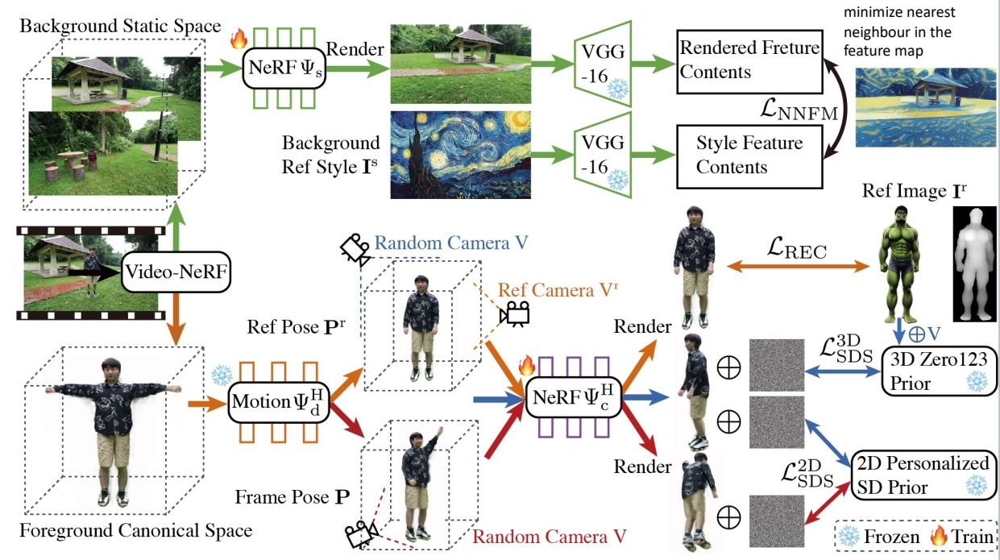

# DynVideo-E: Harnessing Dynamic NeRF for Large-Scale Motion- and View-Change Human-Centric Video Editing

Edit a video = edit a canonical ~~image~~ 3D NeRF   

Canonical image in CoDeF is still 2D   

Can we represent the video in a truly 3D space?   

P255  

 

> &#x2705; 利用现有成熟技术，把 3D 场景用 Nerf 表示出来编辑也是在 3D 上进行。    

P256   
> &#x2705; Nerf 在人体成像上比较好。   
> &#x2705; Dynamic NeRF 本身也是比较难的。    

P257    

**Main idea**

 - For the first time introduce the dynamic NeRF as an innovative video representation for large-scale motion- and view-change human-centric video editing.   

> &#x2705; 不直接编辑图像，而是编辑 Nerf．   
> &#x2705;（1）认为背景静止，学出背景 Neof．   
> &#x2705; Stale Diffusion 用来计算 Loss.  

P258  

Follow HOSNeRF, represent the video as:   
 - Background NeRF   
 - Human NeRF   
 - Deformation Field   

Edit background NeRF and human NeRF respectively   

 

P259  

DynVideo-E significantly outperforms SOTA approaches on two challenging datasets by a large margin of 50% ∼ 95% in terms of human preference   
