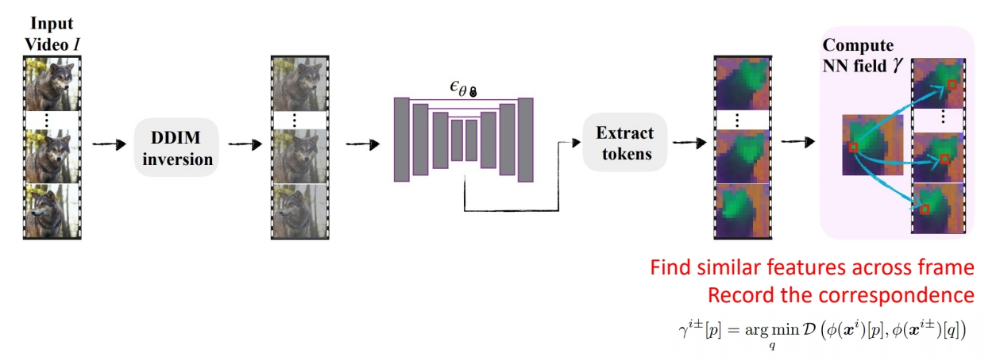

# TokenFlow: Consistent Diffusion Features for Consistent Video Editing

P179   
## TokenFlow

Consistent high-quality semantic edits

Main challenge using T2I to edit videos without finetuning: temporal consistency  

 

> &#x2705; 视频编辑领域比较难的问题：怎么保持时序一致性。

P180   

### **Key Idea**

 - Achieve consistency by enforcing the inter-frame correspondences in the original video   

P181   

### **Main idea**

 

> &#x2705; 在 UNet 中抽出 feature map 之后，找 correspondence 并记录下来。在 denoise 过程中把这个 correspondence 应用起来。   
> &#x2753; 什么是 inter-frame correspondence? 例如每一帧的狗的眼睛的运动。要让生成视频的狗的眼晴具有相同的运动。  

P182  

During conditional denoising, use features from corresponding positions in preceding and following frames instead of the pixel's own feature at output of extended-attention

  
 

> &#x2705; 在 DDIM inversion 过程中，把 attention maps 保存下来了，在 denoise 时，把这个 map 结合进去。    
> &#x2705; 在 attention map 上的演进。  

P183   

### Result 

 

> &#x2705; 逐帧编辑抖动严重，而 Token Flow 更稳定。  
