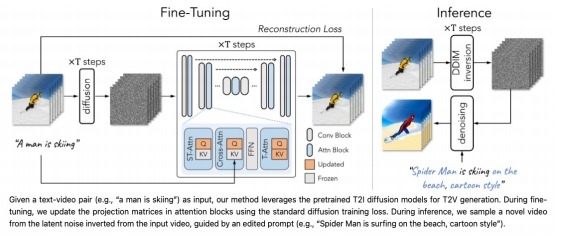
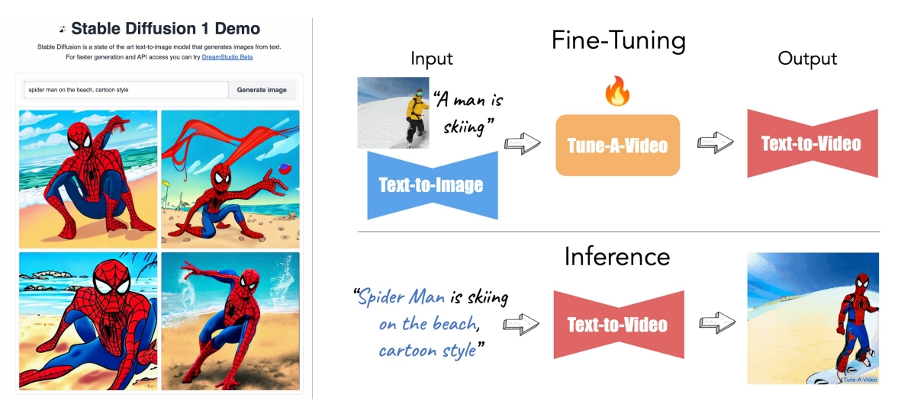
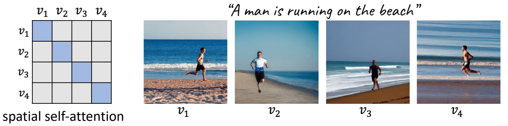
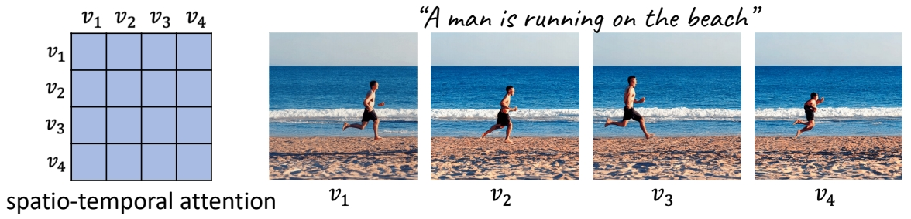
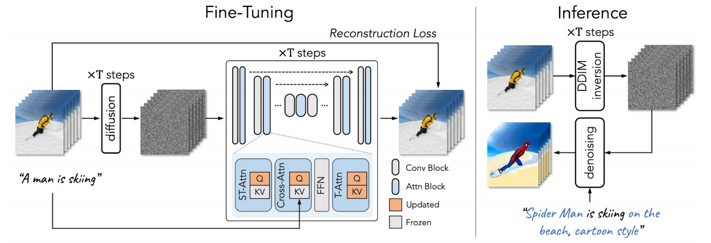
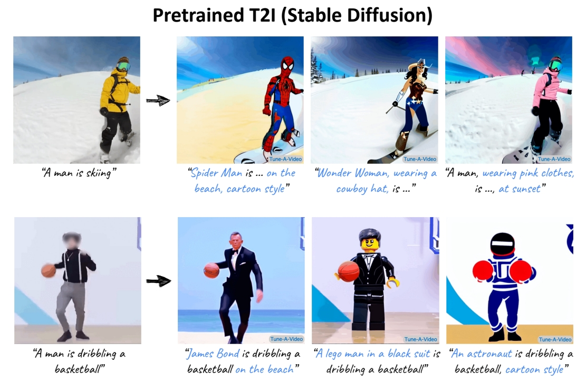
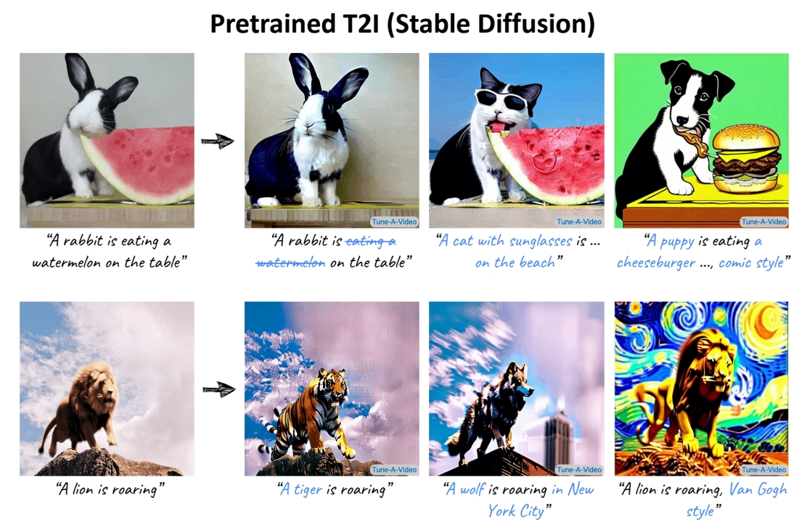
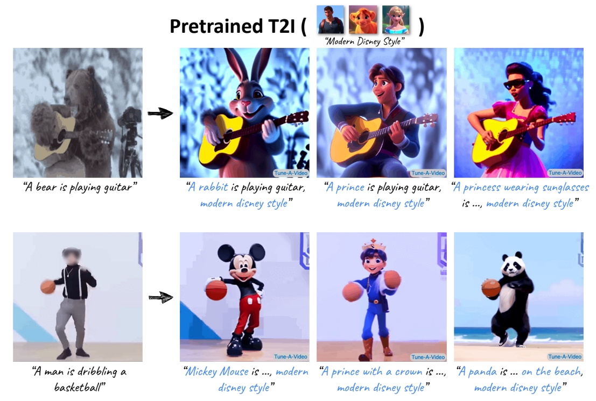
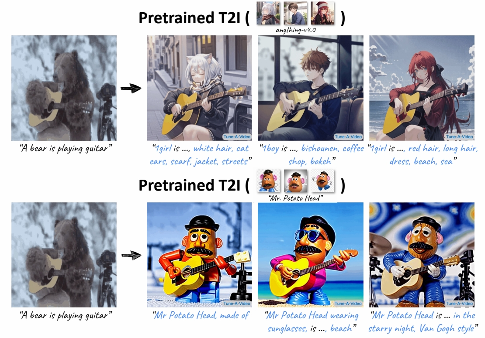
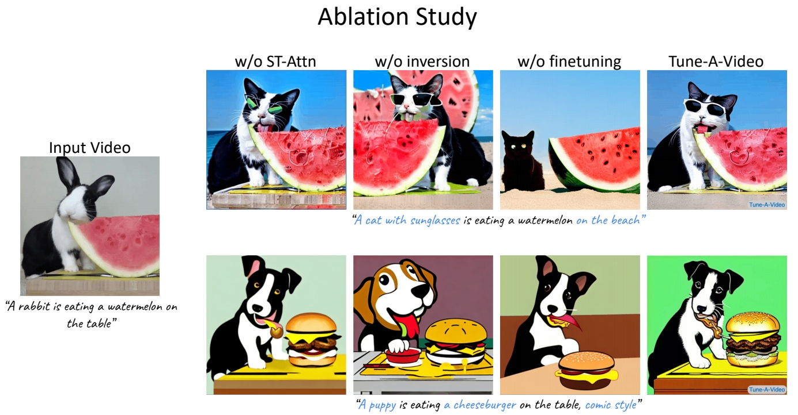

# Tune-A-Video: One-Shot Tuning of Image Diffusion Models for Text-to-Video Generation

P150  
## Tune-A-Video

One-shot tuning of T2I models for T2V generation/editing

    

 

### **Motivation**

Motivation: appearance from pretrained T2I models, dynamics from a reference video 

   

P153

### 方法

**Obs #1: Still images that accurately represent the verb terms**

  

**Obs #2: Extending attention to spatio-temporal yields consistent content**

  

P154   

  

P155

  

**Full finetuning**: finetunes the entire network

 - inefficient, especially when #frames increases;   
 - prone to overfitting → poor editing ability.   

**Our tuning strategy**: update the specific projection matrices

 - parameter efficient and fast (~10 min);    
 - retains the original property of pre-trained T2I diffusion models.   

\begin{align*} \mathcal{V} ^\ast =\mathcal{D} (\mathrm{DDIM-samp} (\mathrm{DDIM-inv} (\varepsilon (\mathcal{V} )),\tau^\ast  ))\end{align*}

**Structure guidance via DDIM inversion**

 - preserves the structural information   
 - improves temporal consistency      

P156  
### 主观效果

    
P157  
 
P158  
 
P159  
  
P160  
  

P161
### 客观指标

 

**Automatic metrics – CLIP Score**

 - *Frame Consistency*: the average cosine similarity between all pairs of video frames   
 - *Textual Alignment*: average CLIP score between all frames of output videos and corresponding edited prompts    

**User study** 

Compare two videos generated by our method and a baseline (shown in random order):   

 - *Which video has better temporal consistency?*    
 - *Which video better aligns with the textual description?*    

Wu et al., “Tune-A-Video: One-Shot Tuning of Image Diffusion Models for Text-to-Video Generation,” ICCV 2023.

> &#x2705; base model：没有太多 motion.   

### Reference

<https://github.com/showlab/Tune-A-Video>