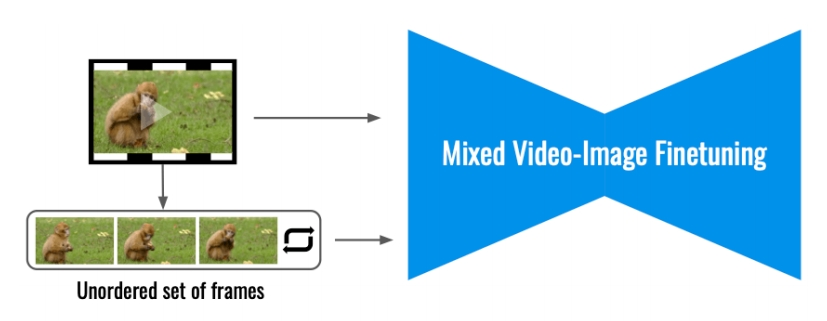
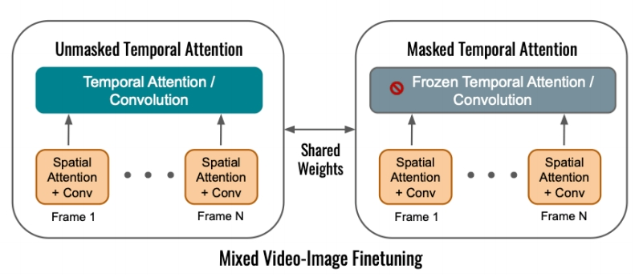
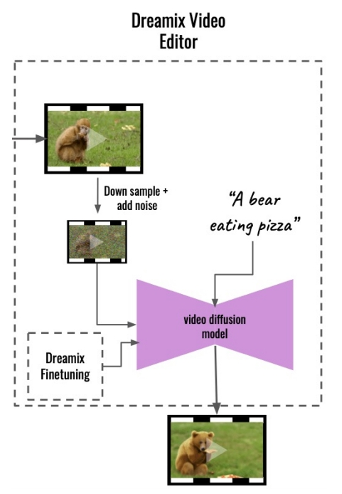

# Dreamix: Video Diffusion Models are General Video Editors

## Dreamix

Few-shot finetuning for personalized video editing

**Main idea: Mixed Video-Image Finetuning**

 - Finetune Imagen Video (Ho et al., 2022) which is a strong video foundation model

 

 - Finetuned to generate individual frames (bypassing temporal attentions) & video

 

P163  

**Inference Overview**

 - Corrupt the input video by downsampling and add noise   
 - Apply the finetuned video diffusion model to denoise and upscale   

  