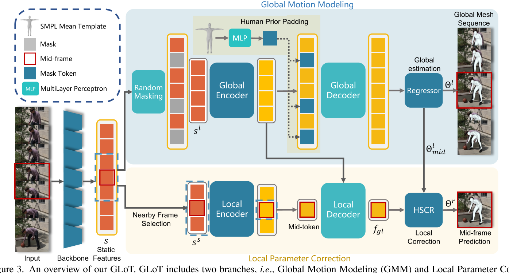

# Global-to-Local Modeling for Video-based 3D Human Pose and Shape Estimation

|缩写|英文|中文|
|---|---|---|
|GLoT|Global-to-Local Transformer|
|HSCR|Hierarchical Spatial Correlation Regressor|分层空间相关回归器|
|GMM|Global Motion Modeling|全局运动建模|
|LPC|Local Parameter Correction|局部参数校正|

## 核心问题是什么?

### 背景

video-based 3D HPE通过**帧内精度和帧间平滑度**进行评估。

> 帧内精度 是指单帧动作的准确性。帧间平滑度 是指一个动作序列的趋势一致性。  

### 现有方案

尽管这两个指标负责不同范围的时间一致性，但现有的最先进方法将它们视为一个统一的问题，并使用单调的建模结构（例如 RNN 或 attention-based block）来设计其网络。

### 存在的问题

然而，使用单一类型的建模结构很难平衡短期和长期时间相关性的学习，并且可能使网络偏向其中一种，导致不好的预测结果，例如：
- 全局位置偏移
- 时序上不一致
- 单帧动作不准确

### 解决方法

为了解决这些问题，我们提出一种端到端框架称为 Global-to-Local Transformer (GLoT)，可以结构性地解耦“长期特征的建模”和“短期特征的建模”。
- 首先，引入了global transformer以及用于长期建模的Masked HPE策略。该策略通过随机屏蔽多个帧的特征来刺激global transformer学习更多的帧间相关性。

> 是否能用于流式？

- 其次，local transformer负责利用人体mesh上的局部细节，并通过利用cross-attention与global transformer进行交互。
- 此外，进一步引入了Hierarchical Spatial Correlation Regressor，通过解耦的全局-局部表示和隐式运动学约束来细化帧内估计。

### 效果

我们的 GLoT 在流行基准（即 3DPW、MPI-INF-3DHP 和 Human3.6M）上以最低的模型参数超越了以前最先进的方法

## 核心贡献是什么？

- 解耦长期和短期相关性的建模。所提出的Global-to-Local Transformer（GLoT）融合了深层网络和人类先验结构的知识，提高了我们方法的准确性和效率。
- GLoT中包含两个组件，即Global Motion Modeling和Local Parameter Correction，分别用于学习帧间全局局部上下文和帧内人体网格结构。
- 在三个数据集的实验表明，GLoT 优于之前最先进的方法 [44]，且模型参数更少。

## 大致方法是什么？

GLoT包括两个分支，即全局运动建模（GMM）和局部参数校正（LPC）。
- 首先从预训练的 ResNet-50 [11] 中提取Static Features，参考 [5, 17, 44]。
- 然后，通过Random Masking(分支1)和Nearby Frame Selection（分支2）分别处理静态特征 S，以将它们（Sl，Ss）输入全局和局部transformer。
- 最后，分层空间相关回归器（HSCR）使用解耦的全局-局部表示\\(f_{gl}\\)和内部运动学结构来校正GMM获得的全局结果\\(θ^l_{mid}\\)。
- 请注意，我们的方法利用 T 帧来预测中间帧，参考[5,44]

### Global Motion Modeling

1. 沿时间维度随机屏蔽一些static token，α是屏蔽比率。（灰）  
2. 将global encoder应用于这些未被mask的static token。（红->黄）
3. 将 SMPL token [10]填充到被mask的位置上（蓝）  
4. 在global decoder阶段，将整个序列发送到global decoder中以获得long-term表示。  
5. 将interate regressor应用于long-term表示以得到初始的全局mesh序列。

GMM得到的SMPL参数表示如下：  

|||
|---|---|
|位姿参数|Tx24×6|
|形状参数|T ×10|
|伪相机参数|T ×3|

> 形状参数和相机参数通常是耦合的

### Local Parameter Correction

人体运动的在中间帧中受到附近帧的显著影响

1. 择附近的帧进行short-term建模，w 是附近帧的长度  
2. 对选定的tokens使用local encoder。  
3. local decoder不仅通过cross attention机制解码代表全局人类运动一致性的特征，还解码代表局部细粒度人类mesh结构的特征。cross attention函数定义如下，  

|||
|---|---|
|Q|a query of the mid-token|
|K|key of the global encoder|
|V|value of the global encoder|

### HSCR

以前的方法：使用HMR直出SMPL参数，而不考虑骨骼结构。  
存在的问题：没有考虑骨骼结构，结合骨骼结构信息可以得到更好的结果。  
本文方法：[42]结合local分支的输出来优化global分支的结果。  

1. 以骨骼结构为依据拼接pose特征，以一整个骨骼链的pose特征来描述这个关节的pose特征。  
2. 以global branch的原始输出l和local branch的输入gl为特征，使用MLP，预测l需要调整的量s  
3. 把s叠加到l上，为最终输出r。    

### Loss Function

1. global branch的输出的GT SMPL参数之间的L2 loss，只对mask的帧计算loss - 重建loss  
2. 2D/3D关节位置的速度 - 可以帮助模型学习运动一致性  
3. Masked HPE strategy - 更好地捕获远程依赖性

## 有效

## 缺陷

不支持流式

## 验证

## 启发

global E&D, local E&D、MASK策略、refine策略

## 遗留问题

## 参考材料

https://blog.csdn.net/weixin_44880995/article/details/132674988