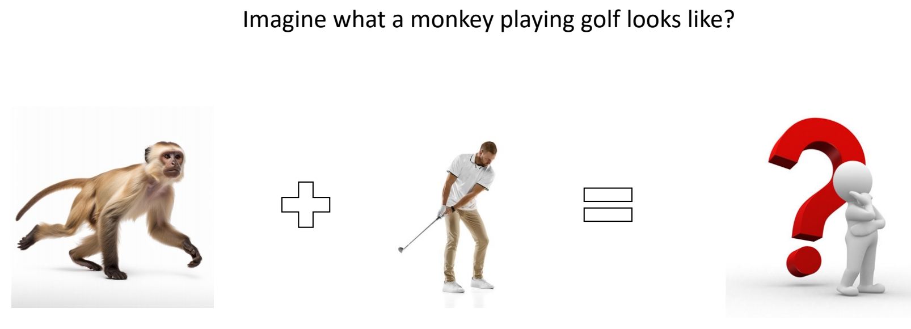

# MotionDirector: Motion Customization of Text-to-Video Diffusion Models

Tune on multiple videos of a motion to be customised

 

 

   

P171   

 - MokonDirector can customize foundakon models to generate videos with desired tokons.

 

P172   

 - The challenge is generalizing the learned motions to diverse appearance.   
 - MotionDirector learns the appearances and motions in reference videos in a decoupled way, to avoid overfitting on the limited appearances.   

   

P173   

 - Decouple appearance and motion.

    

P174   

### Result

- Comparing with other methods.

   

P175   

    

P176  

 
     
