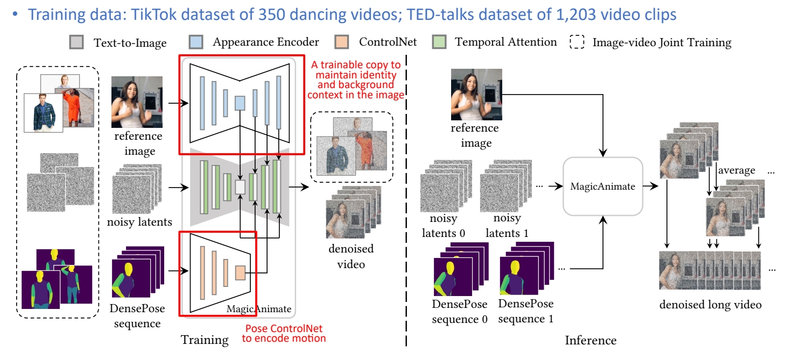
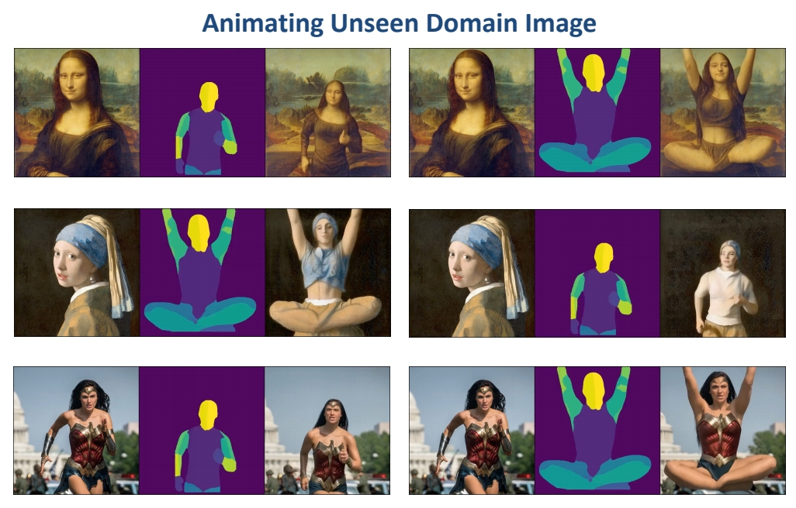

# MagicAnimate: Temporally Consistent Human Image Animation using Diffusion Model

**Challenges**

 - Flickering video   
 - Cannot maintain background   
 - Short video animation results   

**Possible Cause**

 - Weak appearance preservation due to lack of temporal modeling    

> &#x2705; 把 pose control net 加到核心的 U-Net 生成。   
> &#x2705; 把原始 U-Net fix, copy- 分可以 train 的 U-Net.    
> &#x2705; 输入：reference image, 两个 U-Net 在部分 layer 进行结合达到前景 appearance 和背景 appeorance 的 Encode 推断时输入多个 Sequence, 可以生成 long video.   

P219   

  

P220   

 

P223   

 