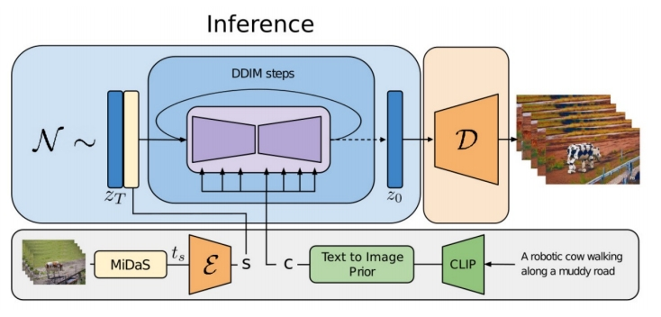

# Structure and Content-Guided Video Synthesis with Diffusion Models

 - Inflate Stable Diffusion to a 3D model, finetune on pretrained weights   
 - Insert temporal convolution/attention layers   
 - Finetune to take **per-frame depth as conditions**   

|||
|--|--|
|   |   |

> &#x2705; 特点：(1) 不需要训练。 (2) 能保持前后一致性。   

P60 

P61   

 - Condition on structure (depth) and content (CLIP) information.   
 - Depth maps are passed with latents as input conditions.   
 - CLIP image embeddings are provided via cross-attention blocks.   
 - During inference, CLIP text embeddings are converted to CLIP image embeddings.    
   

> &#x2705; 用 depth estimator 从源视频提取 struct 信息，用 CLIP 从文本中提取 content 信息。   
> &#x2705; depth 和 content 分别用两种形式注入。depth 作为条件，与 lantent concat 到一起。content 以 cross attention 的形式注入。    