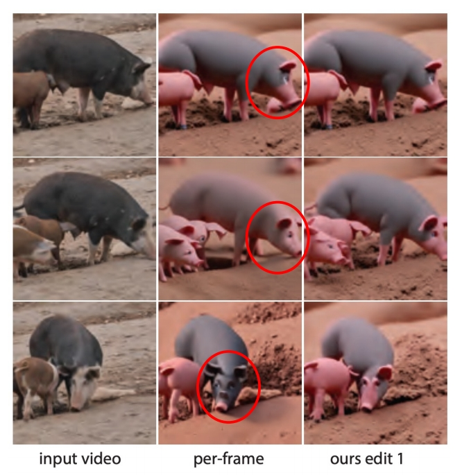
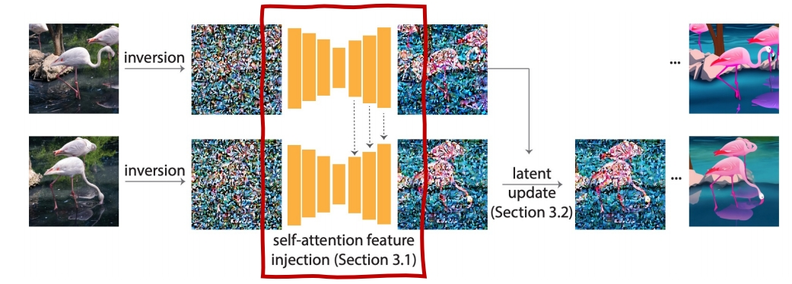
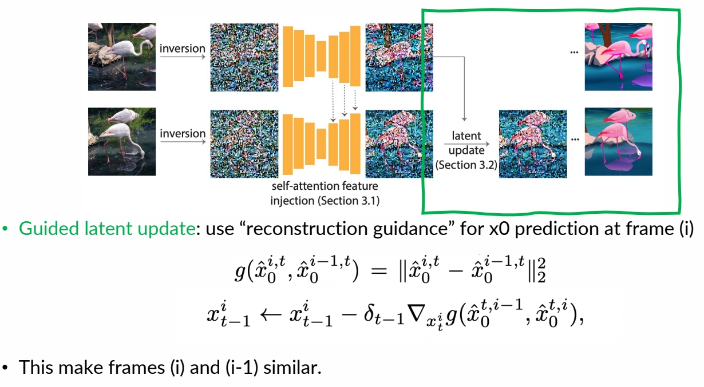
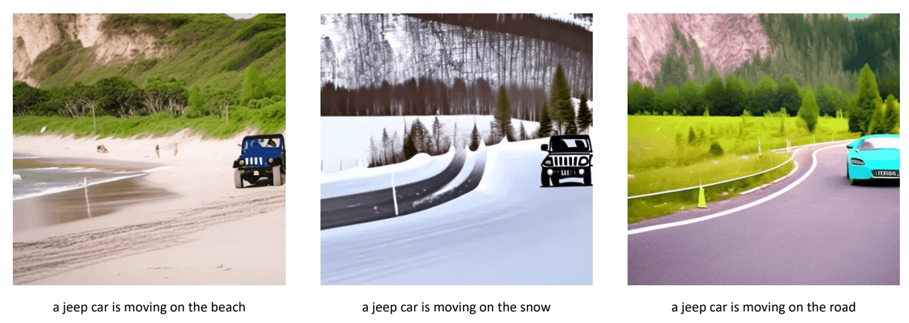
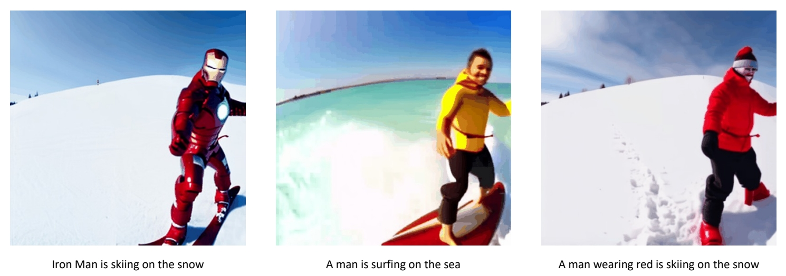

# Pix2Video: Video Editing using Image Diffusion

 - Given a sequence of frames, generate a new set of images that reflects an edit.   
 - Editing methods on individual images fail to preserve temporal information.    

> &#x2705; 没有 3D diffusion model，只是用 2D diffusion model 生成多张图像并拼成序列。关键在于保持时序的连续性。    

 - Leverage a pretrained per-frame depth-conditioned Stable Diffusion model to edit frame by frame, to maintain motion consistency between source video and edited video
 - No need for training/finetuning

 

P195   

### How to ensure temporal consistency?   

#### Obtain initial noise from DDIM inversion   

  

> &#x2705; (1) 用每一帧的原始图像的 inversion 作为 init noise.   
> &#x2705; (2) 下一帧的生成会引用上一帧的 latent.    
> &#x2705; (3) 生成的中间结果上也会有融合。   

P196   
#### **Self-Attention injection:** 

Inject self-attention features from the previous frame in U-Net for generating the current frame    

   

- Use the latent of the previous frame as keys and values to guide latent update of the current frame   

    

    

> &#x2705; reconstruction guidance，使生成的 latent code 与上一帧接近。    

> &#x2705; (1) 使用 DDIM inversion 把图像转为 noise．   
> &#x2705; (2) 相邻的 fram 应 inversion 出相似的 noise．    
> &#x2705; 使用 self-attention injection 得到相似的 noise.

P197   
### Result

 

P198   

  
