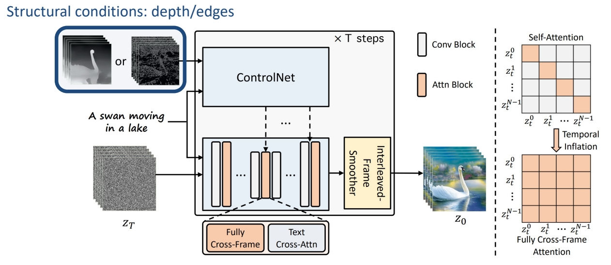
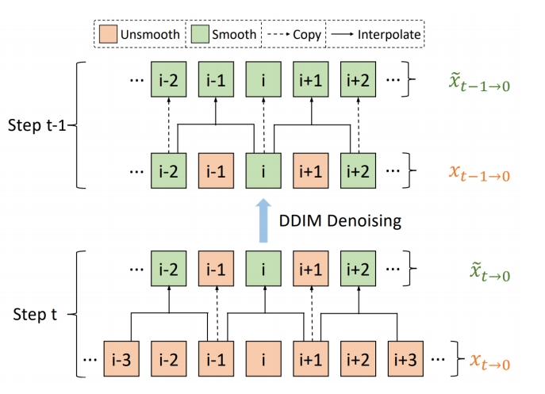

# ControlVideo: Training-free Controllable Text-to-Video Generation

提出无需训练的框架，通过结构一致性实现可控文本到视频生成。

 - Input structural conditions through **ControlNet**

 

> &#x2705; 使用预训练的 stable diffusion, 无需额外训练。   
> &#x2705; control net 是与 stable diffusion 配对的。   
> &#x2705; control net 以深度图或边缘图为条件，并在时间维度上 embed 以此得到的Z。与原始视频有比较好的对应关系，但仍存在 temporal consistency 问题。   

P201  

 - Use pretrained weights for Stable Diffusion & ControlNet, no training/finetuning   
 - Inflate Stable Diffusion and ControlNet along the temporal dimension   
 - Interleaved-frame smoothing during DDIM sampling for bever temporal consistency    

    

> &#x2705; 解决 temporal consistency 问题，方法：   
> &#x2705; 在每个 timestep，让不同帧成为前后两帧的融合。    
> &#x2753; control net 与 diffusion medel 是什么关系？     

P202   

 

P203   

  

P207    

> &#x2705; 除了 control net, 还使用光流信息作为引导。   
> &#x2705; Gop：Group of Pictures.    