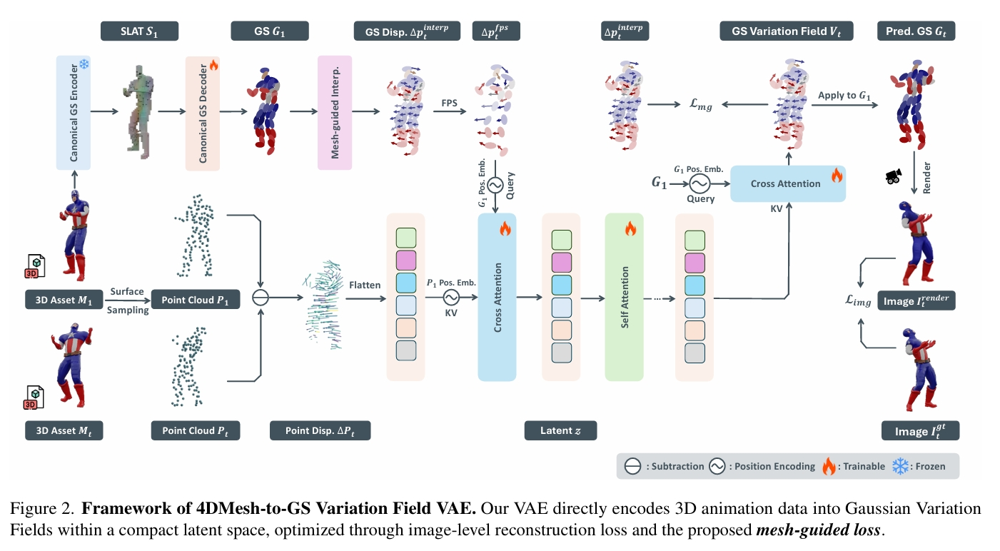

# Gaussian Variation Field Diffusion for High-fidelity Video-to-4D Synthesis

## 核心问题是什么?

视频到4D生成框架，可从单段视频输入中创建高质量动态3D内容。

 

### 现有方法及局限性

直接进行4D扩散建模因数据构建成本高昂，且需联合表征3D形状、外观与运动的高维特性而极具挑战性。

### 本文方法及优势

**直接4D网格-高斯场变分自编码器**（Direct 4DMesh-to-GS Variation Field VAE）：无需逐实例拟合，直接从3D动画数据中编码规范高斯溅射点（GS）及其时序变化，将高维动画压缩至紧凑潜空间。  

 

**高斯变分场扩散模型**：该模型采用时序感知型扩散Transformer架构，以输入视频和规范GS作为条件。

 

通过在Objaverse数据集精选的可动画3D对象上训练，本模型相较现有方法展现出更优的生成质量。尽管仅使用合成数据训练，其对真实场景视频输入仍表现出卓越的泛化能力，为高质量动态3D内容生成开辟了新路径。项目页面：GVFDiffusion.github.io。

## 主要方法

