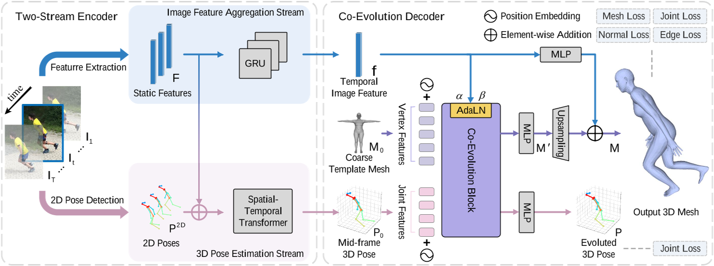
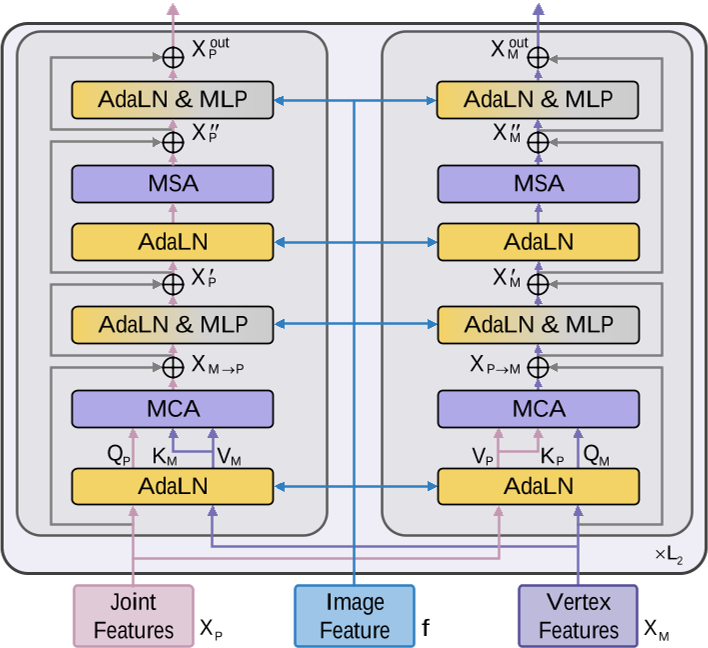

# Co-Evolution of Pose and Mesh for 3D Human Body Estimation from Video

|缩写|英文|中文|
|---|---|---|
|PMCE|Pose and Mesh Co-Evolution network|姿势和Mesh协同进化网络|
|AdaLN|Adaptive Layer Normalization|自适应层标准化|

## 核心问题是什么?

### 背景

尽管基于单图像的 3D 人体网格恢复取得了重大进展，但从视频中**准确**、**平滑**地恢复 3D 人体运动仍然具有挑战性。

### 现有方法

现有的基于视频的方法通常通过从耦合图像特征估计复杂的姿势和形状参数来恢复人体网格，其高复杂性和低表示能力通常导致不一致的姿势运动和有限的形状模式。

### 本文方法

为了缓解这个问题，我们引入 3D 姿势作为中介，并提出一种姿势和Mesh协同进化网络（PMCE），将该任务分解为两部分：  
1）基于视频的 3D 人体姿势估计  
2）从估计的 3D 姿态和时间图像特征回归顶点。

具体来说，我们提出了一种双流编码器，用于估计中间帧 3D 姿势并从输入图像序列中提取时间图像特征。此外，我们设计了一个协同进化解码器，它与图像引导自适应层归一化（AdaLN）执行姿势和网格交互，以使姿势和网格适合人体形状。

### 效果

大量实验表明，所提出的 PMCE 在三个基准数据集（3DPW、Human3.6M 和 MPI-INF-3DHP）上的每帧精度和时间一致性方面均优于以前最先进的方法。我们的代码可在 https://github.com/kasvii/PMCE 获取。

## 核心贡献是什么？

- 提出了一种姿势和网格协同进化网络 (PMCE)，用于从视频中恢复 3D 人体网格。它将任务分解为两部分：基于视频的 3D 位姿估计，以及通过图像引导位姿和网格协同进化进行网格顶点回归，从而实现准确且时间一致的结果。 
- 设计了协同进化解码器，该解码器在我们提出的 AdaLN 的指导下执行姿势和网格交互。 AdaLN根据图像特征调整关节和顶点特征的统计特性，使其符合人体形状。 
- 方法在 3DPW 等具有挑战性的数据集上实现了最先进的性能，将 MPJPE 降低了 12.1%，PVE 降低了 8.4%，加速误差降低了 8.5%。

## 大致方法是什么？

PMCE包括两个时序步骤：  
1）基于视频的 3D 姿态估计：关注人体骨骼，根据姿势预测准确、平滑的人体运动。  
2）根据 3D 姿态和时间图像特征进行网格顶点回归：利用视觉线索补充人体形状信息，恢复准确的Mesh网格并细化预测的 3D 姿势，实现姿势和网格的协同进化。

|输入|输出|方法|
|---|---|---|
|T 帧视频序列|静态图像特征|预训练的 ResNet-50|
|静态图像特征|时序图像特征|Encoder|
|T 帧视频序列|2D 姿势|现成的 2D 姿态检测器|
|2D 姿势|中间帧 3D 姿势|Encoder|
|3D 姿态特征、时间特征|Mesh Vertices|co-evolution decoder 活动层归一化（AdaLN）通过**时序图像特征**调整关节和顶点特征的统计特征来指导交互，以使pose和mesh适合人体形状。|

### self/cross attention

|输入|输出|方法|
|---|---|---|
|X|Q|linear|
|X或Y|K, V|linear|
|Q, K, V|multi head|Softmax|
|multi head|output|concat|

### Layer Normalization

先标准化到0-1分成，再映射新的均值、方差上。  

### 2D keypoint的位置归一化（左下）

通常的做法为：先crop出人体区域，并在区域中进行归一化。好处是降低背景噪声并简化特征提取。缺点是裁剪操作丢弃了人体在整个图像中的位置信息，这对于预测原始相机坐标系中的全局旋转至关重要[22]。  
本文做法：相对于完整图像而不是裁剪区域对 2D 位姿进行归一化。

### 3D Pose估计（左下）

|输入|输出|方法|
|---|---|---|
|归一化之后的2D Sequence|joint feature(T * J * C1)|project|
|静态图像特征（来自左上）|静态图像特征（T * 1 * C1）|project|
|空间位置信息|空间位置信息|Spatical embedding|
|时序信息|时序信息|temporal embedding|

以上信息加起来，得到(T * J * C1)的输入特征。

ST-Transformer 由 L1 层级联空间 Transformer 和时间 Transformer 组成。  
空间Transformer：旨在探索关节之间的空间信息，计算同一帧中joint token之间的相似度。
时间 Transformer：为了捕获帧之间的时间关系，时间 Transformer 将联合特征 X 从 (T × J × C1) reshape 为 (J × T × C1)。因此，注意力矩阵是通过同一关节的frame token之间的相似度来计算的。  
融合：使用多层感知器（MLP）将维度从 C1 变换为 3，并将 T 帧融合为 1，以获得中帧 3D 姿态（J * 3）。

### 图像特征聚合(左上)

目的：聚合T帧的静态图像特征以获得中间帧的时序特征

方法：双向GRU

### Co-Evolution Decoder

输入：
- 3D Pose（来自左下），提供更精确、更稳健的姿态信息
- 时序图像特征（来自左上），提供视觉线索，例如身体形状和表面变形
- template mesh

输出：人体mesh

### Adaptive layer normalization

AdaLN 基于时间图像特征自适应调整关节和顶点特征的统计特性，指导pose和mesh以适应人体形状。

把它看作是一个风格迁移任务[11]，自适应调整关节和顶点的特征趋近于图像特征 f 。

图像特征f为AdaLN提供新的 scaling α 和 shifting β。关节特征和顶点特征按照f提供的α和β进行调整，这样，图像特征中包含的形状信息可以注入到关节和顶点特征中，同时保留它们的空间结构。  

### Co-Evolution Block

### Loss Function

- mesh vertex loss Lmesh
- 3D joint loss Ljoint
- surface normal loss Lnormal
- surface edge loss Ledge

## 有效

## 缺陷

## 验证

## 启发

## 遗留问题

## 参考材料