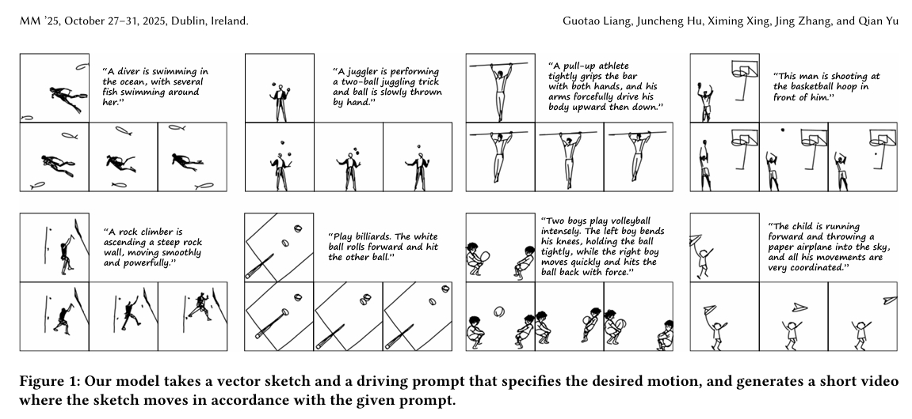

# Multi-Object Sketch Animation with Grouping and Motion Trajectory Priors

## 核心问题是什么?

矢量草图动画，能处理多对象交互和复杂运动

 

### 现有方法及局限性

现有方法难以应对这些场景，要么仅限于单对象情况，要么存在时间不一致和泛化能力差的问题。

### 本文方法及优势

GroupSketch采用包含运动初始化和运动优化的两阶段流程：  
第一阶段通过交互式将输入草图划分为语义组并定义关键帧，通过插值生成粗粒度动画；  
第二阶段提出基于组的位移网络（GDN），利用文本-视频模型的先验知识预测组别位移场以优化粗动画。GDN还整合了上下文条件特征增强（CCFE）等专用模块来提升时间一致性。  

大量实验表明，本方法在为复杂多对象草图生成高质量、时间一致的动画方面显著优于现有方法，从而拓展了草图动画的实际应用。

# 参考材料

https://hjc-owo.github.io/GroupSketchProject/

