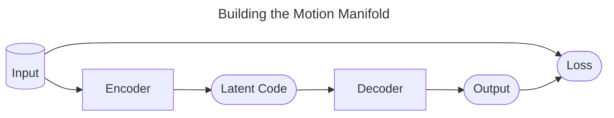

# A deep learning framework for character motion synthesis and editing

## 核心问题是什么?

开创了Deep Learning Based运动生成的先河

## 大致方法

### 第一步：Building the Motion Manifold

|输入|输出|方法|
|---|---|---|
|动作数据，T*D1|latent data，T*D2(256)|一维（时间维度）卷积 Based Encoder|
|latent data，T*D2(256)|重建动作数据，T*D1|一维（时间维度）卷积 Based Decoder|
|动作数据  重建动作数据  网络参数|Loss|L2 Loss + L1正则化|

关键创新：Max Pooling。实验表明Max Pooling对结果起到了较大的提升作用。  

### 第二步：Mapping High Level Parameters to Human Motions

|输入|输出|方法|
|---|---|---|
|高级控制参数，例如轨迹 frequency|触地信息，T * 4|正弦函数|
|高级控制参数，例如轨迹 触地信息，T * 4|latent data，T*D2(256)|卷积based网络|
|latent data，T*D2(256)|重建动作数据，T*D1|一维（时间维度）卷积 Based Decoder，**fixed**|
|重建动作数据 GT|Loss|

### Motion Editing in Hidden Unit Space

 
 