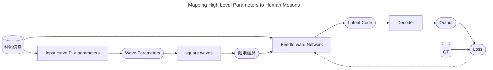

# A deep learning framework for character motion synthesis and editing

## 核心问题是什么?

开创了Deep Learning Based运动生成的先河

## 大致方法

### 第一步：Building the Motion Manifold

|输入|输出|方法|
|---|---|---|
|动作数据，T*D1|latent data，T*D2(256)|一维（时间维度）卷积 Based Encoder|
|latent data，T*D2(256)|重建动作数据，T*D1|一维（时间维度）卷积 Based Decoder|
|动作数据  重建动作数据  网络参数|Loss|L2 Loss + L1正则化|

关键创新：Max Pooling。实验表明Max Pooling对结果起到了较大的提升作用。  

    
    
    
### 第二步：Mapping High Level Parameters to Human Motions

|输入|输出|方法|
|---|---|---|
|高级控制参数，例如轨迹 frequency|触地信息，T * 4|正弦函数|
|高级控制参数，例如轨迹 触地信息，T * 4|latent data，T*D2(256)|卷积based网络|
|latent data，T*D2(256)|重建动作数据，T*D1|一维（时间维度）卷积 Based Decoder，**fixed**|
|重建动作数据 GT|Loss|

## 应用

### Applying Constraints in Hidden Unit Space

### Motion Stylization in Hidden Unit Space

## 实验

### 数据集

1. CMU
2. 自采数据 + 重定向

### 数据预处理流程

- 时序标准化：统一降采样至60FPS保证时序一致性

- 空间表征转换：将关节角度表示→3D关节位置（局部坐标系）

- 坐标系构建：以根关节地面投影为原点，通过肩/臀部向量计算前进方向（Z轴）

- 运动学参数增强：添加全局速度（XZ平面）、旋转速度（Y轴）和足部接触标签

- 数据归一化：减去均值/除以标准差（分别处理姿态、速度、接触标签）

## 总结 

核心价值：第一篇基于AI的3D骨骼动作生成工作

成本分析：需要特定角色的大量数据

落地瓶颈：需要特定角色的大量数据，生成动作也只能用于特定角色，没有角色之间的泛化性。  