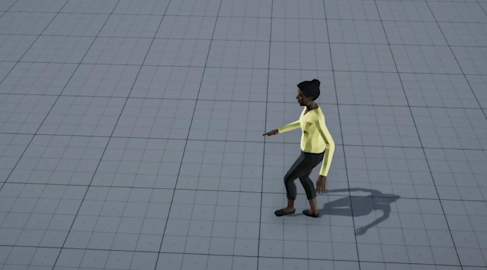

# MoGlow: Probabilistic and controllable motion synthesis using normalising flows

基于数据的运动建模与合成是一个活跃的研究领域，其在动画、游戏和社交机器人等领域具有广泛应用。本文提出了一类基于归一化流的新型概率化、生成式且可控的运动数据模型。此类模型能够描述高度复杂的分布，且与生成对抗网络（GAN）或变分自编码器（VAE）不同，它可以通过精确的最大似然估计进行高效训练。我们提出的模型采用自回归结构，并利用长短期记忆网络（LSTM）实现任意长的时间依赖性。重要的是，该模型具有因果性，即输出序列中的每个姿态生成时均不依赖未来时间步的姿态或控制输入；这种零算法延迟的特性对于需要实时运动控制的交互应用至关重要。该方法原则上可适用于任何运动类型，因为它不对运动特征或角色形态施加限制性的任务特定假设。我们在人类和四足动物运动的动作捕捉数据集上评估了模型性能。主客观实验结果均表明，本方法随机采样的运动效果优于任务无关的基线模型，其运动质量接近录制的动作捕捉数据。