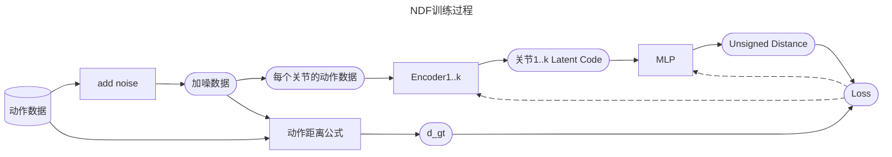
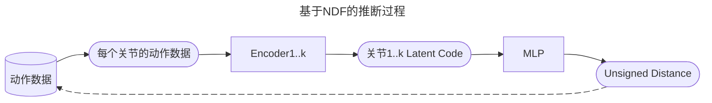

# Pose-NDF: Modeling Human Pose Manifolds with Neural Distance Fields

[TODO] 图1

本文提出Pose-NDF——一种基于神经距离场（NDF）的连续型人体姿态概率模型。姿态或运动先验对于生成真实的新姿态，以及从含噪声或局部观测数据中重建精确姿态至关重要。Pose-NDF通过神经隐函数的零水平集学习合理姿态流形，将三维隐式曲面建模思想拓展至高维空间SO(3)^K（人体姿态由K个四元组构成的单数据点定义）。所得高维隐函数可对输入姿态求导，从而通过在三维超球面上执行梯度下降，将任意姿态投影至该流形。与现有基于VAE、将姿态空间转换为高斯分布的方法不同，本方法直接建模真实姿态流形并保持姿态间距离。实验表明，在去噪真实动作捕捉数据、遮挡姿态恢复、图像至三维姿态重建等下游任务中，Pose-NDF作为先验模型均优于当前最优方法。此外，通过随机采样与投影，本方法能比基于VAE的方法生成更多样化的姿态。我们将公开代码与预训练模型以供进一步研究，详见https://virtualhumans.mpi-inf.mpg.de/posendf/。

## 主要方法

### 数据定义

θ = {θ1, ..., θK} 

其中θk是每个关节在其父坐标系下的四元数表达

### 距离定义

[TODO] 公式2

### 训练

### 优化

## 效果

[TODO] 表1