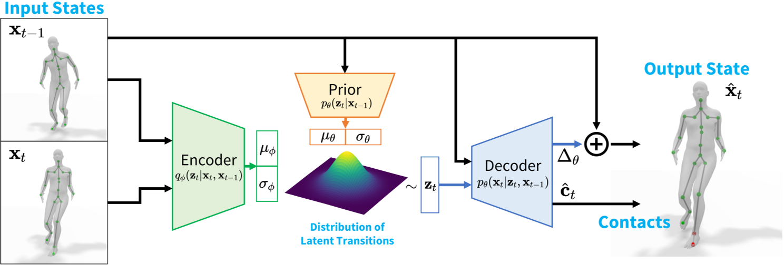

# HuMoR: 3D Human Motion Model for Robust Pose Estimation

||2021|HuMoR: 3D Human Motion Model for Robust Pose Estimation|训练时有后验概率信息，而推时只有先验概率信息。因此分别构造先验概率模型和后验概率模型，并让先验概率逼迫后验概率|开源|[link](https://caterpillarstudygroup.github.io/ReadPapers/14.html)

|缩写|英文|中文|
|---|---|---|
|CVAE|conditional variational autoencoder|条件变分自动编码器|
|GMM|Gaussian mixture model |高斯混合模型|

## 核心问题是什么?

### 背景

在存在**噪声和遮挡**的情况下恢复合理的姿势序列仍然是一个挑战。

### 解决方法

我们提出了一种条件变分自动编码器形式的表达生成模型，它学习运动序列每一步的姿态变化的分布。  
我们引入了一种灵活的基于优化的方法，该方法利用 HuMoR 作为动作先验，从模糊的观察中稳健地估计合理的姿势和形状。

### 效果

通过广泛的评估，我们证明我们的模型在大型运动捕捉数据集上进行训练后可以推广到**不同的运动和身体形状**，并能够从包括 3D 关键点和 RGB(-D) 视频在内的多种输入模式进行运动重建。请参阅项目页面：geometry.stanford.edu/projects/humor。

## 核心贡献是什么？

- HuMoR，一种通过创新的 条件VAE 建模的生成 3D 人体运动先验，可实现富有表现力的通用运动重建和生成， 
- 鲁棒的测试时优化方法，使用 HuMoR 作为强运动先验，联合求解姿势、身体形状和地平面/接触。
- 能够对各种输入（例如 RGB(-D) 视频和 2D/3D 关节位置序列）进行操作，以产生准确且合理的运动和接触。

## 大致方法是什么？

1. 建立一个从真实人体运动中学习的富有表现力和可概括的 3D 人体运动生成模型。  
2. 基于先验模型的测试时动作优化。

### HuMoR: 3D Human Dynamics Model

转移关系z的先验概率为黄后，后验概率为绿色。  
通过Encoder(基于后验概率得到的转移关系) + Decoder(基于转移关系得到当前帧)可以得到一个比较准确的Decoder  
同时，通过让先验概率逼近后验概率，可以得到一个比较准确的先验概率。  
推断时，通过先验概率和Decoder得到当前帧。  

#### 逐帧的表示

|符号|维度|信息|
|---|---|---|
|\\(r\\)|3|root位移|
|\\(\dot r\\)|3|root的线速度|
|\\(\Phi\\)|3|root的朝向|
|\\(\dot \Phi\\)|3|root的角速度
|\\(\Theta\\)|\\(3 \times 21\\)|关节的local rotation，轴角形式|
|\\(J\\)|\\(3 \times 22\\)|关节的位置 没有提到特殊处理，应该就是指全局位置|
|\\(\dot J\\)|\\(3 \times 22\\)|关节的线速度|

#### Latent Variable Dynamics Model 潜变量动力学模型

假设：当前状态只与上一帧状态有关。  
目标：\\(p_\theta(x_t|x_{t-1})\\)，描述the plausibility of a transition.  
CVAE：引入一个潜变量z，分别求\\(p_\theta(z_t|x_{t-1})\\)和\\(p_\theta(x_t|z_t, x_{t-1})\\)，结合求出\\(p_|theta(x_t|x_{t-1})\\)  

$$
p_\theta(x_t|x_{t-1}) = \int_{z_t} p_\theta(z_t|x_{t-1}) p_\theta(x_t|z_t, x_{t-1})
$$

这样把问题分解为两部分，其中第一项为Encoder，第二项为Decoder。  

由于\\(x_t\\)和\\(x_{t-1}\\)差别不大。作者发现学习\\(x_t\\)与\\(x_{t-1}\\)之间的差，比直接学习\\(x_t\\)效果好。  

Decoder会同时输出触地标签，这个标签会在test时使用。  

> 模型与传统的随机物理模型类似。条件先验可以被视为一个控制器，产生的“力”zt是一个关于状态 xt−1 的函数的输出，而解码器的作用就像方程中广义位置和速度的组合物理动力学模型和欧拉积分器。

##### 对比Motion VAE

Motion VAE也使用了以上CVAE的原理。本文的改进在于：  
通过额外学习条件先验、对状态和接触的变化进行建模以及鼓励关节位置和角度预测之间的一致性来克服这个问题。

#### 初始状态\\(p_\theta(x_0)\\)

GMM  
这一部分单独训练。

#### 训练

训练数据：pair data \\((x_{t-1}, x_t)\\)  
并使用scheduled sampling，使模型对自身错误的长期积累具有鲁棒性。

||||
|---|---|---|
|重建loss|重建出的xt应与训练数据是的xt接近|1. 由Encoder\\((x_{t-1}, x_t)\\)得到潜变量z  2. 由z和\\(x_{t-1}\\)Decoder出xt|
|KL散度|z的先验分布与z的后验分布应该接近|z的先验分布为\\(p_\theta(z\mid x_{t-1})\\) z的后验分布为\\(q_\phi(z\mid x_{t-1},x_{t-1})\\) 这个loss的权重在训练时会逐步减小，以避免posterior collapse。|
|SMPL关节一致性|预测出的关节位置应该与GT一致|[?]这个是不是有点多余？x里面已经包含关节位置、速度和旋转信息了。|
|触地标签|触地标签应与GT一致|
|触地时脚的速度|触地是脚的速度应该较小|

### 基于HuMoR的动作优化

#### RollOut

定义一个确定性的推断函数。用于test。  
当输入x0与每一步转换z是确定的时候，第T帧的输出也是确定的。  

#### Optimization Variables

输入：观察序列y，为需要被优化的动作序列的特征  
优化变量：初始状态x0，转移序列z，形状参数beta，地面高度g  
优化目标：通过rollout函数，使得第T帧的输出与观察序列y的第T帧接近  

#### 优化目标

||优化目标||
|---|---|---|
|mot|CVAE|z产生的先验概率尽量大，即根据x0和序列z生成每一帧xt之后，再计算每一帧会产生这个z序列的先验概率|
|mot|init|第一帧的概率尽量大|
|data|data|所产生的序列应与观察序列y相似|
|reg|skel|所生成的关节位置应与beta对应的SMPL体型一致 每一帧的骨长应保持不变|
|reg|env|当检测到脚步触地时，脚应该不动，且脚的高度为0|
|reg|gnd|地面高度接近初值|[?]初值在哪里定义的？|
|reg|shape|正常人的体型的shape参数不会太大|
|additional|pose|\\(z^{poset}\\)不要太大|\\(z^{poset}_ ∈ R^{32}\\) 是 VPoser 模型的潜在空间中对身体关节角度的表示|
|additional|smooth|前后两帧的关节位置不能发生突变|

第一步：initialization optimization  
优化参数：SMPL参数初值  
优化目标：data, shape, additional

第二步：计算z序列的初值  
计算方法：CVAE Encoder  

## 有效

## 缺陷

1. 训练和使用比较麻烦，训练包含2个阶段，使用包含3个阶段  
2. 整体优化，不能用于流式场景

## 验证

## 启发

## 遗留问题

## 参考材料