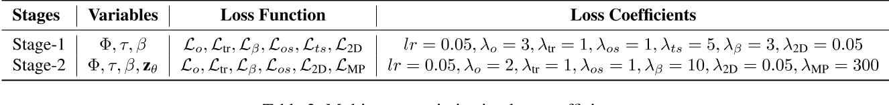

# HMP: Hand Motion Priors for Pose and Shape Estimation from Video

## 核心问题是什么?

### 难点

1. 3D 手部姿势估计在难点在于手部的高度关节、频繁遮挡、自遮挡和快速运动而变得复杂。  
2. 虽然视频信息有助于解决上述问题，但现有的基于视频的 3D 手部数据集(例如HO3D)不足以训练前馈模型以推广到野外场景。  
3. 大型人体动作捕捉数据集中还包括手部动作，例如AMASS，但缺少视频对应。

### 解决方法

1. 针对手部的generative motion prior，并在 AMASS 数据集上进行训练，该数据集具有多样化和高质量的手部运动。  
2. 将该运动先验用于基于视频的 3D 手部运动估计，在latent空间进行优化。

### 效果

我们集成强大的运动先验显着提高了性能，特别是在**遮挡**场景中。它产生稳定、时间一致的结果，超越了传统的单帧方法。我们通过对 HO3D 和 DexYCB 数据集进行定性和定量评估来证明我们方法的有效性，特别强调 HO3D 的以遮挡为中心的子集。代码可在 https://hmp.is.tue.mpg.de 获取

## 核心贡献是什么？

- 从大规模MoCap 数据集AMASS [37] 中学习到了generative motion prior。
- 提出了一种latent空间的优化的方法，用于从单目视频中准确估计手部姿势和形状。 

## 大致方法是什么？

HMP 方法由两个阶段组成（图 2）：  
- 初始化阶段，检测手部边界框、2D 手部关键点，并从视频帧初始化 MANO 手部姿势和形状估计（第 3.2 节）。  
- 多阶段优化阶段（第 3.4 节），它通过强制执行手部运动先验约束来细化视频中的这些估计。

### 初始化阶段

|输入|输出|方法|
|---|---|---|
|图像|bbox|hand tracking model [9] 当由于遮挡等原因导致bbox置信度低时，使用SLERP|
|bbox|全局坐标中的手部姿势和形状|PyMAFX [64]|
|bbox|2d keypoints|MediaPipe and PyMAF-X [36,64] 如果MediaPipe检测失败，就用PyMAFX检测出的3d keypoints投影到2d 经实验，这种方式得到的2d kps效果最好|

### 手部动作先验

使用VAE学习手部动作先验。  
其中Decoder为“非自回归”。我们采用基于神经运动场（NeMF）[23]的解码器，通过 NeRF 式 MLP [39] 将身体运动表示为手部姿势的连续矢量场。

> 自回归模型，例如[Humor](https://caterpillarstudygroup.github.io/ReadPapers/14.html)需要根据上一帧来预测下一帧，无法并行，因此长序列的生成会比较慢。  
> 但非自回归模型不依赖上一帧的输出，因此可以 并行化。  

因此Decoder不需要以上一帧为输出，它的输入是latent code z和时间步t。  

||本文（非自回归Decoder）|Humor(自回归Decoder)|
|---|---|---|
|是否依赖上一帧的信息|不需要以上一帧为输出，它的输入是|需要根据上一帧预测下一帧|
|输入|描述整个动作序列的latent code z和时间步t|描述状态转移的latent code z和上一帧的特征|
|潜变量z的含义|描述整个动作序列|描述状态转移|
|是否可并行生成|可以|不可以|

根据目标函数优化latent空间的潜变量z，而不是原始空间的动作参数，从而生成好的目标序列。  
z的初值来源于Encoder。  

优化过程中不考虑手的global rotation。因为手在空间的移到是unlimited的。  

> 我认为global rotation还是有影响的。不同的global rotation下，手的动作分布有一些细微的差别，这些差别来自重力的影响。  

### Latent Optimization

#### 优化目标

|loss|content|
|---|---|
|o|global orientation重建loss|
|tr|global translation重建loss|
|beta|形状参数不应过大|
|os|global translation的平滑|
|ts|global orientation的平滑|
|2D|与2D信息一致|
|MP|latent code的合理性|

#### 多阶段优化

第一阶段以重建为主要目标。第二阶段以优化为主要目标。  

#### 遮挡处理

发生遮挡时，初始化阶段的所有信息（bbox，2D关键点，SMPL参数）都变更不可靠。  
解决方法：仅使用观察到的时间步长来优化latent code zθ。在这种情况下，运动先验表现为一种运动填充方法，该方法利用来自可见帧的提示来推断被遮挡的帧。这是我们方法的关键部分，使其对遮挡具有鲁棒性。

## 有效

1. 由于使用了强大的生成运动先验，我们的方法可以在部分或严重遮挡的情况下重建更准确的 3D 手部运动。我们在 HO3D-OCC（HO3D 数据集的特定于遮挡的子集）上强调了这一点。 
2. 与传统的基于时间先验的方法或直接回归手部姿势和形状的方法相比，我们的框架使我们能够执行更好的手部重建结果。

## 缺陷

对2D kps识别的准确性要求非常高，解决方法：引入图像信息

## 验证

## 启发

## 遗留问题

## 参考材料