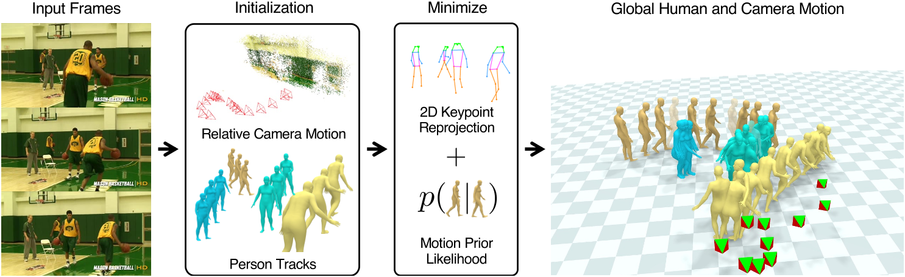

# Decoupling Human and Camera Motion from Videos in the Wild

## 核心问题是什么?

### 要解决的问题

从in the wild视频重建人的全局运动轨迹。

### 现有方法

1. 大多数现有方法并不对相机运动进行建模；  
2. 依赖背景像素来推断 3D 人体运动的方法通常需要全场景重建，这对于in the wild视频通常是不可能的。

### 本文方法

即使现有的 SLAM 系统无法恢复准确的场景重建，背景像素运动仍然提供足够的信号来约束相机运动。
我们的优化方法将相机和人体运动解耦，这使我们能够将人们放置在同一个世界坐标系中。

### 效果

我们表明，相对相机估计以及数据驱动的人体运动先验可以解决场景尺度模糊性并恢复全局人体轨迹。我们的方法可以在具有挑战性的野外视频（例如 PoseTrack）中稳健地恢复人们的全局 3D 轨迹。我们在 3D 人体数据集 Egobody 上量化了对现有方法的改进。我们进一步证明，恢复的相机比例允许我们在共享坐标系中推理多人的运动，从而提高 PoseTrack 中下游跟踪的性能。

## 核心贡献是什么？

提出了一种对摄像机运动进行建模的方法，以从野外视频中恢复现实世界中的 3D 人体运动

## 大致方法是什么？

给定输入 RGB 视频，  
1. 使用 SLAM 系统根据静态场景的像素运动估计帧之间的相对相机运动 [58]。

> 首先，即使场景视差不足以进行准确的场景重建，它仍然允许对相机运动进行合理的估计

2. 使用 3D 人体跟踪系统估计所有检测到的人的identity和身体姿势[46]。

3. 使用1和2来初始化共享世界坐标系中人类和相机的轨迹。

> 人体可以以多种方式在世界上真实地移动。学习的先验很好地捕捉了现实人类运动的这个空间。

4. 在多个阶段优化这些全局轨迹，使得视频中的 2D 观察结果和人类如何在世界中移动的先验知识保持一致 [48]。

3.1节中，我们描述了如何在世界坐标系中初始化多人轨迹和摄像机。在第 3.2 节中，我们描述了世界轨迹的平滑步骤，以热启动我们的联合优化问题。最后在 3.3 节中，我们描述了使用人体运动先验对轨迹和相机比例进行全面优化。

### 每一帧的特征表示

||||
|---|---|---|
|global orientation|3|
|body pose|22 * 3|
|shape|16|
|root translation|3|

### stage 1：在世界坐标系中初始化多人轨迹和摄像机

#### 3D 人体跟踪

- 输出

每个人的pose和shape。  
其中：  
pose估计上逐帧进行的，且为相机坐标系下的pose。  
shape是每个人独立且所有帧统一的。 

- 方法

PHALP(《Tracking People by Predicting 3D Appearance, Location & Pose》)

#### 估计相机运动

- 输出：

每一帧中相机坐标系在世界坐标系下的rotation和translation。

- 方法：

《DROID-SLAM: Deep Visual SLAM for Monocular, Stereo, and RGB-D Cameras》，使用静态场景的像素运动中的信息来计算

> 但相机运动的scale是不确定的，需要结合人物运动信息（human motion prior）来得到这个scale。  

#### 优化世界坐标系下的人物位姿

1. 用PHALP的结果初始化人物的shape和（相对于root的）pose  
2. 用camera rotation + root rotation初始化人的global orientation  
3. 用camera translation + root translation初始化人的global translation
4. 初始化camera scale为1

基于以上信息（人的shape，pose，global orientation, global translation），可以使用LBS计算出每一帧中每个关节的global position。  

- 优化目标：  
关节的3D global position投影回到相机坐标系中的2在平面上，应于检测出的2D 关键点重合。  

- 优化参数：  
global orientation, global translation  

> 这是个欠约束问题，优化所有信息会陷入local optima。  

### Stage 2：世界坐标系下的轨迹平滑

人在相机坐标系下的位移，是人在世界坐标系下的位移与相机在世界坐标系下的位置二者共同作用的结果。  
要完全消除相机位移的影响，需要引入人物运动先验。但这件事在stage 3中完成。此时先不考虑。  

此时，只是对Stage 2的结果做一些平滑。  

- 优化目标：  
1. Stage 1中的优化目标
2. shape参数不要太大
3. joint position（世界坐标系下）平滑
4. joint rotation（用VPoser编码到隐空间）平滑

- 优化参数：  
1. camera scale
2. human shape
3. human pose（相对于root）

### Stage 3：使用人体运动先验对轨迹和相机比例进行全面优化

#### 运动先验

使用[HuMoR](./14.md)作为运动先验。  

1. 以HuMoR的方式表示动作，得到st序列
2. 使用HuMoR Encoder根据st序列计算出转称序列zt
3. 使用HuMoR Decoder根据\\(s_t{t-1}\\)和zt计算也st，得到另一个st序列
4. HuMoR Decoder还会输出预测的触地信息c和地面高度g  

- 优化目标

||||
|---|---|---|
|CVAE|z产生的先验概率尽量大，即根据x0和序列z生成每一帧xt之后，再计算每一帧会产生这个z序列的先验概率|
|skate|当检测到脚步触地时，脚应该不动|
|con|当检测到脚步触地时，脚的高度应低于某个阈值|

- 优化参数

initial state s0  
camera scale  
转移latent code z

- 优化方法

逐步增加HuMoR中的T的范围。  
实际上，loss CVAE的权重非常小。**怀疑这个约束的重要性**。  

## 有效

1. 3D人体跟踪的结果受到遮挡等原因而无效时，此算法使用的motion prior可以很好地处理这种情况。  
2. 多人场景中，由于人物可能会不同时地出现或消失，是多人检测的难点。本文方法也能很好的处理。  

## 缺陷

1. 本文只是消除相机运动对人物轨迹的影响，但并没有重建相机运动轨迹。  

## 验证

## 启发

## 遗留问题

## 参考材料