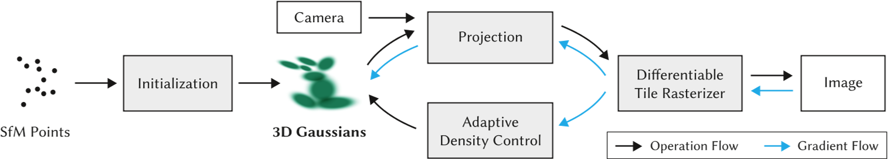
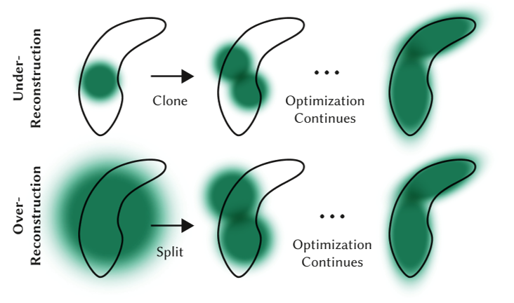

# 3D Gaussian Splatting for Real-Time Radiance Field Rendering

|缩写|英文|中文|
|---|---|---|
|SfM|Structure-from-Motion||
|SH|spherical harmonics|球谐基|
||covariance matrix|协方差矩阵|
|Nerf|Neural Radiance Field|神经辐射场|
|GS|Gaussian splatting|高斯溅射|

## 核心问题是什么?

### 现有方法及问题

Nerf方法需要训练和渲染成本高昂的神经网络，而其加速方案会牺牲质量来换取速度。对于无界且完整的场景（而不是孤立的物体）和1080p分辨率渲染，当前没有方法可以实现实时显示速率。

### 本文方法

高斯溅射是一种表示 3D 场景和渲染新视图的方法，它被认为是 NeRF 类模型的替代品。  
这项工作最出名的地方是其高渲染速度。这归功于下面将要介绍的表示本身，以及使用自定义 CUDA 内核定制实现的渲染算法。    
首先，从相机校准期间产生的稀疏点开始，用 3D 高斯表示场景，保留连续体积辐射场的所需属性以进行场景优化，同时避免在空白区域中进行不必要的计算；  
其次，我们对 3D 高斯进行交错优化/密度控制，特别是优化各向异性协方差以实现场景的准确表示；  
第三，我们开发了一种快速可见性感知渲染算法，该算法支持各向异性泼溅，既加速训练又允许实时渲染。

### 效果

在几个已建立的数据集上展示了最先进的视觉质量和实时渲染。

## 核心贡献是什么？

- 引入各向异性 3D 高斯作为辐射场的高质量、非结构化表示。  
- 3D 高斯属性的优化方法，与自适应密度控制交错，为捕获的场景创建高质量表示。  
- 快速、可微的渲染方法对于可见性感知的 GPU，允许各向异性泼溅和快速反向传播，以实现高质量的新颖视图合成。

## 大致方法是什么？

输入：一组静态场景的图像

1. 由 SfM 校准的相应相机，会产生稀疏点云。  
2. 从SfM点云创建了一组 3D 高斯（第 4 节），由位置（均值）、协方差矩阵和不透明度 𝛼 定义这些高斯。  

> 这允许非常灵活的优化机制。这会产生 3D 场景的相当紧凑的表示，部分原因是高度**各向异性的体积片可用于紧凑地表示精细结构**。

3. 辐射场的方向外观分量（颜色）通过球谐函数 (SH) 表示。  
4. 通过 3D 高斯参数的一系列优化步骤来创建辐射场表示（第 5 节），即位置、协方差、𝛼 和 SH 系数与高斯密度自适应控制的操作交织在一起。
5. 基于图块的光栅化器（效率的关键）（第 6 节），让各向异性图块的𝛼混合，通过快速排序表示可见性顺序。  
> 快速光栅化器还包括通过跟踪累积的 𝛼 值进行快速向后传递，并且对可以接收梯度的高斯数量没有限制。

### 可微 3D 高斯Splatting

输入：没有法线信息的稀疏 (SfM) 点集  
输出：允许高质量新视角合成的场景表示，即一组 3D 高斯。  

#### 表示

3D 世界由一组 3D 点表示，实际上有数百万个 3D 点，数量大约为 50 万到 500 万。每个点都是一个 3D 高斯，具有自己独特的参数，这些参数针对每个场景进行拟合，以便该**场景的渲染与已知的数据集图像紧密匹配**。  

每个 3D 高斯的参数如下：
- 均值 μ， 可解释为位置 x、y、z；
- 协方差 Σ；
- 不透明度 σ(𝛼)，应用 sigmoid 函数将参数映射到 [0, 1] 区间；
- 颜色参数，(R、G、B) 的 3 个值或球谐函数 (SH) 系数。

选择3D高斯作为场景表示是因为：  
1. 具有可微分体积表示的属性  
2. 非结构化和显式的，以允许非常快速的渲染
3. 可以轻松投影到 2D splats，从而实现快速𝛼混合渲染

> 之前的类似工作使用带法线信息的2D平面圆。但SfM有时是难以估计比较准确的法线信息，因此给这些方法带来的困难。  

本文使用的3D高斯，由世界坐标系下的3D协方差矩阵和中心位置来描述。不需要包含法线信息。  

#### 协方差矩阵

协方差是各向异性的，这意味着 3D 点可以是沿空间中任意方向旋转和拉伸的椭圆体。需要用 9 个参数来表示协方差矩阵。  

> 这种各向异性协方差的表示（适合优化）允许我们优化 3D 高斯以适应捕获场景中不同形状的几何形状，从而产生相当紧凑的表示。图 3 说明了这种情况。

协方差矩阵是需要被优化的参数之一，但是不能直接优化这样的协方差矩阵。  
**优化过程中必须保证协方差矩阵是半正定的**，但梯度下降的优化方法会破坏协方差矩阵的的半正定性。因此，把协方差矩阵分解为：    
  
$$
\Sigma = RSS^\top R^\top
$$

这种因式分解称为协方差矩阵的特征分解，其中：
- S 是一个对角缩放矩阵，具有 3 个缩放参数；
- R 是一个 3x3 旋转矩阵，用 4 个四元数表示。

S和R分别存储和优化。

#### 渲染

输入：
- 世界坐标系到相机坐标系的变换为W
- 投影变换为J

相机坐标系下的协方差矩阵为：  

$$
\Sigma' = JW\Sigma J^\top W^\top
$$

> 文中提到一种简化方法，可以把协方差矩阵从 3 * 3 简化为 2 * 2。  

### 通过 3D 高斯自适应密度控制进行优化

优化参数：
- 位置 𝑝
- 不透明度 𝛼   
- 协方差 Σ  
- 颜色 𝑐 的 SH 系数，或者颜色

**这些参数的优化与控制高斯密度的步骤交织在一起**，以更好地表示场景。

#### 优化

优化过程中“渲染”与“渲染结果与GT比较”交替进行。  

**3D 高斯协方差参数的质量对于表示的紧凑性至关重要，因为可以用少量大的各向异性高斯函数捕获大的均匀区域。**

**我们的快速光栅化（参见第 6 节）对于优化的效率至关重要，因为它是优化的主要计算瓶颈。**

1. 使用GPU加速以及为某些操作添加自定义 CUDA 内核，加速渲染过程  
2. 对 𝛼 使用 sigmoid 激活函数将其限制在 [0 − 1) 范围内并获得平滑梯度
3. 出于类似的原因，对协方差尺度使用指数激活函数。
4. 将初始协方差矩阵估计为各向同性高斯矩阵，其轴等于到最近三个点的距离的平均值。
5. 对position使用类似于 Plenoxels 的标准指数衰减调度技术。  
6. 损失函数是 L1 与 D-SSIM 项的结合

#### 高斯自适应控制

需要控制的信息为：单位体积上高斯的数量及其密度。当从初始的稀疏高斯集变为更好地表示场景的更密集的集，并且具有正确的参数时，渲染结果也会逐渐清晰。  

具体策略为：  

1. 优化预热后（参见第 7.1 节），我们每 100 次迭代进行一次致密化，并删除任何本质上透明的高斯分布，即 𝛼 小于阈值 𝜖𝛼 

2. 针对两种场景：  
- 缺少几何特征的区域（“重建不足”）
- 高斯覆盖场景中大面积的区域（通常对应于“过度重建”）

这两者都有很大的视图空间位置梯度。直观上，这可能是因为它们对应于尚未很好重建的区域，并且优化尝试移动高斯来纠正这一点。

3. 当检测到视图空间位置梯度较大时，增加高斯密度

4. 对于重建区域中的小高斯，如果需要创建的新的几何形状，最好通过简单地创建相同大小的副本并将其沿位置梯度的方向移动来克隆高斯。

5. 有高方差的区域中的大高斯需要被分割成更小的高斯。我们用两个新的高斯函数替换这些高斯函数，并将它们的尺度除以我们通过实验确定的因子 𝜙 = 1.6。我们还通过使用原始 3D 高斯作为 PDF 进行采样来初始化它们的位置。

克隆高斯与分割高斯的区别在于，前者会增加系统总体积和高斯数量，而后者在保留总体积但增加高斯数量。

6. 与其他体积表示类似，我们的优化可能会因靠近输入摄像机的浮动体而陷入困境；在我们的例子中，这可能会导致高斯密度的不合理增加。  
缓和高斯数量增加的有效方法是:  
(1) 每隔 𝑁 = 3000 迭代将 𝛼 值设置为接近于零。然后，优化会在需要时增加高斯函数的 𝛼，同时删除 𝛼 小于 𝜖𝛼 的高斯函数，如上所述。高斯可能会缩小或增长，并且与其他高斯有相当大的重叠  
(2) 定期删除在世界空间中非常大的高斯以及在视空间中具有较大足迹的高斯。  
该策略可以总体上很好地控制高斯总数。

### 高斯快速可微光栅化器

目标：  
对所有高斯进行快速整体渲染、快速排序，近似 𝛼 混合（包括各向异性 splat），而不需要限制高斯的数量。

本文为高斯图设计了一个基于图块的光栅化器，其特点为：  
1. 一次对整个图像的基元进行预排序
2. 允许在任意数量的混合高斯上进行有效的反向传播，并且（光栅化器的）附加内存消耗低，每个像素只需要恒定的开销。
3. 光栅化pipeline是完全可微分的
4. 考虑到 2D 投影（第 4 节），光栅化器可以对各向异性 splats 进行光栅化。

具体步骤为：  
1. 将屏幕分割成 16×16 块
2. 根据视锥体和每个块剔除 3D 高斯。具体来说，我们只保留与视锥体相交的置信区间为 99% 的高斯分布。此外，我们使用保护带来简单地拒绝极端位置处的高斯分布（即那些均值接近近平面且远离视锥体的位置），因为它们的**投影 2D 协方差将不稳定**。
3. 根据每个高斯重叠的图块数量来实例化它们，并为每个实例分配一个结合了视图空间深度和图块 ID 的键。
4. 使用单个快速 GPU 基数排序根据这些键对高斯进行排序 [Merrill 和 Grimshaw 2010]。请注意，**没有额外的每像素点排序，混合是基于此初始排序执行的**。因此， 𝛼 混合在某些情况下可能是近似的。然而，当图块接近单个像素的大小时，这些近似值变得可以忽略不计。我们发现这种方式**极大地增强了训练和渲染性能，而不会在融合场景中产生可见的伪影**。
5. 通过识别排序后深度最大和最小的高斯来为每个图块生成一个列表。
6. 对于光栅化，我们为每个图块启动一个线程块。每个线程：  
（1）首先协作地将高斯数据包加载到共享内存中。  
（2）然后对于给定的像素，通过从前到后遍历列表来累积颜色和𝛼值，从而最大化数据加载/共享和处理的并行性增益。  
（3）当我们达到像素中的目标饱和度 𝛼 时，相应的线程就会停止。  
每隔一段时间，就会查询图块中的线程，并且当所有像素都饱和时（即 𝛼 变为 1），整个图块的处理就会终止。

> 附录 C 中给出了排序的详细信息和总体光栅化方法的高级概述。

## 有效

## 缺陷

1. 在视角不可见区域有伪影。解决方法：通过规则剔除这些伪影。  
2. 简单的可见性算法，可能导致高斯突然切换深度/混合顺序。解决方法：可以通过抗锯齿来解决。  
3. 没有对我们的优化应用任何正则化；解决方法：加入正则化将有助于处理看不见的区域和弹出的伪影。

## 验证

## 启发

## 遗留问题

## 参考材料