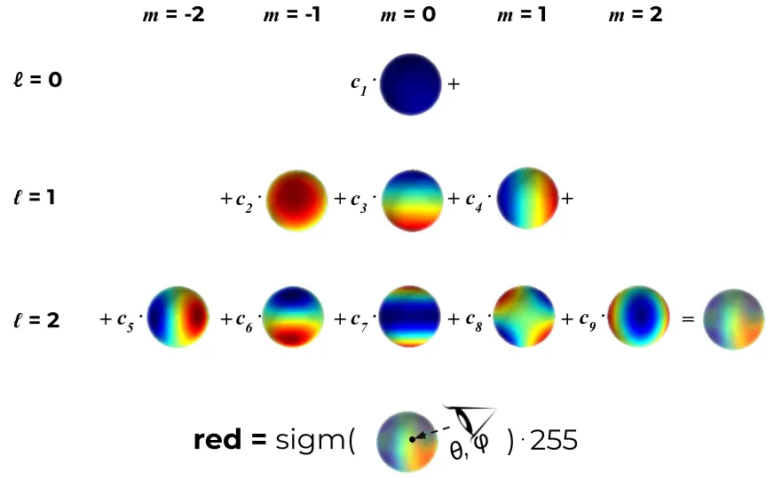
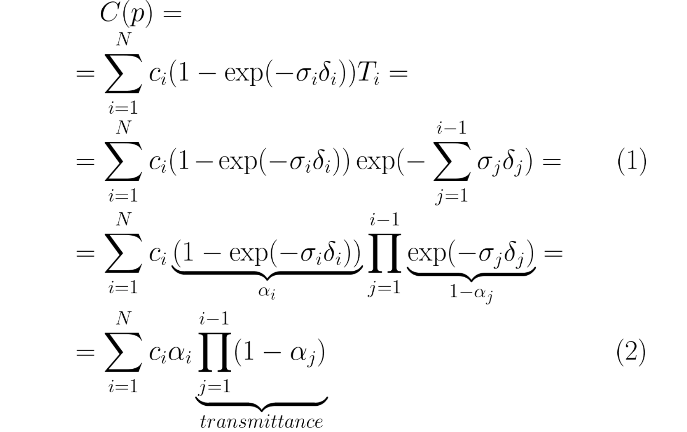
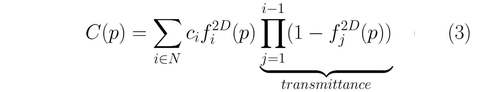

# 3D Gaussian Splatting for Real-Time Radiance Field Rendering

|缩写|英文|中文|
|---|---|---|
|SfM|Structure-from-Motion||
|SH|spherical harmonics|球谐基|
||covariance matrix|协方差矩阵|
|Nerf|Neural Radiance Field|神经辐射场|
|GS|Gaussian splatting|高斯溅射|

## 核心问题是什么?

### 现有方法及问题

Nerf方法需要训练和渲染成本高昂的神经网络，而其加速方案会牺牲质量来换取速度。对于无界且完整的场景（而不是孤立的物体）和1080p分辨率渲染，当前没有方法可以实现实时显示速率。

### 本文方法

高斯溅射是一种表示 3D 场景和渲染新视图的方法，它被认为是 NeRF 类模型的替代品。  
这项工作最出名的地方是其高渲染速度。这归功于下面将要介绍的表示本身，以及使用自定义 CUDA 内核定制实现的渲染算法。    
首先，从相机校准期间产生的稀疏点开始，用 3D 高斯表示场景，保留连续体积辐射场的所需属性以进行场景优化，同时避免在空白区域中进行不必要的计算；  
其次，我们对 3D 高斯进行交错优化/密度控制，特别是优化各向异性协方差以实现场景的准确表示；  
第三，我们开发了一种快速可见性感知渲染算法，该算法支持各向异性泼溅，既加速训练又允许实时渲染。

### 效果

在几个已建立的数据集上展示了最先进的视觉质量和实时渲染。

## 核心贡献是什么？

- 引入各向异性 3D 高斯作为辐射场的高质量、非结构化表示。  
- 3D 高斯属性的优化方法，与自适应密度控制交错，为捕获的场景创建高质量表示。  
- 快速、可微的渲染方法对于可见性感知的 GPU，允许各向异性泼溅和快速反向传播，以实现高质量的新颖视图合成。

## 大致方法是什么？


输入：一组静态场景的图像

1. 由 SfM 校准的相应相机，会产生稀疏点云。  
2. 从SfM点云创建了一组 3D 高斯（第 4 节），由位置（均值）、协方差矩阵和不透明度 𝛼 定义这些高斯。  

> 这允许非常灵活的优化机制。这会产生 3D 场景的相当紧凑的表示，部分原因是高度**各向异性的体积片可用于紧凑地表示精细结构**。

3. 辐射场的方向外观分量（颜色）通过球谐函数 (SH) 表示。  
4. 通过 3D 高斯参数的一系列优化步骤来创建辐射场表示（第 5 节），即位置、协方差、𝛼 和 SH 系数与高斯密度自适应控制的操作交织在一起。
5. 基于图块的光栅化器（效率的关键）（第 6 节），让各向异性图块的𝛼混合，通过快速排序表示可见性顺序。  
> 快速光栅化器还包括通过跟踪累积的 𝛼 值进行快速向后传递，并且对可以接收梯度的高斯数量没有限制。

### 可微 3D 高斯Splatting

输入：没有法线信息的稀疏 (SfM) 点集  
输出：允许高质量新视角合成的场景表示，即一组 3D 高斯。  

#### 表示

3D 世界由一组 3D 点表示，实际上有数百万个 3D 点，数量大约为 50 万到 500 万。每个点都是一个 3D 高斯，具有自己独特的参数，这些参数针对每个场景进行拟合，以便该**场景的渲染与已知的数据集图像紧密匹配**。  

每个 3D 高斯的参数如下：
- 均值 μ， 可解释为位置 x、y、z；
- 协方差 Σ；
- 不透明度 σ(𝛼)，应用 sigmoid 函数将参数映射到 [0, 1] 区间；
- 颜色参数，(R、G、B) 的 3 个值或球谐函数 (SH) 系数。

选择3D高斯作为场景表示是因为：  
1. 具有可微分体积表示的属性  
2. 非结构化和显式的，以允许非常快速的渲染
3. 可以轻松投影到 2D splats，从而实现快速𝛼混合渲染

> 之前的类似工作使用带法线信息的2D平面圆。但SfM有时是难以估计比较准确的法线信息，因此给这些方法带来的困难。  

本文使用的3D高斯，由世界坐标系下的3D协方差矩阵和中心位置来描述。不需要包含法线信息。  

##### 协方差矩阵

协方差是各向异性的，这意味着 3D 点可以是沿空间中任意方向旋转和拉伸的椭圆体。需要用 9 个参数来表示协方差矩阵。  

> 这种各向异性协方差的表示（适合优化）允许我们优化 3D 高斯以适应捕获场景中不同形状的几何形状，从而产生相当紧凑的表示。图 3 说明了这种情况。

协方差矩阵是需要被优化的参数之一，但是不能直接优化这样的协方差矩阵。  
**优化过程中必须保证协方差矩阵是半正定的**，但梯度下降的优化方法会破坏协方差矩阵的的半正定性。因此，把协方差矩阵分解为：    
  
$$
\Sigma = RSS^\top R^\top
$$

这种因式分解称为协方差矩阵的特征分解，其中：
- S 是一个对角缩放矩阵，具有 3 个缩放参数；
- R 是一个 3x3 旋转矩阵，用 4 个四元数表示。

S和R分别存储和优化。

```python
def strip_symmetric(L):
    uncertainty = torch.zeros((L.shape[0], 6), dtype=torch.float, device="cuda")

    uncertainty[:, 0] = L[:, 0, 0]
    uncertainty[:, 1] = L[:, 0, 1]
    uncertainty[:, 2] = L[:, 0, 2]
    uncertainty[:, 3] = L[:, 1, 1]
    uncertainty[:, 4] = L[:, 1, 2]
    uncertainty[:, 5] = L[:, 2, 2]
    return uncertainty

def build_scaling_rotation(s, r):
    L = torch.zeros((s.shape[0], 3, 3), dtype=torch.float, device="cuda")
    R = build_rotation(r)

    L[:,0,0] = s[:,0]
    L[:,1,1] = s[:,1]
    L[:,2,2] = s[:,2]

    L = R @ L
    return L

# scaling和rotation是优化好的S和R
def build_covariance_from_scaling_rotation(scaling, scaling_modifier, rotation):
    # 构造一个包含缩放scale和旋转rotation的变换矩阵
    L = build_scaling_rotation(scaling_modifier * scaling, rotation)
    actual_covariance = L @ L.transpose(1, 2)
    # 由于actual_covariance是对称矩阵，只需要存一半就可以了，参数减少到6
    symm = strip_symmetric(actual_covariance)
    return symm
```

##### 颜色参数

颜色参数可以用3个RGB值或一组SH系数来表示。  

不需要视角依赖特性时，可以进行简化，选择用 3 个 RGB 值表示颜色。  

视角依赖性是一种很好的特性，它可以提高渲染质量，因为它允许模型表示非朗伯效应，例如金属表面的镜面反射。  

视角相关的颜色参数，则需要使用SH系数表示颜色。  
SH是一组定义在球表面的正交基，每个定义在球面上的函数都可以通过SH来表达。



定义SH基的自由度ℓ_max 内，并假设每种颜色（红色、绿色和蓝色）都是前 ℓ_max 个 SH 函数的线性组合。对于每个 3D 高斯，通过学习其正确的系数，使得当我们从某个方向看这个 3D 点时，得到最接近真实的颜色。

```python
# deg：球协基的个数
# sh：优化出的SH系数
# dirs：相机指向高斯球心的视线方向
def eval_sh(deg, sh, dirs):
    """
    Evaluate spherical harmonics at unit directions
    using hardcoded SH polynomials.
    Works with torch/np/jnp.
    ... Can be 0 or more batch dimensions.
    Args:
        deg: int SH deg. Currently, 0-3 supported
        sh: jnp.ndarray SH coeffs [..., C, (deg + 1) ** 2]
        dirs: jnp.ndarray unit directions [..., 3]
    Returns:
        [..., C]
    """
    assert deg <= 4 and deg >= 0
    # 第l层的球协基需要2*i+1个系数，[0,l]层球协基共需要(l+1)**2个系数
    coeff = (deg + 1) ** 2
    assert sh.shape[-1] >= coeff

    # C0,C1,C2,C3,C4是提前定义好的球协基，是定值，不需要被优化
    result = C0 * sh[..., 0]
    if deg > 0:
        x, y, z = dirs[..., 0:1], dirs[..., 1:2], dirs[..., 2:3]
        result = (result -
                C1 * y * sh[..., 1] +
                C1 * z * sh[..., 2] -
                C1 * x * sh[..., 3])

        if deg > 1:
            xx, yy, zz = x * x, y * y, z * z
            xy, yz, xz = x * y, y * z, x * z
            result = (result +
                    C2[0] * xy * sh[..., 4] +
                    C2[1] * yz * sh[..., 5] +
                    C2[2] * (2.0 * zz - xx - yy) * sh[..., 6] +
                    C2[3] * xz * sh[..., 7] +
                    C2[4] * (xx - yy) * sh[..., 8])

            if deg > 2:
                result = (result +
                C3[0] * y * (3 * xx - yy) * sh[..., 9] +
                C3[1] * xy * z * sh[..., 10] +
                C3[2] * y * (4 * zz - xx - yy)* sh[..., 11] +
                C3[3] * z * (2 * zz - 3 * xx - 3 * yy) * sh[..., 12] +
                C3[4] * x * (4 * zz - xx - yy) * sh[..., 13] +
                C3[5] * z * (xx - yy) * sh[..., 14] +
                C3[6] * x * (xx - 3 * yy) * sh[..., 15])

                if deg > 3:
                    result = (result + C4[0] * xy * (xx - yy) * sh[..., 16] +
                            C4[1] * yz * (3 * xx - yy) * sh[..., 17] +
                            C4[2] * xy * (7 * zz - 1) * sh[..., 18] +
                            C4[3] * yz * (7 * zz - 3) * sh[..., 19] +
                            C4[4] * (zz * (35 * zz - 30) + 3) * sh[..., 20] +
                            C4[5] * xz * (7 * zz - 3) * sh[..., 21] +
                            C4[6] * (xx - yy) * (7 * zz - 1) * sh[..., 22] +
                            C4[7] * xz * (xx - 3 * yy) * sh[..., 23] +
                            C4[8] * (xx * (xx - 3 * yy) - yy * (3 * xx - yy)) * sh[..., 24])
    return result
```

#### 渲染

##### 一个高斯球对一个像素点的影响

第i个3D高斯球对3D中任意一点p的影响定义如下：


> 这个方程和多元正态分布的概率密度函数的区别在于，没有协方差归一化项，且使用用不透明度来加权。
> 高斯的妙处在于每个点都有双重影响。一方面，根据其协方差，每个点实际上代表了空间中接近其均值的有限区域。另一方面，它具有理论上无限的范围，这意味着每个高斯函数都定义在整个 3D 空间中，并且可以针对任何点进行评估。这很棒，因为在优化过程中，它允许梯度从远距离流动。⁴

##### 所有高斯球对一个像素的影响

NeRF 和高斯溅射使用相同的逐点 𝛼 混合的图像形成模型。  

|Nerf|3D GS|
|---|---|
|||

Nerf的公式和3D GS的公式几乎完全相同。唯一的区别在于两者之间如何计算 𝛼。在高斯溅射中，每个像素的聚合都是通过投影二维高斯的有序列表的贡献进行的。

> 这种微小的差异在实践中变得极为重要，并导致渲染速度截然不同。事实上，这是高斯溅射实时性能的基础。

##### 坐标系转换

3D GS公式中的\\(f^{2D}\\) 是 f(p) 在 2D 上的投影。3D 点及其投影都是多元高斯函数，因此 “3D 高斯函数对 3D 中任意点的影响” 与 “投影的 2D 高斯函数对做任意像素点的影响” 具有相同的公式。唯一的区别是必须使用投影到 2D 中平均值 μ 和协方差 Σ ，这一步称为 EWA splatting⁵ 。

定义相机内参矩阵为K，外参矩阵为W=[R|t]  

2D 的均值为：

$$
\mu^{2D} = K((W\mu)/(W\mu)_z)
$$

2D的协方差矩阵为：  

$$
\Sigma^{2D} = JW\Sigma J^\top W^\top
$$

> 文中提到一种简化方法，可以把协方差矩阵从 3 * 3 简化为 2 * 2。  


#### 加速

1. 对于给定的相机，每个 3D 点的 f(p) 可以预先投影到 2D 中，然后再迭代像素。避免重复投影。
2. 没有网络，不需要对图像做逐像素的推理，2D 高斯分布直接混合到图像上。
3. 射线经过哪些 3D 点是确定的，不需选择ray sampling策略。
4. 在 GPU 上，使用可微分 CUDA 内核的自定义实现，每帧进行一次预处理排序阶段。

> 使用GPU加速以及为某些操作添加自定义 CUDA 内核，加速渲染过程  

##### 筛选

理论上，每个高斯球对所有像素都会有影响。但实际上，在渲染某个像素时，会先过滤出相关的高斯球，并对它们排序，按照深度顺序进行计算。  

分组：使用简单的 16x16 像素图块实现分组  
排序：按深度对 3D 点进行排序


### 通过 3D 高斯自适应密度控制进行优化

优化参数：
- 位置 𝑝
> 对position使用类似于 Plenoxels 的标准指数衰减调度技术。  

- 不透明度 𝛼   
> 对 𝛼 使用 sigmoid 激活函数将其限制在 [0 − 1) 范围内并获得平滑梯度

- 协方差 Σ  
> **3D 高斯协方差参数的质量对于表示的紧凑性至关重要，因为可以用少量大的各向异性高斯函数捕获大的均匀区域。**  
> 出于类似的原因，对协方差尺度使用指数激活函数。

- 颜色 𝑐 的 SH 系数，或者颜色

**这些参数的优化与控制高斯密度的步骤交织在一起**，以更好地表示场景。

#### 初始化

初始化是指在训练开始时设置的 3D 点的参数。  

对于**点位置（均值）**，作者建议使用由 SfM（运动结构）生成的点云。因为对于任何 3D 重建，无论是使用 GS、NeRF 还是更经典的方法，都必须知道相机矩阵，因此都会需要运行 SfM 来​​获取这些矩阵。SfM 会产生稀疏点云作为副产品，为什么不将其用于初始化呢？当由于某种原因无法获得点云时，可以使用随机初始化，但可能会损失最终重建质量。  
**协方差**被初始化为各向同性，即半径为 从球体mean开始到相邻点的平均距离，这样 3D 世界就可以被很好地覆盖，没有“洞”。

```python
def create_from_pcd(self, pcd : BasicPointCloud, spatial_lr_scale : float):
    self.spatial_lr_scale = spatial_lr_scale
    # 位置初始化
    fused_point_cloud = torch.tensor(np.asarray(pcd.points)).float().cuda()
    # 颜色初始化
    fused_color = RGB2SH(torch.tensor(np.asarray(pcd.colors)).float().cuda())
    features = torch.zeros((fused_color.shape[0], 3, (self.max_sh_degree + 1) ** 2)).float().cuda()
    features[:, :3, 0 ] = fused_color
    features[:, 3:, 1:] = 0.0

    print("Number of points at initialisation : ", fused_point_cloud.shape[0])
    # 协方差scale初始化
    dist2 = torch.clamp_min(distCUDA2(torch.from_numpy(np.asarray(pcd.points)).float().cuda()), 0.0000001)
    scales = torch.log(torch.sqrt(dist2))[...,None].repeat(1, 3)
    # 协方法rotation初始化
    rots = torch.zeros((fused_point_cloud.shape[0], 4), device="cuda")
    rots[:, 0] = 1
    # 不透明度初始化
    opacities = inverse_sigmoid(0.1 * torch.ones((fused_point_cloud.shape[0], 1), dtype=torch.float, device="cuda"))

    self._xyz = nn.Parameter(fused_point_cloud.requires_grad_(True))
    self._features_dc = nn.Parameter(features[:,:,0:1].transpose(1, 2).contiguous().requires_grad_(True))
    self._features_rest = nn.Parameter(features[:,:,1:].transpose(1, 2).contiguous().requires_grad_(True))
    self._scaling = nn.Parameter(scales.requires_grad_(True))
    self._rotation = nn.Parameter(rots.requires_grad_(True))
    self._opacity = nn.Parameter(opacities.requires_grad_(True))
    self.max_radii2D = torch.zeros((self.get_xyz.shape[0]), device="cuda")
```
#### 优化

1. 地面真实视图和当前渲染之间的 L1 Loss

```python
def l1_loss(network_output, gt):
    return torch.abs((network_output - gt)).mean()
```

2. D-SSIM：结构差异指数测量

```python
def _ssim(img1, img2, window, window_size, channel, size_average=True):
    mu1 = F.conv2d(img1, window, padding=window_size // 2, groups=channel)
    mu2 = F.conv2d(img2, window, padding=window_size // 2, groups=channel)

    mu1_sq = mu1.pow(2)
    mu2_sq = mu2.pow(2)
    mu1_mu2 = mu1 * mu2

    sigma1_sq = F.conv2d(img1 * img1, window, padding=window_size // 2, groups=channel) - mu1_sq
    sigma2_sq = F.conv2d(img2 * img2, window, padding=window_size // 2, groups=channel) - mu2_sq
    sigma12 = F.conv2d(img1 * img2, window, padding=window_size // 2, groups=channel) - mu1_mu2

    C1 = 0.01 ** 2
    C2 = 0.03 ** 2

    ssim_map = ((2 * mu1_mu2 + C1) * (2 * sigma12 + C2)) / ((mu1_sq + mu2_sq + C1) * (sigma1_sq + sigma2_sq + C2))

    if size_average:
        return ssim_map.mean()
    else:
        return ssim_map.mean(1).mean(1).mean(1)
```
#### 高斯自适应控制

目的：解决重建不足和过度重建的问题  
原因：SGD 本身只能调整现有的点。但在完全没有点（重建不足）或点太多（过度重建）的区域中，它很难找到好的参数。这时就需要自适应致密化。  
频率：在训练期间偶尔启动一次，比如每 100 个 SGD 步  
方法：，分割具有大梯度的点（图 8）并删除已经收敛到非常低的 α 值的点（如果一个点是如此透明，为什么要保留它？）。


具体策略为：  

1. 当检测到视图空间位置梯度较大时，增加高斯密度

>对于重建不足或过度重建，这两者都有很大的视图空间位置梯度。直观上，这可能是因为它们对应于尚未很好重建的区域，并且优化尝试移动高斯来纠正这一点。

2. 对于重建区域中的小高斯，如果需要创建的新的几何形状，最好通过简单地创建相同大小的副本并将其沿位置梯度的方向移动来克隆高斯。

3. 有高方差的区域中的大高斯需要被分割成更小的高斯。我们用两个新的高斯函数替换这些高斯函数，并将它们的尺度除以我们通过实验确定的因子 𝜙 = 1.6。我们还通过使用原始 3D 高斯作为 PDF 进行采样来初始化它们的位置。

> 克隆高斯与分割高斯的区别在于，前者会增加系统总体积和高斯数量，而后者在保留总体积但增加高斯数量。


6. 与其他体积表示类似，我们的优化可能会因靠近输入摄像机的浮动体而陷入困境；在我们的例子中，这可能会导致高斯密度的不合理增加。  
缓和高斯数量增加的有效方法是:  
(1) 每隔 𝑁 = 3000 迭代将 𝛼 值设置为接近于零。然后，优化会在需要时增加高斯函数的 𝛼，同时删除 𝛼 小于 𝜖𝛼 的高斯函数，如上所述。高斯可能会缩小或增长，并且与其他高斯有相当大的重叠  
(2) 定期删除在世界空间中非常大的高斯以及在视空间中具有较大足迹的高斯。  
该策略可以总体上很好地控制高斯总数。

### 高斯快速可微光栅化器

目标：  
对所有高斯进行快速整体渲染、快速排序，近似 𝛼 混合（包括各向异性 splat），而不需要限制高斯的数量。

本文为高斯图设计了一个基于图块的光栅化器，其特点为：  
1. 一次对整个图像的基元进行预排序
2. 允许在任意数量的混合高斯上进行有效的反向传播，并且（光栅化器的）附加内存消耗低，每个像素只需要恒定的开销。
3. 光栅化pipeline是完全可微分的
4. 考虑到 2D 投影（第 4 节），光栅化器可以对各向异性 splats 进行光栅化。

具体步骤为：  
1. 将屏幕分割成 16×16 块
2. 根据视锥体和每个块剔除 3D 高斯。具体来说，我们只保留与视锥体相交的置信区间为 99% 的高斯分布。此外，我们使用保护带来简单地拒绝极端位置处的高斯分布（即那些均值接近近平面且远离视锥体的位置），因为它们的**投影 2D 协方差将不稳定**。
3. 根据每个高斯重叠的图块数量来实例化它们，并为每个实例分配一个结合了视图空间深度和图块 ID 的键。
4. 使用单个快速 GPU 基数排序根据这些键对高斯进行排序 [Merrill 和 Grimshaw 2010]。请注意，**没有额外的每像素点排序，混合是基于此初始排序执行的**。因此， 𝛼 混合在某些情况下可能是近似的。然而，当图块接近单个像素的大小时，这些近似值变得可以忽略不计。我们发现这种方式**极大地增强了训练和渲染性能，而不会在融合场景中产生可见的伪影**。
5. 通过识别排序后深度最大和最小的高斯来为每个图块生成一个列表。
6. 对于光栅化，我们为每个图块启动一个线程块。每个线程：  
（1）首先协作地将高斯数据包加载到共享内存中。  
（2）然后对于给定的像素，通过从前到后遍历列表来累积颜色和𝛼值，从而最大化数据加载/共享和处理的并行性增益。  
（3）当我们达到像素中的目标饱和度 𝛼 时，相应的线程就会停止。  
每隔一段时间，就会查询图块中的线程，并且当所有像素都饱和时（即 𝛼 变为 1），整个图块的处理就会终止。

> 附录 C 中给出了排序的详细信息和总体光栅化方法的高级概述。

## 实现

### 训练

```python
def training(dataset, opt, pipe, testing_iterations, saving_iterations, checkpoint_iterations, checkpoint, debug_from):
    first_iter = 0
    tb_writer = prepare_output_and_logger(dataset)
    gaussians = GaussianModel(dataset.sh_degree)
    scene = Scene(dataset, gaussians)
    gaussians.training_setup(opt)
    if checkpoint:
        (model_params, first_iter) = torch.load(checkpoint)
        gaussians.restore(model_params, opt)

    bg_color = [1, 1, 1] if dataset.white_background else [0, 0, 0]
    background = torch.tensor(bg_color, dtype=torch.float32, device="cuda")

    iter_start = torch.cuda.Event(enable_timing = True)
    iter_end = torch.cuda.Event(enable_timing = True)

    viewpoint_stack = None
    ema_loss_for_log = 0.0
    progress_bar = tqdm(range(first_iter, opt.iterations), desc="Training progress")
    first_iter += 1
    for iteration in range(first_iter, opt.iterations + 1):        
        iter_start.record()

        gaussians.update_learning_rate(iteration)

        # Every 1000 its we increase the levels of SH up to a maximum degree
        if iteration % 1000 == 0:
            gaussians.oneupSHdegree()

        # Pick a random Camera
        if not viewpoint_stack:
            viewpoint_stack = scene.getTrainCameras().copy()
        viewpoint_cam = viewpoint_stack.pop(randint(0, len(viewpoint_stack)-1))

        # Render
        if (iteration - 1) == debug_from:
            pipe.debug = True

        bg = torch.rand((3), device="cuda") if opt.random_background else background

        render_pkg = render(viewpoint_cam, gaussians, pipe, bg)
        image, viewspace_point_tensor, visibility_filter, radii = render_pkg["render"], render_pkg["viewspace_points"], render_pkg["visibility_filter"], render_pkg["radii"]

        # Loss
        gt_image = viewpoint_cam.original_image.cuda()
        Ll1 = l1_loss(image, gt_image)
        loss = (1.0 - opt.lambda_dssim) * Ll1 + opt.lambda_dssim * (1.0 - ssim(image, gt_image))
        loss.backward()

        iter_end.record()

        with torch.no_grad():
            # Log and save
            training_report(tb_writer, iteration, Ll1, loss, l1_loss, iter_start.elapsed_time(iter_end), testing_iterations, scene, render, (pipe, background))
            if (iteration in saving_iterations):
                print("\n[ITER {}] Saving Gaussians".format(iteration))
                scene.save(iteration)

            # Densification
            if iteration < opt.densify_until_iter:
                # Keep track of max radii in image-space for pruning
                gaussians.max_radii2D[visibility_filter] = torch.max(gaussians.max_radii2D[visibility_filter], radii[visibility_filter])
                gaussians.add_densification_stats(viewspace_point_tensor, visibility_filter)

                if iteration > opt.densify_from_iter and iteration % opt.densification_interval == 0:
                    size_threshold = 20 if iteration > opt.opacity_reset_interval else None
                    gaussians.densify_and_prune(opt.densify_grad_threshold, 0.005, scene.cameras_extent, size_threshold)
                
                if iteration % opt.opacity_reset_interval == 0 or (dataset.white_background and iteration == opt.densify_from_iter):
                    gaussians.reset_opacity()

            # Optimizer step
            if iteration < opt.iterations:
                gaussians.optimizer.step()
                gaussians.optimizer.zero_grad(set_to_none = True)

            if (iteration in checkpoint_iterations):
                print("\n[ITER {}] Saving Checkpoint".format(iteration))
                torch.save((gaussians.capture(), iteration), scene.model_path + "/chkpnt" + str(iteration) + ".pth")
```
### 推断

```python
def render(viewpoint_camera, pc : GaussianModel, pipe, bg_color : torch.Tensor, scaling_modifier = 1.0, override_color = None):
    """
    Render the scene. 
    viewpoint_camera: FOV，画布大小、相机位置、变换矩阵
    pc: 用于获取高斯球的属性
    pipe：一些配置
    Background tensor (bg_color) must be on GPU!
    """
 
    # Create zero tensor. We will use it to make pytorch return gradients of the 2D (screen-space) means
    screenspace_points = torch.zeros_like(pc.get_xyz, dtype=pc.get_xyz.dtype, requires_grad=True, device="cuda") + 0
    try:
        screenspace_points.retain_grad()
    except:
        pass

    # Set up rasterization configuration
    tanfovx = math.tan(viewpoint_camera.FoVx * 0.5)
    tanfovy = math.tan(viewpoint_camera.FoVy * 0.5)

    raster_settings = GaussianRasterizationSettings(
        image_height=int(viewpoint_camera.image_height),
        image_width=int(viewpoint_camera.image_width),
        tanfovx=tanfovx,
        tanfovy=tanfovy,
        bg=bg_color,
        scale_modifier=scaling_modifier,
        viewmatrix=viewpoint_camera.world_view_transform, # world to camera
        projmatrix=viewpoint_camera.full_proj_transform, # mvp
        sh_degree=pc.active_sh_degree,
        campos=viewpoint_camera.camera_center, # camera position
        prefiltered=False,
        debug=pipe.debug
    )

    rasterizer = GaussianRasterizer(raster_settings=raster_settings)

    means3D = pc.get_xyz 
    means2D = screenspace_points
    opacity = pc.get_opacity

    # If precomputed 3d covariance is provided, use it. If not, then it will be computed from
    # scaling / rotation by the rasterizer.
    scales = None
    rotations = None
    cov3D_precomp = None
    if pipe.compute_cov3D_python:
        cov3D_precomp = pc.get_covariance(scaling_modifier)
    else:
        scales = pc.get_scaling
        rotations = pc.get_rotation

    # If precomputed colors are provided, use them. Otherwise, if it is desired to precompute colors
    # from SHs in Python, do it. If not, then SH -> RGB conversion will be done by rasterizer.
    shs = None
    colors_precomp = None
    # 没有预制的color，就计算过color
    if override_color is None:
        # 如果预测的是SH的系数，则根据SH计算color
        if pipe.convert_SHs_python:
            shs_view = pc.get_features.transpose(1, 2).view(-1, 3, (pc.max_sh_degree+1)**2)
            dir_pp = (pc.get_xyz - viewpoint_camera.camera_center.repeat(pc.get_features.shape[0], 1))
            dir_pp_normalized = dir_pp/dir_pp.norm(dim=1, keepdim=True)
            sh2rgb = eval_sh(pc.active_sh_degree, shs_view, dir_pp_normalized)
            colors_precomp = torch.clamp_min(sh2rgb + 0.5, 0.0)
        # 或者直接预测color
        else:
            shs = pc.get_features
    else:
        colors_precomp = override_color

    # Rasterize visible Gaussians to image, obtain their radii (on screen). 
    rendered_image, radii = rasterizer(
        means3D = means3D,
        means2D = means2D,
        shs = shs,
        colors_precomp = colors_precomp,
        opacities = opacity,
        scales = scales,
        rotations = rotations,
        cov3D_precomp = cov3D_precomp)

    # Those Gaussians that were frustum culled or had a radius of 0 were not visible.
    # They will be excluded from value updates used in the splitting criteria.
    return {"render": rendered_image,
            "viewspace_points": screenspace_points,
            "visibility_filter" : radii > 0,
            "radii": radii}
```
## 有效

## 局限性

1. 在视角不可见区域有伪影。解决方法：通过规则剔除这些伪影。  
2. 简单的可见性算法，可能导致高斯突然切换深度/混合顺序。解决方法：可以通过抗锯齿来解决。  
3. 没有对我们的优化应用任何正则化；解决方法：加入正则化将有助于处理看不见的区域和弹出的伪影。

## 验证

## 启发

## 遗留问题

## 参考材料

1. https://towardsdatascience.com/a-comprehensive-overview-of-gaussian-splatting-e7d570081362
2. https://caterpillarstudygroup.github.io/ImportantArticles/3D_Gaussian_Splatting.html