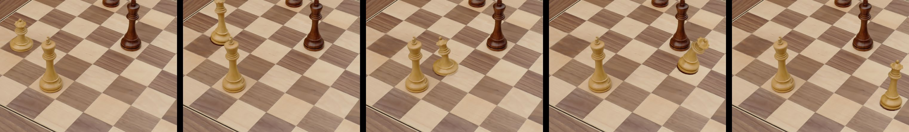
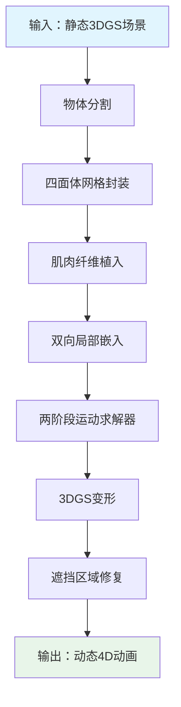
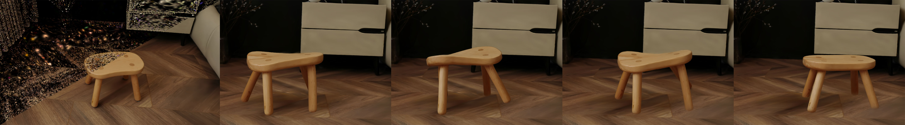
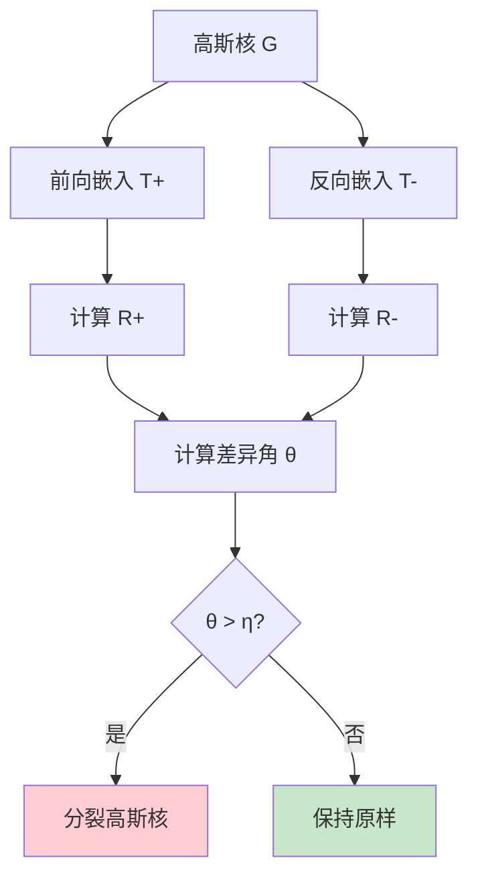
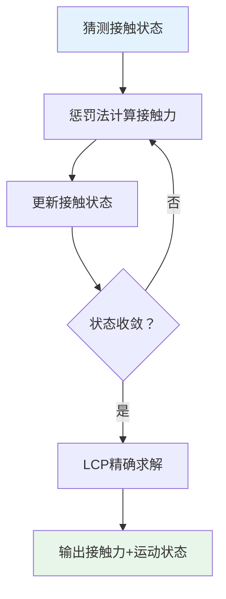
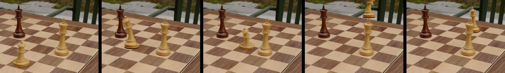

# EnliveningGS: Active Locomotion of 3DGS — 超详细解读

> **论文信息**
> - **标题**: EnliveningGS: Active Locomotion of 3DGS
> - **作者**: Siyuan Shen, Tianjia Shao, Kun Zhou (浙江大学), Chenfanfu Jiang (UCLA), Yin Yang (犹他大学)
> - **会议**: CVPR 2024
> - **代码**: https://gapszju.github.io/EnliveningGS/

---

## 目录

1. [这篇文章到底在讲什么？](#1-这篇文章到底在讲什么)
2. [背景知识](#2-背景知识)
3. [核心问题](#3-核心问题)
4. [方法总览：EnliveningGS 流水线](#4-方法总览enliveninggs-流水线)
5. [技术细节深入解读](#5-技术细节深入解读)
6. [实验结果与对比](#6-实验结果与对比)
7. [优缺点分析](#7-优缺点分析)
8. [个人思考与扩展](#8-个人思考与扩展)
9. [参考文献与延伸阅读](#9-参考文献与延伸阅读)

---

## 1. 这篇文章到底在讲什么？

### 1.1 一句话概括

**让用 3D Gaussian Splatting（3DGS）表示的 3D 模型，能像真实生物一样主动行走、跳跃、扭转——而不是像石头一样静止不动。**

### 1.2 用类比来理解

- **传统3D场景**：游戏里的树木、建筑都是"死"的——除非程序员预先写好动画脚本，否则它们永远不会自己动弹。
- **这篇文章的目标**：让游戏里的任何物体（棋盘上的棋子、椅子、玩偶）都能像活物一样，自己"决定"怎么动，并且能够真实与环境互动。



### 1.3 为什么这个问题重要？

在 VR、AR、电子游戏、电影特效等领域，都希望虚拟世界里的物体能够**真实、自然、物理合理**地运动。但现有技术有这些局限：

- 只能做预先录制好的动画（不灵活）
- 需要极其复杂的手工调整（费时费力）
- 只能处理"刚体"（不会变形的物体），无法处理"软体"

### 1.4 核心创新点

1. **"肌肉"驱动**：在3D模型内部"植入"虚拟肌肉纤维，通过控制肌肉收缩程度来驱动运动。
2. **混合接触建模**：结合 LCP + 惩罚法处理接触/摩擦问题，既保证精度又提高效率。
3. **双向局部嵌入**：精确描述3D模型变形时每个高斯核的位置和形状变化。

---

## 2. 背景知识

### 2.1 什么是 3D Gaussian Splatting (3DGS)？

#### 传统3D表示方法对比

| 表示方法 | 优点 | 缺点 |
|---------|------|------|
| 网格（Mesh） | 计算效率高 | 难以表示复杂几何细节 |
| NeRF | 图像逼真 | 渲染速度极慢 |
| 点云（Point Cloud） | 简单直接 | 无法表示连续表面 |

#### 3DGS 的核心思想

**3D Gaussian Splatting** 把3D场景表示成成千上万个"3D高斯分布"（椭圆形的"云团"），每个云团有自己的位置、形状、不透明度和颜色。

**类比理解**：想象一堆半透明的彩色果冻球，从任何角度看过去，它们重叠在一起就形成了一幅完整的画面。

#### 3DGS 的数学表示

每个"高斯核"表示为：

```
G(x) = exp(-1/2 (x-μ)^T Σ^(-1) (x-μ))
```

其中：
- `μ ∈ R³`：高斯核的中心位置
- `Σ ∈ R^(3×3)`：协方差矩阵（决定形状）
- `σ ∈ [0,1)`：不透明度
- `c ∈ R^k`：球谐函数系数（决定颜色）

**协方差矩阵分解**：

```
Σ = R S S^T R^T
```

- `R`：旋转矩阵（四元数表示）
- `S = diag(s₁, s₂, s₃)`：缩放矩阵

### 2.2 主动运动 vs 被动运动

**被动运动**（Passive Dynamics）：物体在外力作用下的运动（如苹果落地、布料飘动）。

**主动运动**（Active Locomotion）：物体通过自身内部驱动机制产生的运动（如人类行走、鱼类游泳）。

**主动运动的难点**：
1. **逆向问题**：给定目标轨迹，反推肌肉激活程度
2. **接触建模**：接触力会影响身体运动，需要精确建模

### 2.3 物理仿真中的接触问题

**难点**：
1. **不连续性**：分离与接触状态突变
2. **摩擦力的复杂性**：遵循库仑摩擦定律
3. **组合爆炸**：`3^N` 种可能状态组合（NP难）

**现有方法对比**：

| 方法 | 原理 | 优点 | 缺点 |
|------|------|------|------|
| 惩罚法 | 接触力=弹簧力 | 实现简单，效率高 | 数值稳定性差 |
| LCP方法 | 优化问题求解 | 理论严谨 | 计算复杂度高 |

**本文创新**：结合两种方法，用惩罚法"粗筛"，用LCP精确求解。

### 2.4 什么是"逆向问题"？

- **正向问题**：已知参数，预测结果（例：已知地球和太阳质量，预测轨道）
- **逆向问题**：已知结果，反推参数（例：已知轨道，反推太阳质量）
- **本文的逆向问题**：给定运动轨迹，反推肌肉激活程度

---

## 3. 核心问题

### 3.1 问题定义

**输入**：3DGS模型 + 目标运动轨迹
**输出**：肌肉激活程度 + 真实运动轨迹

### 3.2 技术挑战

1. **超高维度优化**：一个3DGS模型包含数十万~上百万个高斯核，系统自由度达**数百万级**。
2. **接触力建模**：涉及碰撞检测、摩擦力计算、数值稳定性等多个难题。
3. **3DGS特殊问题**：高斯核分裂（大变形时产生"尖刺伪影"）、遮挡修复（运动后新暴露区域需要颜色填补）。

---

## 4. 方法总览：EnliveningGS 流水线

### 4.1 整体框架



**流程步骤**：
1. **物体分割**：从场景中分离目标物体
2. **四面体网格封装**：构建物理仿真用的网格
3. **肌肉纤维植入**：在网格内植入虚拟肌肉
4. **双向局部嵌入**：建立网格与高斯核的双向映射
5. **两阶段运动求解**：求解最优肌肉激活
6. **3DGS变形**：更新高斯核状态
7. **遮挡区域修复**：填补新暴露区域

### 4.2 双向局部嵌入示意图



---

## 5. 技术细节深入解读

### 5.1 混合网格-高斯表示

四面体网格的作用：
1. **质量离散化**：分配质量到网格顶点
2. **变形计算**：求解偏微分方程
3. **肌肉植入**：定义肌肉纤维路径

### 5.2 双向局部嵌入（核心创新）

对于每个高斯核，定义两个局部嵌入：
- **前向嵌入 T⁺**：从网格到高斯核的映射
- **反向嵌入 T⁻**：从高斯核到网格的映射

高斯核中心位置用重心坐标表示：

```
x' = Σ λᵢ(x) vᵢ'
```

协方差矩阵变换：

```
Σ' = F Σ F^T
```

其中 `F = D_s · D_m⁻¹` 是变形梯度。

**分裂条件**：

如果前向和反向嵌入的旋转矩阵差异角 `θ > η`，则分裂高斯核：



### 5.3 肌肉驱动的动态

肌肉被建模为**分段线性弹簧**：

```
f_muscle = k · a
```

- `k`：刚度系数
- `a ∈ [0,1]`：激活程度

**动力学方程**：

```
M p¨ = f_ext + f_int + f_d + f_m + f_c
```

- `M`：质量矩阵
- `f_ext`：外力（重力等）
- `f_int`：内力（弹性力，使用 Ne-Hookean 模型）
- `f_d`：阻尼力
- `f_m`：肌肉力
- `f_c`：接触力

### 5.4 混合接触建模框架

#### LCP 公式化

接触约束表示为 LCP 问题：

```
[ f⊥ ]   [ Nᵀu̇   ]
[ f‖ ] ⊥ [ Dᵀu̇ + Eλ ]
[ λ  ]   [ -λᵀEᵀu̇ ]
≥ 0
```

#### 混合方法流程



### 5.5 两阶段运动求解器

**第一阶段**：忽略接触约束，求近似解（无约束优化）

**第二阶段**：用第一阶段结果作为初始猜测，加入接触约束，求解完整优化问题（使用SQP或增广拉格朗日法）

**效率提升**：两阶段策略避免从随机初始点搜索，大大提高收敛速度。

### 5.6 高斯核自我分裂机制

**分裂条件**：

```
θ = arccos((tr(R₊ᵀR₋) - 1) / 2) > η
```

**分裂操作**：

给定高斯核 `(α₀, μ₀, Σ₀)`，分裂为：

```
αₗ = αᵣ = α₀ / 2
μₗ = μ₀ - κ v_k    μᵣ = μ₀ + κ v_k
Σₗ = Σᵣ = Σ₀ - κ² v_k v_kᵀ
```

---

## 6. 实验结果与对比

### 6.1 locomotion 设计示例

#### 行走（Walking）

- 控制四条腿的轨迹
- 对角支撑腿同时抬起，其他腿摆动前进


#### 跳跃（Jumping）

- 控制质心轨迹和底部相对速度
- 实现连续跳跃（国际象棋棋子）

#### 扭转（Twisting）

- 空中旋转180度
- 控制角动量变化



### 6.2 变形质量对比

| 方法 | Bending PSNR↑ | Bending SSIM↑ | Twisting PSNR↑ | Twisting SSIM↑ | Falling PSNR↑ | Falling SSIM↑ |
|------|---------------|---------------|----------------|----------------|---------------|---------------|
| SuGaR | 28.04 | 0.890 | 26.37 | 0.823 | 25.01 | 0.913 |
| PhysGaussian | 28.14 | 0.907 | 26.53 | 0.856 | 25.10 | 0.923 |
| VR-GS | 28.63 | 0.917 | 26.53 | 0.893 | 25.31 | 0.938 |
| Ours (w/o split) | 28.62 | 0.918 | 26.47 | 0.891 | 25.34 | 0.939 |
| **Ours** | **28.79** | **0.923** | **26.89** | **0.910** | **25.67** | **0.951** |

### 6.3 两阶段求解器对比

| 方法 | 平均迭代次数↓ | 最佳目标值↓ | 最差目标值↓ |
|------|----------|--------|--------|
| QP（静态接触假设） | - | 9.43 | 23.86 |
| QPCC [41] | 46.19 | 1.29 | 12.11 |
| **Ours** | **17.01** | **0.83** | **7.89** |

Ours 方法比 QP 快约 **60倍**。

### 6.4 修复效果对比

| 方法 | PSNR↑ | SSIM↑ | LPIPS↓ | Residual↓ |
|------|-------|-------|--------|----------|
| Mask (w/o L_seg) | - | - | - | 0.058 |
| Remove | 25.917 | 0.827 | 0.211 | - |
| **w/ L_seg** | **35.291** | **0.945** | **0.034** | **0.002** |

---

## 7. 优缺点分析

### 7.1 优点

1. **创新性强**：首次实现3DGS的主动运动控制，打破了传统3DGS只能"被动受力"的限制。
2. **物理真实**：完全基于物理仿真，运动过程自然且符合物理规律。
3. **效率较高**：混合方法（惩罚法 + LCP）比纯LCP方法快约60倍。
4. **质量好**：能处理大变形，通过高斯核分裂机制减少伪影。

### 7.2 缺点/局限性

1. **环境简化**：目前假设环境是平面，更复杂地形（如斜坡、楼梯）需要更多工作。
2. **计算开销**：对于非常复杂的场景（如上百万高斯核），仍有计算挑战。
3. **手动干预**：需要手动植入肌肉纤维（虽然论文提供了自动生成工具，但仍需人工调整）。

---

## 8. 个人思考与扩展

### 8.1 这篇论文的意义

这篇论文打开了3DGS应用于**物理仿真和动画**的大门，未来可能在以下领域产生重要影响：
- VR/AR中的应用：实现真实物理交互的虚拟物体
- 电子游戏的动态物体：让游戏中的物体能够自主运动
- 电影特效的快速动画生成：减少手工动画制作的工作量

### 8.2 潜在扩展方向

1. **更复杂环境**：从平面扩展到任意地形（如斜坡、楼梯、沙滩等）
2. **多物体交互**：实现多个物体之间的物理交互（如碰撞、堆叠等）
3. **学习-based 优化**：用神经网络（如PINNs）来加速肌肉激活程度的求解
4. **实时控制**：结合强化学习（Reinforcement Learning）实现实时运动控制

### 8.3 关键技术借鉴

1. **混合方法思路**：对于复杂的优化问题，组合多种方法往往比单一方法更有效。
2. **双向嵌入**：这种双向映射的思想可用于其他需要建立两种表示方法之间关系的场景。
3. **两阶段求解**：对于复杂的约束优化问题，先用简单方法得到初始解，再进行精细化求解，是一种有效的策略。

---

## 9. 参考文献与延伸阅读

### 9.1 相关工作

1. **3DGS**: Kerbl et al., "3D Gaussian Splatting for Real-Time Radiance Field Rendering", TOG 2023
2. **PhysGaussian**: Xie et al., "PhysGaussian: Physics-Integrated 3D Gaussians", CVPR 2024
3. **VR-GS**: Jiang et al., "VR-GS: A Physical Dynamics-Aware Interactive Gaussian Splatting System", SIGGRAPH 2024
4. **LCP**: Stewart & Trinkle, "An Implicit Time-Stepping Scheme for Rigid Body Dynamics", IJNM 1996

### 9.2 基础理论

1. **Neo-Hookean模型**: Bonet & Wood, "Nonlinear Continuum Mechanics"
2. **摩擦力学**: Andrews et al., "Contact and Friction Simulation", SIGGRAPH 2022
3. **软体运动**: Tan et al., "Softbody Locomotion", TOG 2012

### 9.3 开源资源

- **代码**: https://gapszju.github.io/EnliveningGS/
- **3DGS 工具**: https://repo-sam.inria.fr/fungraph/3d-gaussian-splatting/

---

## 附录：核心公式速查

| 公式 | 含义 |
|------|------|
| `Σ = R S Sᵀ Rᵀ` | 协方差矩阵分解 |
| `Σ' = F Σ Fᵀ` | 变形后的协方差 |
| `M p¨ = f_ext + f_int + f_d + f_m + f_c` | 动力学方程 |
| `f_m = A(p) · a` | 肌肉力 |
| `Ψ = μ/2 (I_C - 3) - μ ln J + λ/2 (ln J)²` | Neo-Hookean 势能 |
| `∥f_∥∥ ≤ μ f_⊥` | 摩擦约束 |

---

*本文档由 AI 生成，如有问题欢迎指正。*
