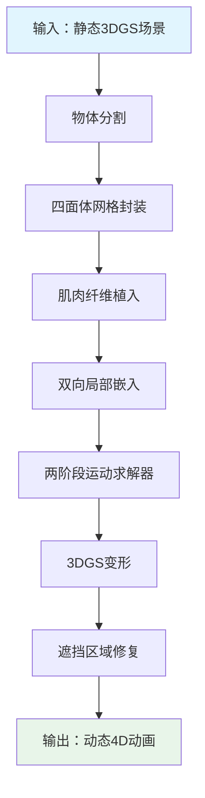
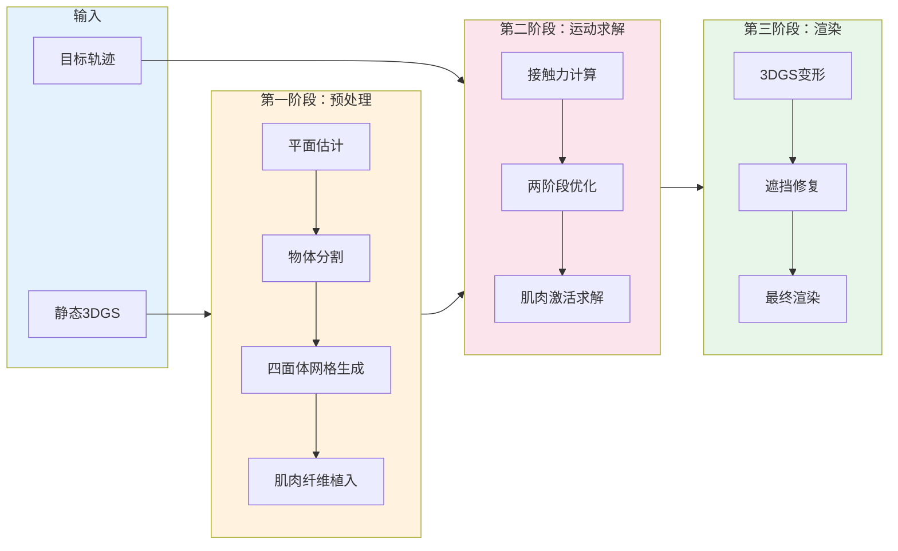
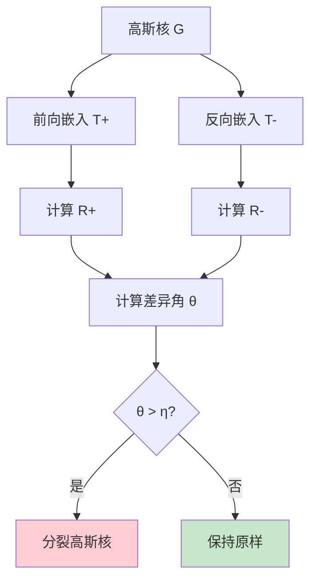
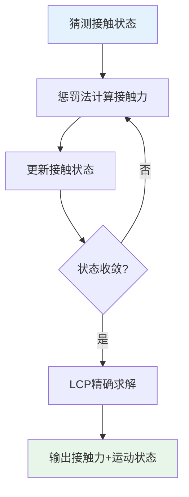

# EnliveningGS: Active Locomotion of 3DGS — 超详细解读

> **论文信息**
> - **标题**: EnliveningGS: Active Locomotion of 3DGS
> - **作者**: Siyuan Shen, Tianjia Shao, Kun Zhou (浙江大学), Chenfanfu Jiang (UCLA), Yin Yang (犹他大学)
> - **会议**: CVPR (IEEE Conference on Computer Vision and Pattern Recognition)
> - **代码**: https://gapszju.github.io/EnliveningGS

---

## 目录

1. [这篇文章到底在讲什么？（通俗版）](#1-这篇文章到底在讲什么通俗版)
2. [背景知识：你需要先了解的预备概念](#2-背景知识你需要先了解的预备概念)
3. [核心问题：为什么让3D模型"活起来"这么难？](#3-核心问题为什么让3d模型活起来这么难)
4. [方法总览：EnliveningGS 流水线](#4-方法总览enlivenings-流水线)
5. [技术细节深入解读](#5-技术细节深入解读)
6. [实验结果与对比](#6-实验结果与对比)
7. [优缺点分析](#7-优缺点分析)
8. [个人思考与扩展](#8-个人思考与扩展)
9. [参考文献与延伸阅读](#9-参考文献与延伸阅读)

---

## 1. 这篇文章到底在讲什么？（通俗版）

### 1.1 一句话概括

**这篇论文解决了这样一个问题：如何让用 3D Gaussian Splatting（3DGS）表示的3D模型，能够像真实生物一样主动地行走、跳跃、扭转——而不是像石头一样静止不动。**

### 1.2 用类比来理解

想象一下你在玩一个电子游戏：

- **传统3D场景**：游戏里的树木、建筑、家具都是"死"的——它们永远不会自己动弹，除非程序员预先写好了动画脚本。
- **这篇文章的目标**：让游戏里的任何物体（比如一个棋盘上的棋子、一把椅子、一个玩偶）都能像活物一样，自己"决定"怎么动，并且能够真实地与环境互动（比如脚踩在地上产生摩擦力，身体跳跃时受到重力影响等等）。

### 1.3 为什么这个问题重要？

在虚拟现实（VR）、增强现实（AR）、电子游戏、电影特效等领域，我们都希望虚拟世界里的物体能够**真实、自然、物理合理地**运动。但是，现有的技术要么只能做"预先录制好的动画"（不灵活），要么需要极其复杂的手工调整（费时费力），要么只能处理"刚体"（不会变形的物体），无法处理"软体"。

### 1.4 核心创新点（通俗版）

1. **"肌肉"驱动**：在3D模型内部"植入"虚拟的肌肉纤维，通过控制肌肉的收缩程度来驱动运动。
2. **混合接触建模**：结合两种数学方法（LCP + 惩罚法）来处理接触/摩擦问题，既保证精度又提高效率。
3. **双向局部嵌入**：精确描述3D模型在变形时每个高斯核的位置和形状变化。

---

## 2. 背景知识：你需要先了解的预备概念

### 2.1 什么是 3D Gaussian Splatting (3DGS)？

#### 2.1.1 传统3D表示方法的问题

| 表示方法 | 优点 | 缺点 |
|---------|------|------|
| **网格（Mesh）** | 计算效率高 | 难以表示复杂几何细节 |
| **NeRF** | 图像逼真 | 渲染速度极慢 |
| **点云** | 简单直接 | 无法表示连续表面 |

#### 2.1.2 3DGS 的核心思想

**3D Gaussian Splatting（3D高斯溅射）** 把3D场景表示成成千上万个"3D高斯分布"（椭圆形的"云团"），每个云团有自己的位置、形状、不透明度和颜色。

**类比理解**：想象你在一堆半透明的彩色果冻球，从任何角度看过去，它们重叠在一起就形成了一幅完整的画面。

#### 2.1.3 3DGS 的数学表示

每个"高斯核"用公式表示为：

\[
G(x) = e^{-\frac{1}{2}(x-\mu)^T \Sigma^{-1} (x-\mu)}
\]

其中：
- \(\mu \in \mathbb{R}^3\)：高斯核的中心位置
- \(\Sigma \in \mathbb{R}^{3 \times 3}\)：协方差矩阵（决定形状）
- \(\sigma \in [0,1)\)：不透明度
- \(c \in \mathbb{R}^k\)：球谐函数系数（决定颜色）

**协方差矩阵分解**：

\[
\Sigma = R S S^T R^T
\]

- \(R\)：旋转矩阵（决定朝向）
- \(S = \text{diag}(s_1, s_2, s_3)\)：缩放矩阵（决定大小）

#### 2.1.4 3DGS 的优缺点

**优点**：
- 渲染速度极快（100+ FPS），适合VR/AR
- 表示能力强，能表示复杂几何
- 训练相对简单

**缺点**：
- 本质上是静态的，无法自然表示动态
- 变形困难，需要控制每个高斯核

### 2.2 主动运动 vs 被动运动

#### 2.2.1 被动运动（Passive Dynamics）

物体在外力作用下产生的运动：
- 苹果从树上掉下来（重力）
- 台球被撞击后滚动（碰撞力）
- 布料在风中飘动（风力）

#### 2.2.2 主动运动（Active Locomotion）

物体通过**自身内部的驱动机制**产生的运动：
- 人类行走（腿部肌肉收缩）
- 鱼类游泳（尾部肌肉运动）
- 软体动物移动（全身肌肉协调）

**难点**：
1. **逆向问题**：给定目标轨迹，反推肌肉激活程度
2. **接触建模**：接触力会影响身体运动，需要精确建模

### 2.3 物理仿真中的接触问题

#### 2.3.1 为什么接触问题这么难？

1. **不连续性**：分离→接触时状态突变
2. **摩擦力的复杂性**：遵循库仑摩擦定律
3. **组合爆炸**：\(3^N\) 种可能状态组合（NP难）

#### 2.3.2 现有接触建模方法

| 方法 | 原理 | 优点 | 缺点 |
|------|------|------|------|
| **惩罚法** | 接触力=弹簧力 | 实现简单，效率高 | 数值稳定性差 |
| **LCP方法** | 优化问题求解 | 理论严谨 | 计算复杂度高 |

**本文创新**：结合两种方法，用惩罚法"粗筛"，用LCP精确求解。

### 2.4 什么是"逆向问题"？

**正向问题**：已知参数，预测结果
> 例：已知地球和太阳质量，预测轨道

**逆向问题**：已知结果，反推参数
> 例：已知轨道，反推太阳质量

**本文的逆向问题**：给定运动轨迹，反推肌肉激活程度

---

## 3. 核心问题：为什么让3D模型"活起来"这么难？

### 3.1 问题定义

> **输入**：3DGS模型 + 目标运动轨迹
> **输出**：肌肉激活程度 + 真实运动轨迹

### 3.2 技术挑战

#### 3.2.1 超高维度优化

一个3DGS模型包含**数十万~上百万个高斯核**，每个有9个自由度，系统自由度达**数百万级**。

#### 3.2.2 接触力建模

涉及碰撞检测、摩擦力计算、数值稳定性等多个难题。

#### 3.2.3 3DGS特殊问题

- **高斯核分裂**：大变形时产生"尖刺伪影"
- **遮挡修复**：运动后新暴露区域需要颜色填补

---

## 4. 方法总览：EnliveningGS 流水线

### 4.1 整体框架

### 4.2 流水线步骤

1. **物体分割**：从场景中分离目标物体
2. **四面体网格封装**：构建物理仿真用的网格
3. **肌肉纤维植入**：在网格内植入虚拟肌肉
4. **双向局部嵌入**：建立网格与高斯核的双向映射
5. **两阶段运动求解**：求解最优肌肉激活
6. **3DGS变形**：更新高斯核状态
7. **遮挡区域修复**：填补新暴露区域

### 4.3 完整流程图

---

## 5. 技术细节深入解读

### 5.1 混合网格-高斯表示

#### 5.1.1 为什么需要四面体网格？

四面体网格用于：
1. **质量离散化**：分配质量到网格顶点
2. **变形计算**：求解偏微分方程
3. **肌肉植入**：定义肌肉纤维路径

#### 5.1.2 双向局部嵌入（核心创新）

对于每个高斯核，定义两个局部嵌入：

- **前向嵌入 \(T^+\)**：从网格到高斯核的映射
- **反向嵌入 \(T^-\)**：从高斯核到网格的映射

高斯核中心位置用重心坐标表示：

\[
x' = \sum_{i=1}^{4} \lambda_i(x) v_i'
\]

其中 \(v_i'\) 是四面体顶点（变形后），\(\lambda_i(x)\) 是重心坐标。

**协方差矩阵变换**：

\[
\Sigma' = F \Sigma F^T
\]

其中 \(F = D_s \cdot D_m^{-1}\) 是变形梯度。

**分裂条件**：

如果前向和反向嵌入的旋转矩阵差异角 \(\theta > \eta\)，则分裂高斯核：

### 5.2 肌肉驱动的动态

#### 5.2.1 肌肉纤维建模

肌肉被建模为**分段线性弹簧**：

\[
f_{\text{muscle}} = k \cdot a
\]

- \(k\)：刚度系数
- \(a \in [0, 1]\)：激活程度

**总肌肉力**：

\[
f_m = A(p) \cdot a
\]

其中 \(A(p)\) 是激活矩阵，描述肌肉收缩如何影响顶点位置。

#### 5.2.2 动力学方程

\[
M \ddot{p} = f_{\text{ext}} + f_{\text{int}} + f_d + f_m + f_c
\]

- \(M\)：质量矩阵
- \(f_{\text{ext}}\)：外力（重力等）
- \(f_{\text{int}}\)：内力（弹性力）
- \(f_d\)：阻尼力
- \(f_m\)：肌肉力
- \(f_c\)：接触力

**内力计算**（Neo-Hookean模型）：

\[
\Psi = \frac{\mu}{2} (I_C - 3) - \mu \ln J + \frac{\lambda}{2} (\ln J)^2
\]

### 5.3 混合接触建模框架

#### 5.3.1 接触约束

1. **非穿透约束**：\(C_n(u) \equiv N^T u + d \geq 0\)
2. **摩擦力约束**：\(\| f_\parallel \| \leq \mu f_\perp\)

#### 5.3.2 LCP 公式化

接触约束表示为 LCP 问题：

\[
\begin{bmatrix} f_\perp \\ f_\parallel \\ \lambda \end{bmatrix}
\perp
\begin{bmatrix} N^T \dot{u} \\ D^T \dot{u} + E \lambda \\ -\lambda^T E^T \dot{u} \end{bmatrix}
\geq 0
\]

#### 5.3.3 惩罚法

\[
f_{\perp}^{\text{spring}} = -k_n \min(0, C_n(u))
\]

\[
f_{\parallel}^{\text{spring}} = - \min\left( k_f \| D^T \dot{u} \|, \mu f_{\perp}^{\text{spring}} \right) \frac{D^T \dot{u}}{\| D^T \dot{u} \|}
\]

#### 5.3.4 混合方法流程

### 5.4 两阶段运动求解器

#### 5.4.1 优化问题形式

\[
\min_{a, f_\perp, f_\parallel, \lambda} \quad G_{\text{position}} + \alpha G_{\text{velocity}} + \beta G_{\text{acceleration}}
\]

\[
\text{s.t.} \quad M \ddot{p} = f_{\text{ext}} + f_{\text{int}} + f_d + A(p) a + f_c
\]

#### 5.4.2 两阶段求解

**第一阶段**：忽略接触约束，求近似解

\[
\min_{a} \quad G_{\text{position}}(a) \quad \text{s.t.} \quad M \ddot{p} = f_{\text{ext}} + f_{\text{int}} + f_d + A(p) a
\]

**第二阶段**：加入接触约束，精细化

用第一阶段结果作为初始猜测，求解完整优化问题。

**效率提升**：两阶段策略避免了从随机初始点搜索，大大提高收敛速度。

### 5.5 高斯核自我分裂机制

#### 5.5.1 为什么需要分裂？

大变形时，高斯核变得"过长"或"过扁"，导致"尖刺伪影"。

#### 5.5.2 分裂条件

\[
\theta = \arccos\left( \frac{\text{tr}(R_+^T R_-) - 1}{2} \right) > \eta
\]

差异角超过阈值则分裂。

#### 5.5.3 分裂操作

给定高斯核 \((\alpha_0, \mu_0, \Sigma_0)\)，分裂为：

\[
\alpha_l = \alpha_r = \frac{\alpha_0}{2}
\]

\[
\mu_l = \mu_0 - \kappa v_k, \quad \mu_r = \mu_0 + \kappa v_k
\]

\[
\Sigma_l = \Sigma_r = \Sigma_0 - \kappa^2 v_k v_k^T
\]

### 5.6 平面估计

#### 5.6.1 问题

3DGS场景没有明确的平面定义，需要从深度图中估计。

#### 5.6.2 方法

1. 从相机视角渲染深度图
2. 构建深度图：\(D_p(u,v) = -\frac{N \cdot t + d}{n^T R^T c K^{-1} p(u,v)}\)
3. 最小化误差：\(\arg\min_{N,d} \sum_{(u,v) \in M} \| D_p(u,v) - D_g(u,v) \|^2\)

### 5.7 遮挡区域修复

#### 5.7.1 问题

物体运动后，原本被遮挡的区域变得可见，但3DGS没有这些区域的颜色信息。

#### 5.7.2 方法

1. 用深度图引导2D修复
2. 使用LaMa等2D修复工具填补颜色
3. 细调修复区域

---

## 6. 实验结果与对比

### 6.1  locomotion 设计示例

#### 6.1.1 行走（Walking）

- 控制四条腿的轨迹
- 对角支撑腿同时抬起，其他腿摆动前进

#### 6.1.2 跳跃（Jumping）

- 控制质心轨迹和底部相对速度
- 实现连续跳跃（国际象棋棋子）

#### 6.1.3 扭转（Twisting）

- 空中旋转180度
- 控制角动量变化

### 6.2 变形质量对比

在 ficus、chair、mouse 数据集上测试：

| 方法 | Bending PSNR↑ | Bending SSIM↑ | Twisting PSNR↑ | Twisting SSIM↑ |
|------|---------------|---------------|----------------|----------------|
| SuGaR | 28.04 | 0.890 | 26.37 | 0.823 |
| PhysGaussian | 28.14 | 0.907 | 26.53 | 0.856 |
| VR-GS | 28.63 | 0.917 | 26.53 | 0.893 |
| Ours | **28.79** | **0.923** | **26.89** | **0.910** |

### 6.3 两阶段求解器对比

| 方法 | 迭代次数↓ | 目标值↓ |
|------|----------|--------|
| QP | - | 9.43 |
| QPCC | 46.19 | 1.29 |
| Ours | **17.01** | **0.83** |

**Ours** 方法在迭代次数和目标值上都最优。

### 6.4 修复效果对比

| 方法 | PSNR↑ | SSIM↑ | LPIPS↓ |
|------|-------|-------|--------|
| Mask (w/o L_seg) | - | - | 0.058 |
| Remove | 25.917 | 0.827 | 0.211 |
| w/ L_seg | **35.291** | **0.945** | **0.034** |

---

## 7. 优缺点分析

### 7.1 优点

1. **创新性强**：首次实现3DGS的主动运动控制
2. **物理真实**：完全基于物理仿真，运动自然
3. **效率较高**：混合方法比纯LCP快60倍
4. **质量好**：能处理大变形，减少伪影

### 7.2 缺点/局限性

1. **环境简化**：假设环境是平面，更复杂地形需更多工作
2. **计算开销**：对于非常复杂的场景仍有挑战
3. **手动干预**：需要手动植入肌肉纤维

---

## 8. 个人思考与扩展

### 8.1 这篇论文的意义

这篇论文打开了3DGS应用于**物理仿真和动画**的大门，未来可能在：
- VR/AR中的真实物理交互
- 电子游戏的动态物体
- 电影特效的快速动画生成

### 8.2 潜在扩展方向

1. **更复杂环境**：从平面扩展到任意地形
2. **多物体交互**：物体之间相互作用
3. **学习-based优化**：用神经网络加速求解
4. **实时控制**：结合强化学习实现实时控制

### 8.3 关键技术借鉴

1. **混合方法思路**：对于复杂问题，组合多种方法是有效的
2. **双向嵌入**：可用于其他需要双向映射的场景
3. **两阶段求解**：先用简单方法得到初始解，再精细化

---

## 9. 参考文献与延伸阅读

### 9.1 相关工作

1. **3DGS**: Kerbl et al., "3D Gaussian Splatting for Real-Time Radiance Field Rendering", TOG 2023
2. **PhysGaussian**: Xie et al., "PhysGaussian: Physics-Integrated 3D Gaussians", CVPR 2024
3. **VR-GS**: Jiang et al., "VR-GS: A Physical Dynamics-Aware Interactive Gaussian Splatting System", SIGGRAPH 2024
4. **LCP**: Stewart & Trinkle, "An Implicit Time-Stepping Scheme for Rigid Body Dynamics", IJNM 1996

### 9.2 基础理论

1. **Neo-Hookean模型**: Bonet & Wood, "Nonlinear Continuum Mechanics"
2. **摩擦力学**: Andrews et al., "Contact and Friction Simulation", SIGGRAPH 2022
3. **软体运动**: Tan et al., "Softbody Locomotion", TOG 2012

### 9.3 开源资源

- **代码**: https://gapszju.github.io/EnliveningGS
- **3DGS工具**: https://repo-sam.inria.fr/fungraph/3d-gaussian-splatting/

---

## 附录：核心公式速查

| 公式 | 含义 |
|------|------|
| \(\Sigma = R S S^T R^T\) | 协方差矩阵分解 |
| \(\Sigma' = F \Sigma F^T\) | 变形后的协方差 |
| \(M \ddot{p} = f_{\text{ext}} + f_{\text{int}} + f_d + f_m + f_c\) | 动力学方程 |
| \(f_m = A(p) \cdot a\) | 肌肉力 |
| \(\Psi = \frac{\mu}{2} (I_C - 3) - \mu \ln J + \frac{\lambda}{2} (\ln J)^2\) | Neo-Hookean势能 |
| \(\| f_\parallel \| \leq \mu f_\perp\) | 摩擦约束 |

---

*本文档由 AI 生成，如有问题欢迎指正。*
