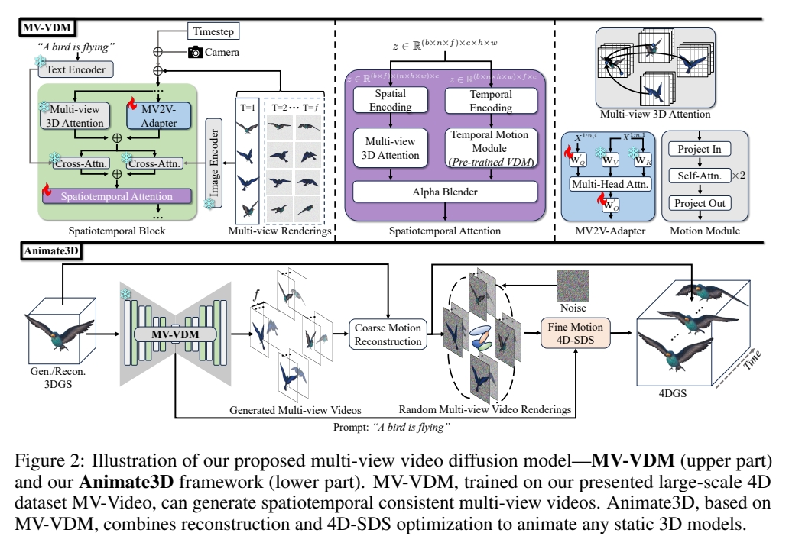

# Animate3d: Animating any 3d model with multi-view video diffusion

当前四维生成领域的研究进展主要集中在通过蒸馏预训练的文本或单视图图像条件模型来生成四维内容。这类方法难以有效利用现有具有多视图属性的三维资源，且由于监督信号固有的模糊性，其生成结果常出现时空不一致问题。本研究提出Animate3D——一个可为任意静态三维模型生成动画的创新框架。其核心设计包含两个关键部分：1）我们提出基于静态三维对象多视图渲染的新型多视图视频扩散模型（MV-VDM），该模型在我们构建的大规模多视图视频数据集（MV-Video）上训练完成；2）基于MV-VDM，我们结合重建技术与四维分数蒸馏采样（4D-SDS），构建了利用多视图视频扩散先验实现三维对象动画的完整框架。具体而言，针对MV-VDM，我们设计了新颖的时空注意力模块，通过融合三维与视频扩散模型来增强时空一致性；同时利用静态三维模型的多视图渲染作为条件输入以保持其身份特征。在三维模型动画生成方面，我们提出有效的两阶段流程：首先直接从生成的多视图视频中重建运动序列，随后通过4D-SDS同步优化外观与运动表现。得益于精确的运动学习机制，我们能够实现直接的网格动画生成。定性与定量实验表明，Animate3D在各方面性能均显著超越现有方法。相关数据、代码与模型将全面开源。

## 研究背景与问题

### 任务

输入：3DGS静态模型
输出：t时刻相对于静态GS的位移、旋转、缩放。

### 本文方法及优势

|要解决的问题|当前方法及存在的问题|本文方法及优势|
|---|---|---|
|引导视频|单视图图像或视频 由于监督信号固有的模糊性，其生成结果常出现时空不一致问题。|利用现有具有多视图属性的三维资源，构建多视图视频扩散模型（MV-VDM）。|

## 主要贡献

1）多视角视频扩散模型（MV-VDM） 2）大规模多视图视频数据集（MV-Video） 3）基于MV-VDM，我们引入结合重建技术与4D分数蒸馏采样（4D-SDS）的框架，利用多视图视频扩散先验实现3D对象动画。

## 主要方法

### 多视角视频扩散模型（MV-VDM）

3D扩散模型(MVDream) + 视频扩散模型([AnimateDiff](./59.md)) + **结合图像条件化方法的高效即插即用时空注意力模块**

## 