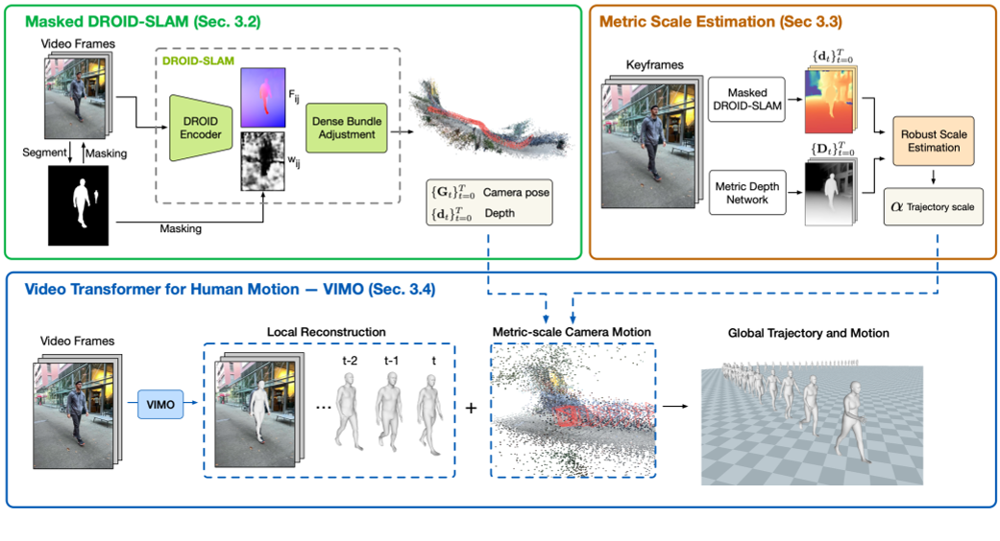
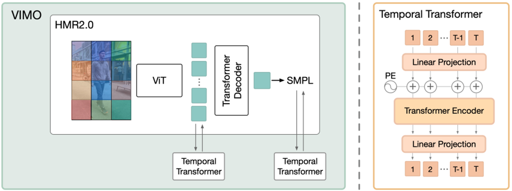

# TRAM: Global Trajectory and Motion of 3D Humans from in-the-wild Videos

|缩写|英文|中文|
|---|---|---|
|VIMO|video transformer model|
|DBA|dense bundle adjustment layer|

## 核心问题是什么?

TRAM是一种从in-the-wild视频中重建人类全局轨迹和运动的两阶段方法。  

### 提取相机轨迹

已有方法（16）是通过相机运动 + 人物运动 + 人物运动先验 联合优化出相机scale。作者认为由于人物运动先验是使用室内数据训练得到的，因此不能泛化到室外场景中。  

作者认为仅通过（排除前景干扰的）背景 + 背景语义足以估计出scale。  

### 人物轨迹恢复

已有方法中，单帧方法恢复较准确，但缺少连续性。而时序方法恢复动作不够准确。原因是基于视频的训练成本高且缺少视频数据。  

作者在HMR2.0(预训练的人物模型)上拓展出VIMO模型（增加2个时序transformer），并使用视频数据finetune这个模型。在轨迹信息的相机作为尺度参考系下，回归出人体的运动学身体运动。 

### 效果

通过组合这两个运动，我们实现了世界坐标系中 3D 人体的精确恢复，将全局运动误差比之前的工作减少了 60%。  


## 核心贡献是什么？

- (i) 我们提出了一种通用方法 TRAM，它可以从野外视频中恢复人体轨迹和运动，比之前的工作有了很大的改进。 
- (ii) 我们证明可以从 SLAM 推断出人体轨迹，并提供技术解决方案，使单目 SLAM 在动态人体存在的情况下具有鲁棒性和公制尺度。 
- (iii) 我们提出了视频变换器模型 VIMO，它建立在大型预训练的基于图像的模型之上，并证明这种可扩展的设计实现了最先进的重建性能。

## 大致方法是什么？



左上：给定一个视频，我们首先使用 DROID-SLAM 恢复相对相机运动和场景深度，并通过双掩蔽对其进行增强（第 3.2 节）。  
右上：我们通过优化过程将恢复的深度与左上预测的深度对齐，以估计度量缩放（第 3.3 节）。  
底部：我们引入 VIMO 在相机坐标下重建 3D 人体（第 3.4 节），并使用公制尺度相机将人体轨迹和身体运动转换到全局坐标。

### detect track video

|输入|输出|方法|
|---|---|---|
|视频|图像|cv2|
|图像|人物的bbox。<br> 一张图像上可能有多个bbox，因此每个图像得到的是**以图像为单位**的bbox list，按照bbox的面积由大到小排序。因为大的bbox更有可能是真实的bbox，而小的bbox更有可能是误检。|VitDet|
|图像，人物的bbox|mask|来自 YOLOv7 [83] 的检测作为Segment Anything Model[32] 模型的提示|
|bbox|tracking。<br> VitDet只负责检测人物的bbox，不负责让bbox与人物的ID挂钩。为了得到某个ID的连续的bbox序列，需要进行tracking。得到的是**以人为单位**的bbox list，以及其相应的mask list。|DEVA-Track-Anything，跟踪策略为IOU。|
|图像|公制深度|ZoeDepth [5]|

### Masked DROID-SLAM

输入：单视角视频  
输出：相机轨迹

|输入|输出|方法|
|---|---|---|
|图像或用户输入|相机内参|相机内参包括focal, center。没有用户指定的情况下，默认center为图像的中心，focal为`np.max([h0, w0])`。|
|图像序列, mask|估计更准确的的相机内参|利用DROID-SLAM的track功能，找到一个可以使droid reprojection error最小的focal.|
|图像序列，mask，相机内参|相机轨迹， disps|Masked DROID-SLAM<br>在DROID-SLAM的基础上，把图像中被mask为有人的区域的置信度转为0，防止人物的移动对DROID-SLAM造成影响。|

> disps：在立体视觉中，"disparity"（视差）是指同一场景点在左右两个相机图像中的水平像素差。这个差异是由于相机从不同的位置观察同一场景造成的。通过计算视差，可以恢复出场景的深度信息，因为视差与深度是相关的（在固定的相机内参下，视差越大，深度越近；视差越小，深度越远）。  
> 相机移动的情况下，才会有来自同一个场景在不同相机观察位置的视差。因此此算法应用于相机移动的场景。而不能使用于相机静止的场景。  

### Trajectory Scale Estimation
作者认为，空间scale的推理能力部分体现在深度预测网络中。

第一步的DPOID会输出深度，但深度的单位未知，且与图像保持一致。  
第二步中的ZoeDepth也会输出深度，且深度是meter scale的。  

|输入|输出|方法|
|---|---|---|
|图像序列|`pred_depth`|预训练的ZoeDepth|
|disps <br> 来自Masked DROID-SLAM|`slam_depth`|`slam_depth = 1/disp`|

通过两个深度的对比，可以得出图像的scale。  

但ZoeDepth预测出的深度存在两个问题：  
1. 特定场景下预测的深度信息不准，例如“天空”  
2. 时间不连续，部分帧不准，存在突变  

为了让这个scale更鲁棒，作者做了以下处理：  
1. 所有帧独立后，再对所有帧取平均值  
2. 去掉无处预测不准确的区域

```python
# 通过求解α，将 α ∗ slam_depth 到 to pred_depth， 我们可以将重建场景和相机轨迹重新缩放到公制单位。
# 此函数每一帧独立调用，每次输入为某一帧的slam_depth和pred_depth
def est_scale_hybrid(slam_depth, pred_depth, sigma=0.5, msk=None, far_thresh=10):
    """ Depth-align by iterative + robust least-square """
    if msk is None:
        msk = np.zeros_like(pred_depth)
    else:
        msk = cv2.resize(msk, (pred_depth.shape[1], pred_depth.shape[0]))

    # Stage 1: Iterative steps
    # 逐像素地求解scale
    s = pred_depth / slam_depth

    # 求解scale时排除以下一些像素：  
    # 1. 前景像素
    # 2. 不合理的深度预测，即深度必须为正值
    # 3. 远区域像素，因此在这些区域上深度预测不准。仅使用深度预测更可靠的中间区域来解决比例问题。
    robust = (msk<0.5) * (0<pred_depth) * (pred_depth<10)
    # 取所有像素的scale均值，作为迭代更新的初始值
    s_est = s[robust]
    scale = np.median(s_est)

    # 迭代更新是为了选择更可靠的区域来计算scale。
    # 这里只是通过更新区域来更新scale，没有优化的过程。
    for _ in range(10):
        # 计算scaled slam depth
        slam_depth_0 = slam_depth * scale
        # 如果scaled slam depth认为某个像素的深度不合理或者不可靠，也会把这个区域排除掉。因为pred_depth不一定可靠。  
        robust = (msk<0.5) * (0<slam_depth_0) * (slam_depth_0<far_thresh) * (0<pred_depth) * (pred_depth<far_thresh)
        s_est = s[robust]
        scale = np.median(s_est)

    # Stage 2: Robust optimization
    robust = (msk<0.5) * (0<slam_depth_0) * (slam_depth_0<far_thresh) * (0<pred_depth) * (pred_depth<far_thresh)
    pm = torch.from_numpy(pred_depth[robust])
    sm = torch.from_numpy(slam_depth[robust])

    def f(x):
        loss = sm * x - pm
        # Geman-McClure Loss
        loss = gmof(loss, sigma=sigma).mean()
        return loss

    # 迭代更新算出的scale作为迭代优化的初始值
    x0 = torch.tensor([scale])
    # torchmin.minimize
    result = minimize(f, x0,  method='bfgs')
    scale = result.x.detach().cpu().item()

    return scale
```


> 为什么在相机移动的情况下，所有帧可以共用一个scale？  
答：scale与相机内参决定。相机内参不变的情况下scale不会变。    


### Video Transformer for Human Motion



想法：利用大型预训练模型中的丰富知识，进行灵活且可扩展的架构设计，其性能可以通过计算和数据不断提高。

做法：  
1. 通过添加两个时间transformer，将基于图像的 HMR2.0 转换为视频模型。
2. 使用视频数据在原始transformer decoder上进行微调

#### 网络输入预处理

|输入|输出|方法|
|---|---|---|
|tracking|chunks|tracking以人为单位组织数据，但是由于数据可能检测错误或者人物出现消失，检测结果是不连续的。但网络要求输入连续数据。因此根据帧ID切段。|
|图像，bbox|cropped image|

#### Transformer

这两个时间transformer使用相同的encoder only架构.  
第一个transfomer在图像域（patch token from ViT）传播时间信息。即，先在每个patch上独立地使用ViT transformer encoder进行编码。再把这个编码合起来，在时间维度上进行增加的transformer。两个transformer合起来，相当于一个ST transformer。      
第二个transformer在人体运动域传播时间信息。作者认为，**先隐空间学习运动模型再回归器出SMPL参数的做法不很合适，因为该隐空间纠缠了许多其他信息，例如形状、相机和图像特征**。相比之下，作者建议回归出SMPL参数之后仅对其中的pose部分使用 Transformer 进行编码和解码。因此，本文直接将这种通用架构应用于 SMPLposes{θt,rt}上，并使用 MoCap 数据进行预训练。

b: batch  
t: frame
c: channel，或者dim

|输入|输出|方法|
|---|---|---|
|图像，[(b,t), c=3, h, w]|feature，[(b,t=16), c=1280, h=16, w=12]|预训练模型vit_huge<br>得到的是一个二维特征|
|bbox的center和scale，focal|bbox_info，[(b,t=16), c=3]|CLIFF (Li et al.) bbox feature<br>一堆magic number，不清楚含义|
|bbox_info，[(b,t=16), c=3]|bbox_info，[(b,t=16), c=3, h=16, w=12]|维度上与feature对齐，便于后面的拼接|
|feature, bbox_info|feature，[(b,t=16), c=1280+3, h=16, w=12]|`feature = torch.cat([feature, bb], dim=1)`<br>图像特征与bbox特征拼接到一起。因为feature来自于cropped image，没有人在整个画面中的信息。而bbox表示人在画面中的位置，正好弥补了这一点。|
|feature，[(b t=16) c=1280+3 h=16 w=12]|feature，[(b h=16 w=12) t=16 c=1280+3]|要在t维度上做transformer，第二个维度必须是t|
|feature，[(b h=16 w=12) t=16 c=1280+3]|feature，[(b h=16 w=12) t=16 c=1280]|st_module|
|feature，[(b h=16 w=12) t=16 c=1280]|feature，[(b t=16) c=1280+3 h=16 w=12]|temporal_attention模块过完以后，又切回原来的顺序|
|feature，[(b t=16) c=1280 h=16 w=12]|pred_pose, pred_shape, pred_cam|smpl_head，此模块来来自HMR2.0|
|pred_pose，[(b,t=16),c=24*6]|pred_pose，[b,t=16,c=24*6]|为再次进行temporal_attention做准备|
|bbox_info，[(b,t=16),c=3]|bbox_info，[b,t=16,c=3]|同样也结合包含图像全局信息的bbox|
|pred_pose，[(b,t=16),c=24*6]|pred_pose，[(b,t=16),c=24*6+3]|`pred_pose = torch.cat([pred_pose, bb], dim=2)`|
|pred_pose，[(b,t=16),c=24*6+3]|pred_pose，[(b,t=16),c=24*6]|motion_module，也是一个temporal_attention模块|
|pred_pose，[(b,t=16),c=24*6+3]|pred_pose，[b,t=16,c=24*6+3]|

```python
# 基于transformer的时序模块
class temporal_attention(nn.Module):
    def __init__(self, in_dim=1280, out_dim=1280, hdim=512, nlayer=6, nhead=4, residual=False):
        super(temporal_attention, self).__init__()
        self.hdim = hdim
        self.out_dim = out_dim
        self.residual = residual
        self.l1 = nn.Linear(in_dim, hdim)
        self.l2 = nn.Linear(hdim, out_dim)

        self.pos_embedding = PositionalEncoding(hdim, dropout=0.1)
        TranLayer = nn.TransformerEncoderLayer(d_model=hdim, nhead=nhead, dim_feedforward=1024,
                                               dropout=0.1, activation='gelu')
        self.trans = nn.TransformerEncoder(TranLayer, num_layers=nlayer)
        
        # Xavier 初始化是一种常用的权重初始化方法，旨在解决深度神经网络训练过程中的梯度消失和梯度爆炸问题。该方法通过根据网络的输入和输出维度来初始化权重，使得前向传播和反向传播过程中的信号保持相对一致的方差。
        nn.init.xavier_uniform_(self.l1.weight, gain=0.01)
        nn.init.xavier_uniform_(self.l2.weight, gain=0.01)

    def forward(self, x):
        x = x.permute(1,0,2)  # (b,t,c) -> (t,b,c)

        # 在channel维度上做MLP，(t=16,b,c=in_dim) -> (t=16,b,c=hdim)
        h = self.l1(x)
        # 在t维度上叠加位置编码和drop out
        h = self.pos_embedding(h)
        # nn.TransformerEncoder，6层transformer encoder layer
        h = self.trans(h)
        # 在channel维度上做MLP，(t=16,b,c=hdim) -> (t=16,b,c=in_dim)
        h = self.l2(h)

        # 预测残差还是预测feature
        if self.residual:
            x = x[..., :self.out_dim] + h
        else:
            x = h

        # (t,b,c) -> (b,t,c)
        x = x.permute(1,0,2)

        return x
```

### 生成最终结果

|输入|输出|方法|
|---|---|---|
|pred_shape|pred_shape|VIMO每一帧都会预测一个shape参数，但是人的真实体型是不会变的，所以都统一到一个体型上|
|pred|pred shape, pred pose, pred_trans|smpl forward|
|pred_cam，相机运动，来自Masked DROID-SLAM<br> scale|pred_camt，相机运动trans<br> pred_camr，相机运动pose，旋转矩阵形式|
|pred_cam, pred|verts|相机视角 + 世界坐标系下的人物 = 相机坐标系下的人物|

## 训练与验证

只开源推断代码，没有开源训练代码

### 数据集

3DPW [81], Human3.6M [24], and BEDLAM [6]

### Loss

- 2D 投影loss
- 3D 重建loss
- SMPL参数loss
[?] 只是动作参数？
- mesh重建loss

## 有效

测的几段视频，发现在重建动作的灵活性和准确性上都优于WHAM。  

## 缺陷

1. 由于缺少世界坐标系下的数据，只能预测相机坐标系下的动作信息。  
2. 在运动相机下有效，在静止相机下代码会出错。错误来自第三方的SLAM估计模块。  
3. 轨迹的抖动与动作的抖动

## 启发

## 遗留问题

## 参考材料

1. 开源：https://yufu-wang.github.io/tram4d/
2. DROID-SLAM：https://blog.csdn.net/huarzail/article/details/130906160
3. torchmin.minimize：https://pytorch-minimize.readthedocs.io/en/latest/api/generated/torchmin.minimize.html
4. nn.init.xavier_uniform_：https://blog.csdn.net/AdamCY888/article/details/131269857
5. SMPLTransformerDecoderHead：https://caterpillarstudygroup.github.io/ReadPapers/28.html