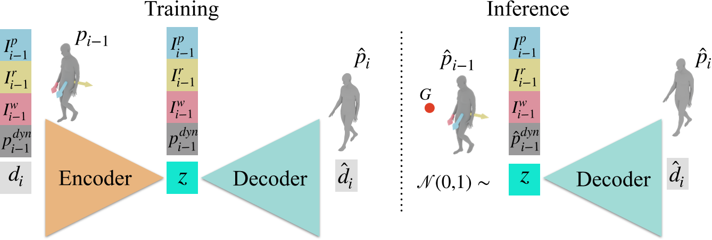

# WANDR: Intention-guided Human Motion Generation

## 核心问题是什么?

### 要解决的问题

输入：角色的初始姿势和目标的 3D 位置  
输出：生成自然的人体运动，并将末端执行器（手腕）放置在目标位置。  

### 现有方法

现有方法（数据驱动或使用强化学习）在泛化和运动自然性方面受到限制。主要障碍是缺乏将运动与目标达成相结合的训练数据。

### 本文方法

为了解决这个问题，我们引入了新颖的意图特征（intention feature）。intention引导角色达到目标位置，并交互式地使生成适应新的情况，而无需定义子目标或整个运动路径。
WANDR 是一种条件变分自动编码器 (c-VAE)，可以在具有目标导向运动的数据集（CIRCLE）进行训练，也可以是不具有目标导向运动的数据集(AMASS)进行训练。  

### 效果

我们广泛评估我们的方法，并证明其生成自然和长期运动的能力，以达到 3D 目标并推广到看不见的目标位置。我们的模型和代码可用于研究目的，请访问 wandr.is.tue.mpg.de。

## 核心贡献是什么？

- 我们提出了 WANDR，一种数据驱动的方法，它将自回归运动先验与新颖的intention引导机制相结合，能够生成在空间中真实移动并达到任意目标的角色。  
- 我们通过实验评估我们的方法，包括“组合多个数据集的优势”以及“我们的运动生成器的泛化能力”。我们的结果强调了“intention机制指导运动生成过程”的有效性
- 同时还能够为缺乏明确目标注释的数据集合并伪目标标签。该模型和代码可用于研究目的。

## 大致方法是什么？

原理：当人试图到达一个遥远的目标时，运动主要集中在腿部和引导身体接近物体，但当他接近物体时，重点将集中在移动手臂和上半身以到达目标。

在训练过程中，模型以意图向量 Ip、Ir 和 Iw 为条件，学习将它们与实际实现目标的行动联系起来。当训练数据没有明确的目标时，根据未来帧中手腕的位置创建一个目标；角色的状态 \\(p^{dyn}_i\\) 表示 SMPL-X 局部姿态参数 pi 以及帧 i − 1 中身体参数的 deltas \\(d{i−1}\\)。  
在推理过程中，WANDR 获取意图特征、状态和随机噪声并返回位姿变化 \\(\hat d_i\\)。下一个位姿 pi 是通过将 \\(\hat d_i\\) 与前一个位姿 \\(\hat p_{i-1}\\) 相结合而获得的。

### 数据表示

body pose：全局位移（3）+ 全局朝向（6）+ local pose (21 * 6)  
角色状态\\(p^{dyn}_i\\)：SMPL-X 局部姿态参数 pi + 帧 i − 1 中身体参数的 deltas \\(d{i−1}\\)

### Intention Features

输入:  
- 当前帧的body pose
- 期待目标帧时手的位置
- 期待手达到指定位置时的目标帧ID（有GT时用GT，没有GT时随机指定未来帧）
- 当前帧ID

输出：
- Wrist Intention：手腕及时到达目标位置所需的平均速度  
- Orientation Intention：达目标位置时的身体方向。通过对此进行调节，我们确保人类模型面向目标并平稳地导航到目标，防止推理过程中出现不自然的运动，例如倒退。
- Pelvis Intention：目标相对于身体的位置的信息。它是目标和骨盆关节之间的差异，不包括 z（高度）分量。

### Motion Network (WANDR)

|输入|输出|方法|
|---|---|---|
|第i帧pose和第i-1帧pose|pose delta di（135维） 通过关注姿势增量而不是绝对姿势值，我们的模型受益于重要的归纳偏差，提高了其学习效率和性能.*类似Motion VAE和HuMoR.*|p是的旋转分量和位移分量分别计算。并去除其中全局旋转和全局位移中的z分量|
|di|对di进行编码|Encoder|
|编码z，意图参数，角色状态|相对于上一帧的delta pose|Decoder|

### Training Loss

|loss|weight|
|---|---|
|重建loss|1|
|KL divergence|1e-2 防止 LKL 的过度支配，从而帮助解码器避免崩溃为均值预测。|
|J 关节位置|1|

## 有效

## 缺陷

## 验证

数据集：AMASS, CIRCLE

## 启发

3D-3D通常预测delta pose，来避免模型过于关注全局朝向。  
2D-3D通常预测全局位置，因为不同全局朝向的3D对应的2D是不同的。  

## 遗留问题

## 参考材料