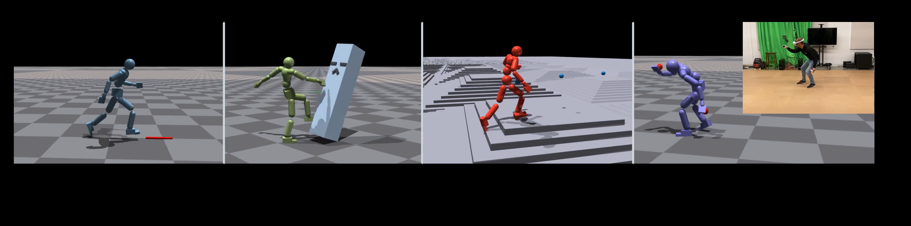
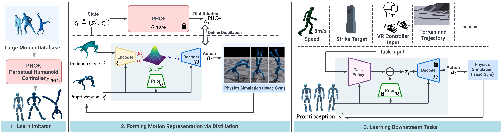
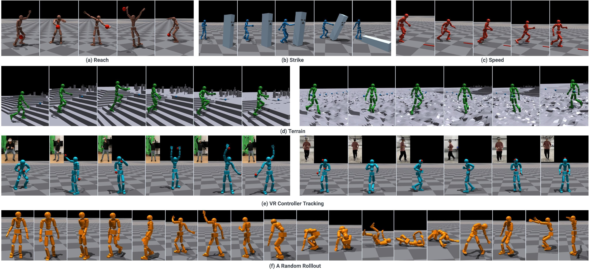
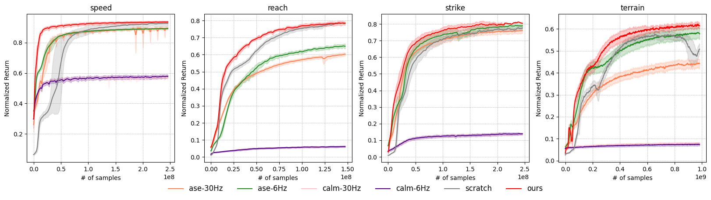
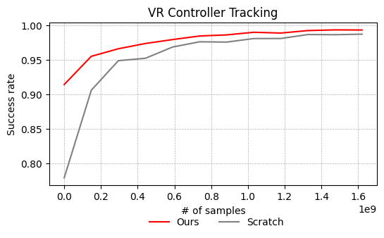
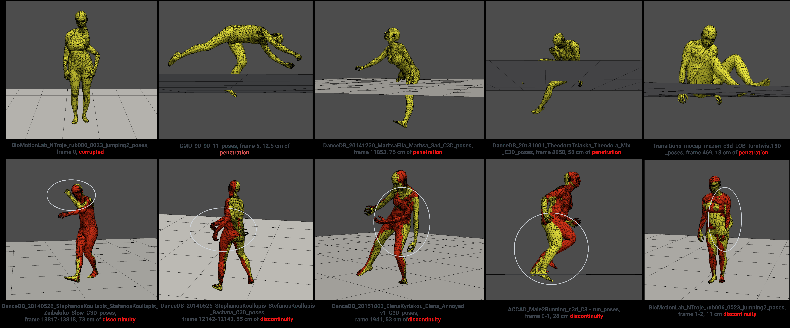

# UHMP: Universal Humanoid Motion Representations for Physics-Based Control

**论文信息**: ICLR 2024, Meta Reality Labs + CMU

**Authors**: Jialong Li, Xiangyu Xu, Minshuo Chen, Mengyi Shan, Haizhou Ge, Yandong Guo, Jingdong Wang, Tuo Zhao

**Link**: [[2310.04582] Universal Humanoid Motion Representations for Physics-Based Control](https://ar5iv.labs.arxiv.org/html/2310.04582)

**项目主页**: https://universal-humanoid-motion.github.io/

## 核心本质

这篇论文的核心本质，是建立了一套业界通用的成熟运动控制范式（Pipeline），用以解决动画数据与物理控制之间的巨大鸿沟（Gap）。

## 1. 核心目标



- 构建一个统一的运动表示（Unified Motion Representation）：使用隐变量 z 作为通用语言，同时支撑动作的自然多样性与物理的稳定性。

## 2. 核心困境（为什么需要这套范式）

- **MoCap 生成模型（如 CVAE）**：动作自然、丰富、像人，但物理不稳定，仿真里会摔倒。
- **纯轨迹优化（TO/MPC）**：物理极其稳定、可控制，但动作单调死板，无法覆盖 MoCap 里的复杂动作，且计算缓慢。
- **矛盾**：追求多样性就不稳，追求稳定就不多样。

## 3. 解决方案与关键流程（取其精华）

作者没有抛弃任何一方，而是用三级跳的策略，完善了一套成熟范式：

### 第一阶段：建立动作先验（Motion Prior）—— PHC+ Imitator



- **手段**：利用大规模 MoCap 数据（如 AMASS）训练 CVAE
- **关键创新**：**PHC+ (Progressive Humanoid Control+)** 使用渐进式训练策略
  - 从 3 个基础动作原语（primitives）开始
  - 逐步增加动作复杂度
  - **在 AMASS 数据集上达到 100% 成功率**（这是蒸馏能成功的前提！）
- **作用**：让网络从无标签数据中自动学习动作的隐语义 z。这一步决定了智能体能做的动作广度与多样性

### 第二阶段：成熟的轨迹优化与蒸馏（Distillation）

- **手段**：作者自研了一套非常成熟、高质量的全身轨迹优化器。它虽然慢，但能在物理仿真里算出稳定、自然、物理正确的参考轨迹
- **关键操作**：利用这套优化器作为"老师"，对 CVAE 的解码器（Decoder）进行知识蒸馏
- **蒸馏 Loss 公式**（变分信息瓶颈）：
  ```
  L = L_action + αL_regu + βL_KL
  ```
  - `L_action`：动作重建损失
  - `L_regu`：正则化项
  - `L_KL`：KL 散度，约束 z 接近先验分布
  - `β` 使用退火策略（annealed schedule），从 0 逐渐增加
- **目的**：在不破坏统一表示 z 的前提下，把物理稳定性灌进网络

### 第三阶段：高层强化学习（High-level RL）

- **手段**：固定蒸馏好的 Decoder 作为底层执行器，训练上层 RL 策略
- **作用**：RL 只负责输出指令 z，实现简单、灵活的高层语义控制

## 4. 最终成果与贡献



- **统一表示 z**：现在的 z 既代表了 MoCap 里的丰富动作语义，也代表了物理上的可执行状态。
- **PHC+ 100% 成功率**：在 AMASS 数据集上实现完美跟踪，证明动作先验质量足够高
- **范式确立**：这篇论文真正的历史贡献，是定型并普及了这套 **Prior（先验）+ Distillation（蒸馏）+ RL（高层控制）** 的标准流水线。后来所有人做基于物理的角色控制，基本都在沿用这套成熟的框架
- **下游任务验证**：
  - 复杂地形穿越（Terrain Traversal）
  - VR 动作追踪（Motion Tracking）

## 5. 不可回避的局限性（因果真相）



- 虽然动作变稳了，但天花板依然被轨迹优化器锁死。
- 因为依赖轨迹优化生成数据，所以该系统能做的动作受限于优化器的求解能力。
- **注意**：论文实验展示了复杂地形穿越和 VR 动作追踪，但更复杂的跳跃、翻滚、交互动作仍受限于优化器能力。

---

## 详细技术流程



### 阶段 1：Motion Prior（动作先验）—— PHC+ CVAE 训练

**作用**：从动作捕捉数据学习统一、丰富的语义隐空间 z

**学习类型**：**监督学习**（变分自编码器）
- 输入：s^p + s^g-mimic
- 标签：MoCap 动作数据
- Loss：重建 Loss + KL 散度

**核心作用**：**把目标转化为行动**
- 输入模仿目标 s^g-mimic（来自动作捕捉）
- 学习输出对应的动作 a（PD 控制器目标）

#### 与标准 CVAE 的区别

| 组件 | 标准 CVAE | UHMP Motion Prior |
|------|-----------|-------------------|
| **输入** | 数据 x（如图像、姿态序列） | 本体感知 s^p（关节位置、速度） |
| **条件** | 外部标签 c（如类别、文本） | 模仿目标 s^g-mimic（来自动作捕捉） |
| **输出** | 重建输入 x̂ | 动作 a（PD 控制器目标） |
| **Prior** | p(z\|c) = N(0,I) 固定 | R(z\|s^p) = N(z \| μ^p_t, σ^p_t) 可学习 |
| **训练目标** | 数据重建 | 动作重建 + 物理稳定性 |
| **训练策略** | 单次训练 | PHC+ 渐进式（从 3 个原语开始） |

**本质区别**：
> UHMP 不是"标准 CVAE"，而是**披着 CVAE 外衣的动作生成模型**——框架思想一样，但每个组件都为控制任务重新设计了。

- **网络架构**：
  ```
  Encoder:  E(z | s^p, s^g-mimic)  →  计算隐变量 z
  Decoder:  D(a | s^p, z)          →  输出动作 a（PD 控制器目标）
  Prior:    R(z | s^p)             →  可学习的高斯先验
  ```
  - `s^p`：本体感知状态（proprioception），包括关节位置、速度等
  - `s^g-mimic`：模仿目标（来自动作捕捉数据）
  - **Prior 灵感来自 HuMoR**：`R(z|s^p) = N(z | μ^p_t, σ^p_t)`

- **训练数据**：原始 MoCap 动作数据（AMASS），无标签，包含走路、跑、蹲、转身等大量人类动作

- **PHC+ 渐进式训练**：
  - 从 3 个基础动作原语（primitives）开始
  - 逐步增加动作复杂度
  - 达到 100% AMASS 成功率

#### 为什么需要渐进式训练？

**原因 1：降低优化难度**
```
AMASS 包含的动作复杂度跨度大：
- 简单：站立、慢走、转身
- 中等：快走、跑步、下蹲
- 复杂：跳跃、翻滚、舞蹈

直接全部训练 → 网络偏向简单动作，复杂动作学不会
渐进训练 → 先学会基础，再扩展复杂度
```

**原因 2：保证物理稳定性**
```
UHMP 的 CVAE 最终要用于物理控制：
- 输出动作 a → PD 控制器目标 → 物理仿真执行

如果直接学复杂动作：
- 基础平衡能力没学会 → 仿真中摔倒
- 动作质量差 → 蒸馏阶段无法收敛

渐进训练 → 确保基础动作足够稳定
```

**原因 3：避免 KL Collapse（CVAE 经典问题）**
```
CVAE 的 ELBO 损失：
L = 重建项 - KL 散度

KL Collapse 现象：
- Decoder 太强 → 不需要 z 也能重建
- 网络忽略隐变量 z
- z 失去控制多样性能力

渐进训练的作用：
- Phase 1：网络必须用 z 区分"站立"vs"走路"vs"转身"
- 养成"依赖 z"的习惯
- 后期不会轻易抛弃 z
```

**本质**：这是 **Curriculum Learning（课程学习）**思想的体现——先易后难，让网络逐步掌握复杂技能。

- **目标**：重建动画姿态，学习自然动作规律，z 代表动作风格/类型

### 阶段 2：Motion Distillation（动作蒸馏）—— 用轨迹优化器训练 Decoder

**作用**：把物理稳定性灌进网络，保留 z 不变

**学习类型**：**监督学习**（不是强化学习）
- 有明确的输入：s_t + z
- 有明确的标签：轨迹优化器输出的动作
- 有监督 Loss：MSE 重建损失

**核心作用**：**让行动变得稳定**
- 阶段 1 的 Decoder 能生成动作，但可能物理不稳定
- 阶段 2 用轨迹优化器的"标准答案"微调，保证物理稳定

#### 蒸馏关系

```
老师：轨迹优化器 (Trajectory Optimizer)
       ↓ (生成"标准答案")
学生：Decoder
       ↓ (学习模仿)
输出：物理稳定的动作
```

- **用到的关键模块**：作者自研的成熟、高质量、全身轨迹优化器（Trajectory Optimizer）
- **轨迹优化器的作用**：以 MoCap 为参考，在物理仿真中计算出稳定、不摔倒、符合动力学的姿态序列
- **蒸馏数据**：轨迹优化器生成的物理稳定姿态序列（"老师"的标准答案）
- **网络**：只使用阶段 1 训练好的 CVAE Decoder（解码器）
- **Decoder 输入**：当前物理状态 s_t + 隐变量 z
- **Decoder 输出**：动作 a（PD 控制器目标）
- **训练目标**：让 Decoder 输出尽量逼近轨迹优化器的稳定姿态
- **注意**：这一步只微调 Decoder，不改变 z 的语义空间。

#### Decoder 的演进：阶段 1 vs 阶段 2

| 方面 | 阶段 1 Decoder | 阶段 2 Decoder |
|------|---------------|---------------|
| **网络结构** | 相同 | 相同（同一网络） |
| **权重** | 从 MoCap 学习 | 在阶段 1 基础上微调 |
| **输出特性** | 像 MoCap 动作 | 像轨迹优化器输出（物理稳定） |
| **训练数据** | 原始 MoCap | 轨迹优化器生成的数据 |
| **目标** | 重建动画姿态 | 逼近物理稳定动作 |

**关键设计：如何保证微调后还能"接上"？**

1. **Encoder 和 Prior 冻结**
   - 阶段 2 只更新 Decoder 权重
   - Encoder 和 Prior 保持不变
   - z 的语义空间不被破坏

2. **小学习率微调**
   - 阶段 2 使用比阶段 1 更小的学习率
   - Decoder 只小幅调整，不颠覆阶段 1 学到的内容

3. **KL 正则约束**
   ```
   L = L_action + αL_regu + βL_KL
   ```
   - L_KL 项约束输出不要偏离原始分布太远
   - 防止"微调过头"

4. **实验验证**
   - 阶段 3 能正常学习复杂任务（地形穿越、VR 追踪）
   - 证明 Encoder-Prior-Decoder 仍然兼容

**本质**：阶段 2 是**兼容性微调**，不是**重新训练**——Decoder 变了，但和 Encoder/Prior 的接口（z 的语义）保持一致。

#### 如果阶段 2 还是不能保证稳定怎么办？

**问题：为什么阶段 2 可能失败？**

| 原因 | 说明 | 解决方案 |
|------|------|----------|
| **轨迹优化器本身失败** | 某些 MoCap 动作在物理上不可执行 | 筛选数据集，剔除无法优化的动作 |
| **Decoder 容量不足** | 网络太小，学不会复杂映射 | 增加网络层数或宽度 |
| **微调过头** | 学习率太大，破坏了阶段 1 的语义 | 降低学习率，增加 KL 权重 |
| **蒸馏数据不足** | 轨迹优化器生成的样本太少 | 增加蒸馏数据量，多次迭代 |

**论文中的保障机制**：

1. **PHC+ 100% 成功率**
   - 阶段 1 已经达到 AMASS 完美跟踪
   - 基础动作质量有保证

2. **轨迹优化器是物理正确的**
   - 基于优化方法（不是学习）
   - 生成的动作天然物理稳定

3. **提前终止（Early Termination）**
   - 如果 Decoder 输出导致摔倒，立即终止
   - 让训练专注于成功的样本

4. **渐进式蒸馏**
   - 先蒸馏简单动作（走路、站立）
   - 再蒸馏复杂动作（跑步、跳跃）

**极端情况**：
> 如果某些动作确实物理不可执行（如 MoCap 数据有穿透、抖动），轨迹优化器会失败，这些动作会被剔除出训练集。UHMP 承认"不是所有 MoCap 动作都能物理实现"，这是合理的取舍。

**与 HuMoR 的关系**：
- Prior 设计 `R(z|s^p) = N(z | μ^p_t, σ^p_t)` 灵感来自 HuMoR
- 但 UHMP 进一步将先验用于下游物理控制任务

### 阶段 3：High-level Control（高层强化学习）

**作用**：学习用 z 控制角色完成任务

**学习类型**：**强化学习**
- 没有标签，只有奖励信号
- 需要探索（从先验 R(z|s^p) 采样 z）
- 目标：最大化累积奖励

**核心作用**：**生成任务目标**
- 阶段 1-2 已经学会"能走起来"和"怎么走"
- 阶段 3 只学习"往哪走"（根据任务目标选择 z）

**网络状态**：
- **Decoder D**：固定（阶段 2 蒸馏后的版本）
- **Prior R**：固定（阶段 1 训练好的版本）
- **Encoder E**：不使用（任务阶段不需要编码）
- **高层策略 π_task**：可训练，学习输出合适的 z

#### 为什么 Decoder 和 Prior 固定后还能工作？

```
阶段 1 + 阶段 2 训练完成后：
┌──────────────────────────────────────┐
│  Encoder E: z 的语义空间已学会        │
│  Prior R: 能根据 s^p 生成合适的 z       │
│  Decoder D: 能根据 z 输出稳定动作      │
└──────────────────────────────────────┘
         ↓
阶段 3：固定底层，只训高层
- Decoder 和 Prior 构成"动作执行器"
- 高层策略学习"如何选择 z"
- 就像学会了"开车"，只需要学"往哪开"
```

**类比**：
> 阶段 1-2：培训司机（学会开车技能）
> 阶段 3：安排任务（学习如何送货、载客、赛车）
> 司机已经会开车了，只需要知道目的地

#### 三阶段学习类型对比

| 阶段 | 方法 | 学习类型 | Loss/信号 |
|------|------|----------|-----------|
| **阶段 1** | PHC+ CVAE | 监督学习 | 重建 Loss + KL 散度 |
| **阶段 2** | Distillation | 监督学习 | MSE（模仿轨迹优化器） |
| **阶段 3** | High-level Policy | 强化学习 | 任务奖励 |

#### 三阶段核心作用对比

| 阶段 | 核心作用 | 输入 | 输出 |
|------|---------|------|------|
| **阶段 1** | 把目标转化为行动 | 模仿目标 s^g-mimic | 能生成动作的 CVAE |
| **阶段 2** | 让行动变得稳定 | 轨迹优化器的"标准答案" | 物理稳定的 Decoder |
| **阶段 3** | 生成任务目标 | 任务目标 s^g | 选择哪个 z（动作指令） |

**关键结论**：
> UHMP 只有**阶段 3 是强化学习**，阶段 1 和 2 都是监督学习。
> 这与 ASE/AMP 等直接使用对抗学习 +RL 的方法有本质区别。
>
> **阶段 1-2 解决了"能走起来"和"怎么走"，阶段 3 只负责"往哪走"**。

#### 与传统端到端 RL 的对比

| 方法 | 需要学什么 | 难度 |
|------|-----------|------|
| **传统端到端 RL** | 目标→行动→稳定 一起学 | 地狱级 |
| **UHMP** | 阶段 1：目标→行动<br>阶段 2：行动→稳定<br>阶段 3：任务→目标 | 简单级 |

**为什么 UHMP 更简单？**
- 传统 RL：同时学太多东西，探索空间巨大，容易学到"奇怪但有效"的步态
- UHMP：分层击破，每层专注一件事，底层用监督学习保证质量

---

## 6. 与论文199（ASE）的对比



### 6.1 它们是不是都在解决"通用性"？

**是，但不是同一种通用性。**

两篇论文都在回答同一个大问题：

> 如何让物理角色控制摆脱"一个任务训一个策略"、"一个动作写一套跟踪器"的低通用性困境？

但它们切入的是这个问题的不同侧面：

- **论文199（ASE）**：主攻**任务通用性 / 技能复用性**。目标是先预训练出一个可复用的技能库，再让上层策略在新任务里调用这些技能。
- **论文191（UHMP）**：主攻**动作通用性 / 运动表示统一性**。目标是用统一隐变量 z 覆盖丰富的动作语义，同时通过蒸馏把这些动作变成物理可执行的控制表示。

所以更准确地说：

- ASE 在解决：**学到的能力能不能跨任务复用？**
- UHMP 在解决：**大量动作能不能被统一表示，并稳定落地到物理控制？**

### 6.2 两者的共同点

1. **都引入了隐变量 z 作为高层控制接口**
   - 都不是直接让 RL 输出低层关节控制，而是先输出一个更抽象的 latent code。
   - 这意味着高层决策与低层动作生成被解耦。

2. **都采用分层控制结构**
   - 高层策略负责选择 latent 指令。
   - 低层模块负责把 latent 指令变成物理动作。

3. **都试图摆脱传统逐动作跟踪、逐任务手工设计的范式**
   - 都代表了从"手工指定控制逻辑"转向"学习统一运动先验"的趋势。

### 6.3 两者最关键的差异

| 维度 | 论文199：ASE | 论文191：UHMP |
|------|-------------|---------------|
| **核心目标** | 技能可复用、跨任务迁移 | 动作表示统一、物理稳定可执行 |
| **通用性的类型** | 任务通用性 | 动作通用性 |
| **z 的本质** | 技能索引 / 技能地址 | 动作语义表示 |
| **z 的来源** | 训练中随机采样，并通过互信息约束赋予语义 | 从 MoCap 数据中通过 CVAE 学出来 |
| **低层控制器** | 预训练技能策略 \(\pi(a\|s,z)\) | 蒸馏后的 Decoder |
| **关键训练机制** | 对抗模仿 + 技能发现 + 两阶段训练 | 动作先验 + 轨迹优化蒸馏 + 高层 RL |
| **主要优点** | 下游任务迁移快、技能可复用 | 动作自然性与物理稳定性结合得更成熟 |
| **主要瓶颈** | 技能语义较隐式，仍偏 locomotion/基础技能 | 上限受轨迹优化器能力限制 |

### 6.4 最重要的一点：它们都用了 z，但 z 不是同一种东西

这是最容易混淆、但也是最关键的区别。

#### ASE 的 z："技能索引"

- z 更像一个**人为构造的技能地址空间**。
- 论文通过互信息最大化，强迫不同 z 对应不同行为模式。
- 因此 z 的目标是：**让系统拥有一组可区分、可调用、可复用的技能**。

可以理解为：

- z1 可能对应走路
- z2 可能对应跑步
- z3 可能对应转身或攻击

所以 ASE 的 z 首先服务的是**技能复用**。

#### UHMP 的 z："动作语义码"

- z 是从大量动作数据中通过 CVAE 自动学出的连续语义表示。
- 它不是先验定义好的技能编号，而是 MoCap 分布压缩后的连续表达。
- 随后作者再用轨迹优化蒸馏，把这个语义空间变成物理稳定、可执行的控制空间。

所以 UHMP 的 z 首先服务的是**统一表示大量动作**。

一句话概括：

> ASE 的 z 是"给高层策略调用技能用的地址"；
> UHMP 的 z 是"从动作数据中学出来的统一语义表示"。

### 6.5 从研究脉络上看，它们是什么关系？

它们不是简单的谁替代谁，而是同一研究脉络中两条互补路线：

- **ASE** 强调：先把大量技能学出来，并让它们能迁移到不同任务。
- **UHMP** 强调：先把大量动作压缩进统一表示，再通过蒸馏获得物理上稳定、易控的执行器。

如果把"通用物理角色控制"看作最终目标，那么：

- ASE 更像是在回答：**如何做出一个可复用的技能库？**
- UHMP 更像是在回答：**如何做出一个统一且稳定的运动表示层？**

两者合起来，才更接近真正的通用角色控制系统。

### 6.6 与 ControlVAE 的对比

| 维度 | ControlVAE (202) | UHMP (191) |
|------|------------------|------------|
| **Prior 设计** | 状态条件高斯 p(z\|s) | 可学习高斯先验 R(z\|s^p) |
| **训练方式** | 世界模型监督学习 | 轨迹优化蒸馏 + RL |
| **多样性保证** | KL 散度 + 数据平衡 | 变分信息瓶颈 |
| **下游任务** | 梯度优化 | 高层 RL 策略 |

**共同点**：
- 都使用可学习的先验分布（非固定标准正态）
- 都用Decoder作为底层控制器
- 都支持多种下游任务

**关键区别**：
- ControlVAE 用世界模型进行监督学习，UHMP 用轨迹优化器蒸馏
- ControlVAE 的 prior 依赖完整状态 s，UHMP 的 prior 仅依赖 proprioception s^p

---

## 七、关键公式总结

### 蒸馏 Loss（变分信息瓶颈）
```
L = L_action + αL_regu + βL_KL
```
- `β` 使用退火策略，从 0 逐渐增加

### Learnable Prior（灵感来自 HuMoR）
```
R(z|s^p) = N(z | μ^p_t, σ^p_t)
```

### 网络架构
```
Encoder:  E(z | s^p, s^g-mimic)  →  隐变量 z
Decoder:  D(a | s^p, z)          →  动作 a（PD 目标）
Prior:    R(z | s^p)             →  可学习高斯先验
```

### 高层策略
```
π_task(z | s^p, s^g)  从 R(z|s^p) 采样用于探索
```
