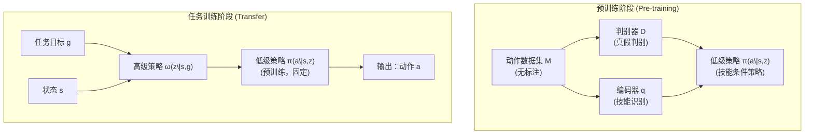
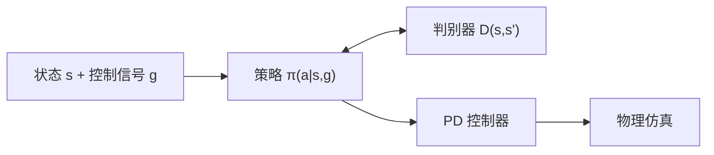
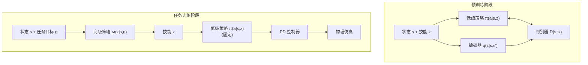
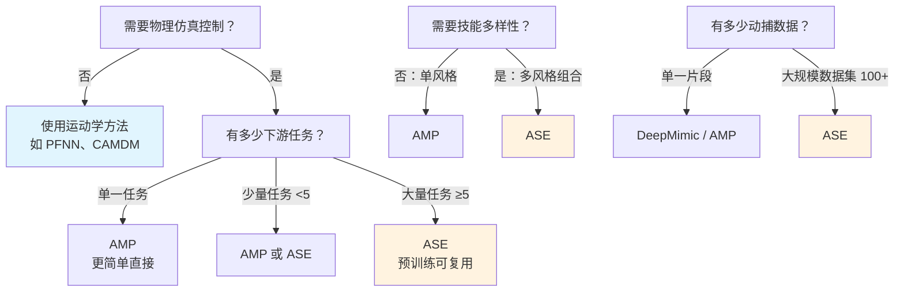

# ASE: Large-Scale Reusable Adversarial Skill Embeddings for Physically Simulated Characters

**论文信息**: ACM Transactions on Graphics (SIGGRAPH 2022), Xue Bin Peng et al., NVIDIA/UC Berkeley/University of Toronto

**Link**: [arXiv:2205.01906](https://arxiv.org/abs/2205.01906)

---

## 一、核心问题

### 1.1 研究背景

人类能够完成各种复杂的运动任务，这得益于我们通过多年练习积累的大量**通用运动技能库**（general-purpose motor skills）。这些技能不仅能让我们执行复杂任务，还能为学习新任务提供强大的**先验指导**（priors）。

然而，传统的基于物理的角色动画方法采用的是**从零开始训练**（tabula rasa approach）的范式：
- 每个新任务都要重新训练一个专用的控制策略
- 即使是走路、跑步这样的基础技能，也要为每个新任务重新学习
- 需要大量手动设计奖励函数，工程工作量巨大

### 1.2 核心问题

**如何赋予智能体大量通用的、可复用的技能库，使其能够灵活地应用于各种新任务？**

灵感来自计算机视觉和 NLP 领域：这些领域通过**大规模预训练 + 下游任务微调**的范式取得了巨大成功。论文希望将这种范式引入到物理角色控制领域。

### 1.3 现有方法及其局限性

| 方法类型 | 代表性工作 | 局限性 |
|---------|-----------|--------|
| **基于优化的方法** | 轨迹优化、强化学习 | 需要手动设计奖励函数，工作量大；不同技能需要不同的启发式设计 |
| **基于运动跟踪的方法** | 跟踪参考动作数据 | 难以应用于大规模多样化数据集；需要运动规划器来选择跟踪哪个动作 |
| **对抗运动先验 (AMP)** | Peng et al. 2021 | 虽然能从无结构数据集学习，但每个任务都要从头训练 |
| **层次化模型** | 先训练低级技能再组合 | 通常使用运动跟踪，限制了模型产生数据集中未出现行为的能力 |
| **无监督强化学习** | 最大化互信息技能发现 | 在复杂高维系统中难以发现有用的行为；难以产生自然的人体运动 |

### 1.4 本文方法

论文提出了 **ASE (Adversarial Skill Embeddings，对抗技能嵌入)** 框架：

**核心思想**：
1. **预训练阶段**：从大规模无标注动作数据集中学习一个通用的低级技能策略 \\(\pi(a|s, z)\\)
   - 使用对抗模仿学习 + 无监督技能发现
   - 学习多样化的技能库，而不需要精确匹配任何特定动作
2. **任务训练阶段**：针对新任务训练一个高级策略 \\(\omega(z|s, g)\\)
   - 通过指定潜在技能变量 \\(z\\) 来控制低级策略
   - 不需要额外的动作数据

**关键创新**：
- 结合了对抗模仿学习（保证运动质量）和无监督强化学习（保证技能多样性）
- 使用连续潜在空间表示技能，支持技能之间的平滑插值
- 能够从超过 100 个多样化动作片段的大规模数据集中学习

---

## 二、核心贡献

1. **可扩展的对抗模仿学习框架**
   - 使物理模拟角色能够学习大量复杂、通用的运动技能
   - 技能可以复用于广泛的下游任务

2. **大规模无结构动作数据训练**
   - 能够处理包含 100+ 多样化动作片段的数据集
   - 利用 NVIDIA Isaac Gym 并行模拟器，使用相当于十年的模拟经验进行预训练

3. **提高技能多样性和迁移效果的设计决策**
   - 球形潜在空间设计
   - 多样性目标函数
   - 鲁棒的恢复策略

4. **无需下游任务动作数据**
   - 预训练的低级策略可以使用简单的任务奖励函数完成各种任务
   - 自动生成复杂自然的策略

---

## 三、大致方法

### 3.1 框架概述



### 3.2 两阶段训练

#### 阶段 1：预训练 (Pre-training)

**输入**：无标注的动作片段数据集 \\(M = \{m_i\}\\)

**目标**：训练低级技能策略 \\(\pi(a|s, z)\\)
- \\(s\\): 状态（角色身体配置）
- \\(a\\): 动作（关节目标旋转）
- \\(z\\): 潜在技能变量

**训练目标函数**：
$$\max_{\pi} -D_{JS}(d_{\pi}(s, s') || d_M(s, s')) + \beta I(s, s'; z | \pi)$$

- 第一项（模仿目标）：鼓励策略产生真实行为，匹配数据集的边际状态转移分布
- 第二项（技能发现目标）：鼓励策略学习多样化技能，最大化技能与行为的互信息

#### 阶段 2：任务训练 (Transfer)

**输入**：任务特定的奖励函数 \\(r_G(s, a, s', g)\\)

**目标**：训练高级策略 \\(\omega(z|s, g)\\)
- 接收状态 \\(s\\) 和任务目标 \\(g\\)
- 输出潜在技能 \\(z\\) 来控制低级策略

**关键**：低级策略\\(\pi\\)在任务训练阶段保持固定，不需要动作数据

---

## 四、训练细节

### 4.1 对抗模仿学习

#### 判别器训练

判别器\\(D(s, s')\\)用于区分数据集转移和策略产生的转移：

$$\min_D -\mathbb{E}_{d_M}[\log D(s, s')] - \mathbb{E}_{d_{\pi}}[\log(1 - D(s, s'))] + w_{gp}\mathbb{E}[||\nabla D||^2]$$

其中：
- \\(d_M\\): 数据集的状态转移分布
- \\(d_{\pi}\\): 策略的状态转移分布
- \\(w_{gp}\\): 梯度惩罚系数，提高训练稳定性

#### 策略的对抗奖励

$$r_{adv} = -\log(1 - D(s_t, s_{t+1}))$$

### 4.2 技能发现目标

**互信息最大化**：
$$I(s, s'; z | \pi) = H(s, s' | \pi) - H(s, s' | z, \pi)$$

- 最大化边际状态转移熵：策略产生的行为要多样化
- 最小化条件状态转移熵：每个技能产生的行为要独特

**变分下界**：
$$I(s, s'; z | \pi) \geq H(z) + \mathbb{E}_{p(z)}\mathbb{E}_{p(s,s'|z,\pi)}[\log q(z|s, s')]$$

其中 \\(q(z|s, s')\\) 是变分编码器，用于从状态转移中恢复技能\\(z\\)

#### 技能编码器

由于潜在空间是超球面，使用**von Mises-Fisher 分布**：
$$q(z|s, s') = \frac{1}{Z}\exp(\kappa \mu_q(s, s')^T z)$$

- \\(\mu_q(s, s')\\): 均值（归一化）
- \\(\kappa\\): 缩放因子
- \\(Z\\): 归一化常数

**编码器训练目标**：
$$\max_q \mathbb{E}_{p(z)}\mathbb{E}_{d_{\pi}(s,s'|z)}[\kappa \mu_q(s, s')^T z]$$

### 4.3 策略的最终训练目标

$$\begin{aligned}
\max_{\pi} \mathbb{E}_{p(Z)}\mathbb{E}_{p(\tau|\pi,Z)} & \left[ \sum_{t=0}^{T-1} \gamma^t \left( -\log(1 - D(s_t, s_{t+1})) + \beta \log q(z_t|s_t, s_{t+1}) \right) \right] \\
& - w_{div} \mathbb{E} \left[ \left( \frac{D_{KL}(\pi(\cdot|s,z_1), \pi(\cdot|s,z_2))}{D_z(z_1, z_2)} - 1 \right)^2 \right]
\end{aligned}$$

最后一项是**多样性目标**，鼓励：
- 相似的潜在变量\\(z_1, z_2\\)产生相似的动作分布
- 不同的潜在变量产生不同的动作分布

### 4.4 潜在空间设计

#### 球形潜在空间

**选择**：\\(Z = \{z : ||z|| = 1\}\\)，均匀分布在球面上

**采样方法**：
$$\bar{z} \sim \mathcal{N}(0, I), \quad z = \bar{z} / ||\bar{z}||$$

**优势**：
- 有界潜在空间，减少低质量样本
- 便于高级策略的探索 - 利用任务训练
- 支持技能插值

### 4.5 提高响应性的设计

#### 问题
标准训练可能导致策略对潜在变量变化不响应（在 episode 开始时采样\\(z_0\\)后，后续改变\\(z\\)无效）

#### 解决方案
1. **时序潜在变量序列**：\\(Z = \{z_0, z_1, ..., z_{T-1}\}\\)
   - 每个时间步条件于不同的\\(z_t\\)
   - 鼓励模型学习技能之间的转换

2. **多样性目标**：鼓励不同\\(z\\)产生不同行为

### 4.6 鲁棒恢复策略

**训练技巧**：在预训练时，每个 episode 有 10% 概率从随机跌倒状态开始
- 从随机高度和方向放下角色
- 学习从跌倒中恢复的策略

**好处**：恢复策略可以无缝集成到下游任务，不需要为每个新任务单独训练恢复能力

### 4.7 高级策略设计

#### 动作空间设计

高级策略\\(\omega\\)输出**未归一化的潜在变量**\\(\bar{z}\\)：
$$\omega(\bar{z}|s, g) = \mathcal{N}(\mu_{\omega}(s, g), \Sigma_{\omega})$$

然后归一化：\\(z = \bar{z} / ||\bar{z}||\\) 后输入低级策略

**探索 - 利用权衡**：
- 训练初期：\\(\mu_{\omega} \approx 0\\)，在球面上均匀采样（高探索）
- 训练后期：\\(\mu_{\omega}\\)远离原点，集中在有效技能（高利用）
- 通过调整距原点距离来控制技能分布的熵

#### 运动先验

为了提高下游任务的运动质量，使用预训练的判别器作为**便携式运动先验**：

$$r_t = w_G r_G(s_t, a_t, s_{t+1}, g) - w_S \log(1 - D(s_t, s_{t+1}))$$

- \\(r_G\\): 任务奖励
- \\(-\log(1 - D)\\): 风格奖励（来自判别器）
- 判别器参数在任务训练时固定

### 4.8 模型架构

| 组件 | 架构 |
|------|------|
| 低级策略 \\(\pi\\) | [1024, 1024, 512] FC + ReLU, 输出高斯分布 |
| 价值函数 \\(V\\) | [1024, 1024, 512] FC + ReLU, 单输出 |
| 编码器 \\(q\\) + 判别器 \\(D\\) | 共享网络，分离输出层 |
| 高级策略 \\(\omega\\) | [1024, 512] FC + ReLU |

### 4.9 角色模型

- **37 自由度**人形角色
- 配备剑和盾
- 状态空间：120D（根高度、旋转、速度，关节旋转/速度，手脚位置等）
- 动作空间：31D（PD 控制器目标关节旋转）

### 4.10 训练算法

```
Algorithm 1: ASE 预训练
1: 输入 M: 参考动作数据集
2: D ← 初始化判别器
3: q ← 初始化编码器
4: π ← 初始化策略
5: V ← 初始化价值函数
6: while not done do
7:   B ← ∅ 初始化数据缓冲区
8:   for trajectory i = 1, ..., m do
9:     Z ← 从 p(z) 采样潜变量序列 {z₀, z₁, ..., z_{T-1}}
10:     τᵢ ← 用π和 Z 收集轨迹
11:     记录 Z 到 τᵢ
12:     for t = 0, ..., T-1 do
13:       r_t ← -log(1 - D(s_t, s_{t+1})) + β log q(z_t|s_t, s_{t+1})
14:       记录 r_t 到 τᵢ
15:     end for
16:     存储 τᵢ 到 B
17:   end for
18:   更新编码器 q (Eq. 13)
19:   更新判别器 D (Eq. 14)
20:   用 PPO 更新策略π和价值函数 V (Eq. 15)
21: end while
```

---

## 五、实验与结论

### 5.1 下游任务

论文设计了多种任务来评估模型能力：

#### (1) Reach（精确控制）
- **目标**：将剑尖移动到目标位置
- **奖励**：\\(r_G = \exp(-5 ||x^* - x^{sword}||^2)\\)
- **评估**：物理数据驱动的逆运动学能力

#### (2) Speed（速度控制）
- **目标**：沿目标方向以目标速度移动
- **目标速度范围**：\\(v^* \in [0, 7]\\) m/s
- **评估**：利用不同运动技能的能力

#### (3) Steering（转向控制）
- **目标**：沿目标方向移动，同时面向目标朝向
- **评估**：组合不同技能的能力

#### (4) Interact（交互任务）
- **目标**：跑到目标位置并击倒它
- **评估**：复杂任务规划和技能组合

### 5.2 实验结果

#### 定性结果
- 角色能够自然地完成各种任务
- 技能库包含：行走、跑步、转身、蹲伏、踢腿、剑挥砍、盾击等
- 能够自动组合不同技能完成任务

#### 定量结果
- 与从零训练的方法相比，样本效率显著提升
- 在复杂任务上成功率更高
- 运动质量更高（通过判别器评分）

### 5.3 消融实验

| 变体 | 描述 | 结果 |
|------|------|------|
| 无技能发现 | 只用对抗模仿 | 技能多样性降低 |
| 无多样性目标 | 移除\\(w_{div}\\)项 | 模式坍塌更严重 |
| 高斯潜在空间 | \\(\mathcal{N}(0,I)\\)而非球形 | 低质量样本更多 |
| 无恢复训练 | 不从跌倒状态开始 | 抗干扰能力弱 |

---

## 六、局限性

1. **数据集依赖性**
   - 运动质量依赖于训练数据集的多样性
   - 数据集中没有的运动类型难以生成

2. **计算资源需求**
   - 需要大规模并行模拟（使用 NVIDIA Isaac Gym）
   - 预训练时间长（相当于十年的模拟经验）

3. **技能粒度**
   - 潜在空间的语义解释性有限
   - 难以精确控制特定技能属性

4. **任务范围**
   - 主要评估了 locomotion 和简单交互任务
   - 更复杂的操作任务（如抓取物体）未充分探索

5. **角色泛化**
   - 技能绑定到特定角色形态
   - 迁移到不同体型的角色需要重新训练

---

## 七、启发

### 7.1 方法学启发

1. **预训练 + 微调范式在物理控制中的成功应用**
   - 类似于 NLP 和 CV 领域的 BERT、GPT 等预训练模型
   - 为物理角色控制提供了一个通用基础模型

2. **对抗学习 + 无监督学习的结合**
   - 对抗学习保证质量
   - 无监督学习保证多样性
   - 两者的平衡很重要

3. **潜在空间设计的重要性**
   - 球形空间优于高斯空间
   - 有界空间减少异常行为
   - 便于探索 - 利用权衡的编码

### 7.2 工程实践启发

1. **大规模并行训练的必要性**
   - 物理模拟需要大量样本
   - GPU 并行模拟是关键

2. **鲁棒性训练技巧**
   - 随机初始状态提高抗干扰能力
   - 这种简单技巧非常有效

3. **模块化设计**
   - 低级策略固定，只需训练高级策略
   - 降低下游任务的训练难度

### 7.3 与其他工作的联系

- 与 **AMP (Adversarial Motion Priors)** 的关系：
  - AMP 每个任务从头训练，ASE 预训练可复用
  - ASE 可以看作 AMP 的扩展和改进

- 与 **DILOW/VAE** 等表示学习的关系：
  - 都使用互信息最大化
  - ASE 专门针对物理控制设计

---

## 八、与相关工作的对比

### 8.1 ASE vs AMP：核心区别

ASE (2022) 是 AMP (2021) 的直接扩展，两者都来自同一研究团队（Xue Bin Peng et al.）。

#### (1) 训练范式对比

| 维度 | AMP | ASE |
|------|-----|-----|
| **训练阶段** | 单阶段（联合训练策略 + 判别器） | 两阶段（预训练 + 任务训练） |
| **潜在空间** | 无 | ✓ 球形潜在空间 \\(Z=\{z: \|z\|=1\}\\) |
| **技能多样性** | 依赖数据集 | 对抗模仿 + 互信息最大化 |
| **技能复用** | ✗ 每任务重新训练 | ✓ 低级策略固定 |
| **数据规模** | 单任务小数据集 | 100+ 动作片段 |
| **编码器** | ✗ | ✓ \\(q(z|s,s')\\) 用于技能识别 |
| **多样性目标** | ✗ | ✓ 鼓励不同\\(z\\)产生不同行为 |

#### (2) 目标函数对比

**AMP 的训练目标**：
$$\max_{\pi} \mathbb{E}\left[\sum \gamma^t \left(w_G r^G_t + w_S r^S_t\right)\right]$$
- \\(r^G\\): 任务奖励
- \\(r^S = -\log(1-D(s,s'))\\): 风格奖励

**ASE 的预训练目标**：
$$\max_{\pi} -D_{JS}(d_{\pi} || d_M) + \beta I(s, s'; z | \pi)$$
- 第一项：**对抗模仿**（同 AMP）
- 第二项：**互信息最大化**（新增，用于技能发现）

**ASE 的任务训练奖励**：
$$r_t = w_G r_G(s,a,s',g) - w_S \log(1 - D(s, s'))$$
- 判别器\\(D\\)作为**便携式运动先验**（预训练后固定）

#### (3) 架构对比

**AMP 架构**：



**ASE 架构**：



#### (4) 训练效率对比

| 方法 | 预训练样本 | 任务训练样本 | 每任务训练时间 |
|------|-----------|-------------|---------------|
| **AMP** | N/A | ~50M 步 | T |
| **ASE** | ~1B 步 | ~5M 步/任务 | T_pre + n × 0.1T |

**结论**：当有 10+ 下游任务时，ASE 的总训练时间显著低于 AMP。

#### (5) 技能多样性对比

**AMP 的模式坍塌问题**：
```
给定大数据集（走路、跑步、跳跃...）
AMP 可能只学会其中一小部分技能
忽略其他动作
```

**ASE 的解决方案**：
```
互信息最大化：I(s, s'; z | π) = H(s,s'|π) - H(s,s'|z,π)

- 最大化边际熵：整体行为要多样
- 最小化条件熵：每个技能要独特

结果：
z₁ → 走路，z₂ → 跑步，z₃ → 跳跃...
```

#### (6) 核心设计哲学对比

| 问题 | AMP 的方案 | ASE 的方案 |
|------|-----------|-----------|
| **如何保证动作质量？** | 判别器区分真实/生成 | 同左（预训练后固定） |
| **如何保证技能多样？** | 依赖数据集多样性 | 互信息最大化 + 多样性目标 |
| **如何实现技能组合？** | 任务奖励引导自动涌现 | 高级策略组合低级技能 |
| **如何复用先验知识？** | ✗ 每任务重新训练 | ✓ 低级策略固定 |
| **如何适应新任务？** | 完整重新训练 | 只训高级策略 |

---

### 8.2 ASE vs 其他物理控制方法

#### (1) 与 DeepMimic 对比

| 维度 | DeepMimic | ASE |
|------|-----------|-----|
| **训练方式** | 单技能跟踪 | 多技能预训练 |
| **数据需求** | 每技能一个动捕片段 | 大规模无标注数据集 |
| **奖励设计** | 需要精确跟踪奖励 | 对抗奖励 + 互信息 |
| **技能复用** | ✗ | ✓ |

#### (2) 与 Feature-Based Control 对比

| 维度 | Feature-Based | ASE |
|------|---------------|-----|
| **设计方式** | 手工设计特征 + 优化 | 数据驱动学习 |
| **动作质量** | 中等（动态性差） | 极高（接近动捕） |
| **泛化能力** | 低（每动作重新设计） | 高（预训练可复用） |

#### (3) 与 ControlVAE 对比

| 维度 | ControlVAE | ASE |
|------|------------|-----|
| **先验类型** | 状态条件高斯 | 球面均匀分布 |
| **学习方式** | 世界模型 + ELBO | 对抗 + 互信息 |
| **技能表示** | 连续潜在空间 | 离散技能库（隐式） |

---

### 8.3 方法选择决策树



---

## 九、遗留问题

### 9.1 开放性问题

1. **技能的可解释性**
   - 潜在空间的每个维度代表什么？
   - 能否实现更细粒度的技能控制？

2. **数据集扩展**
   - 如果使用更大规模数据集（如 AMASS）会怎样？
   - 能否学习更复杂的技能（如体操动作）？

3. **多角色泛化**
   - 能否训练一个模型适用于多个角色？
   - 形态学变化的鲁棒性如何？

4. **与语言模型的结合**
   - 能否用自然语言指定技能？
   - 与 LLM 结合实现指令驱动的角色控制？

5. **实时应用**
   - 推理速度能否满足游戏实时要求？
   - 模型压缩和加速的可能性？

### 9.2 未来方向

1. **层级强化学习的深化**
   - 更多层级的抽象
   - 自动发现技能层级结构

2. **多模态条件**
   - 结合视觉、语言、动作等多种条件
   - 更丰富的交互方式

3. **在线学习**
   - 任务执行过程中持续改进
   - 适应新环境和扰动

---

## 十、关键公式总结

| 公式 | 含义 |
|------|------|
| \\(\max_{\pi} -D_{JS} + \beta I(s,s';z)\\) | 预训练总目标 |
| \\(r_{adv} = -\log(1 - D(s, s'))\\) | 对抗奖励 |
| \\(I(s, s'; z) = H(z) - H(z|s, s')\\) | 互信息分解 |
| \\(r_t = w_G r_G - w_S \log(1 - D)\\) | 任务训练奖励 |

---

## 十一、代码与资源

- **项目主页**: https://xbpeng.github.io/projects/ASE/
- **代码**: 项目主页提供
- **数据集**: 论文未公开具体数据集，但表示代码和数据将公开

---

**笔记说明**：本文是 SIGGRAPH 2022 的重要工作，将预训练范式引入物理角色控制，对后续研究影响深远。理解本文有助于学习后续的 Physics-Based Character Control 相关方法。第八部分详细对比了 ASE 与 AMP 及其他相关工作的区别。
