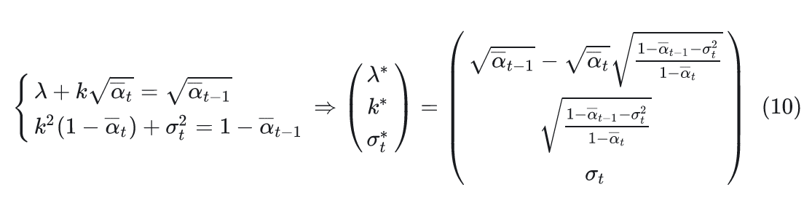
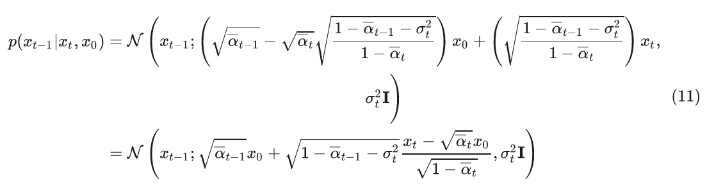
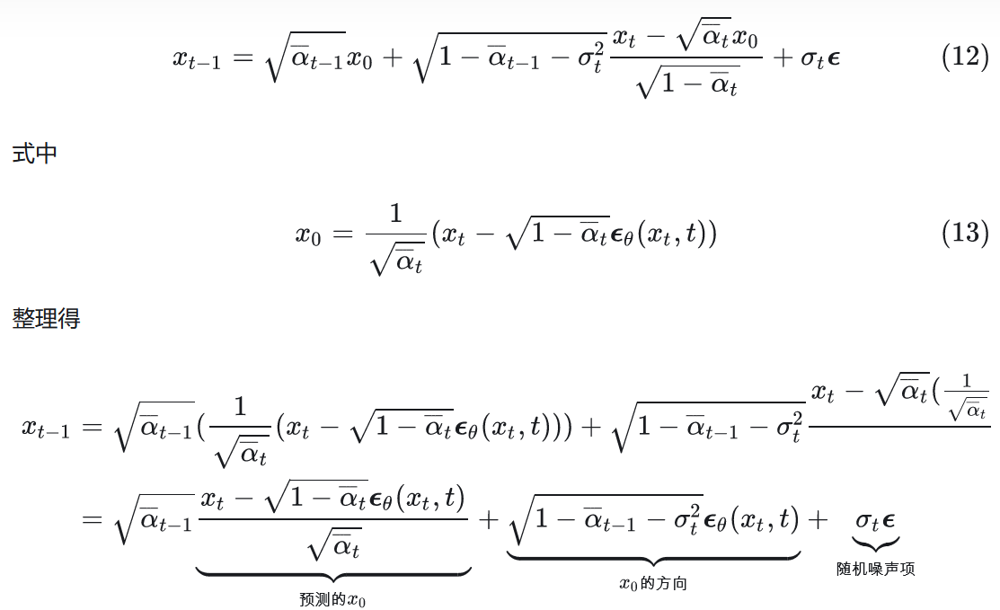
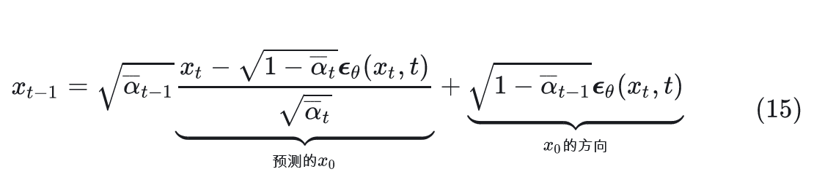
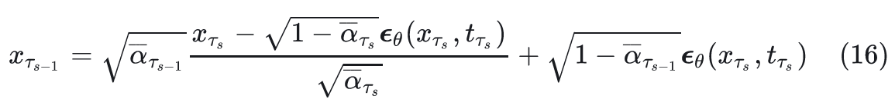
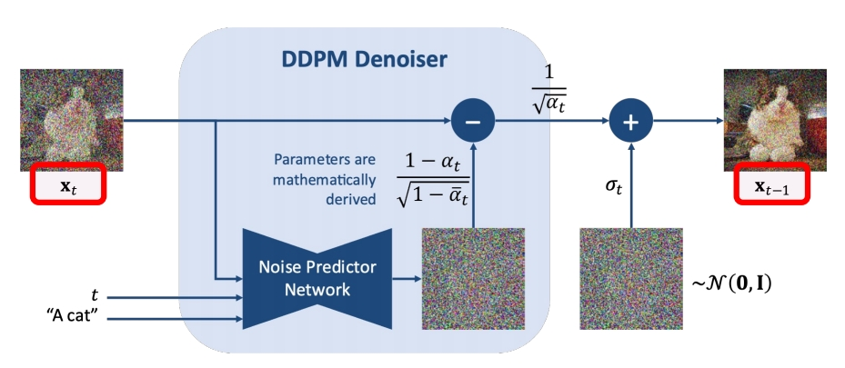
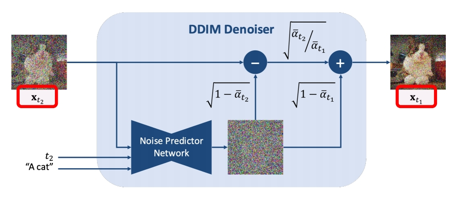
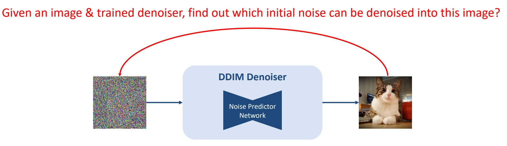
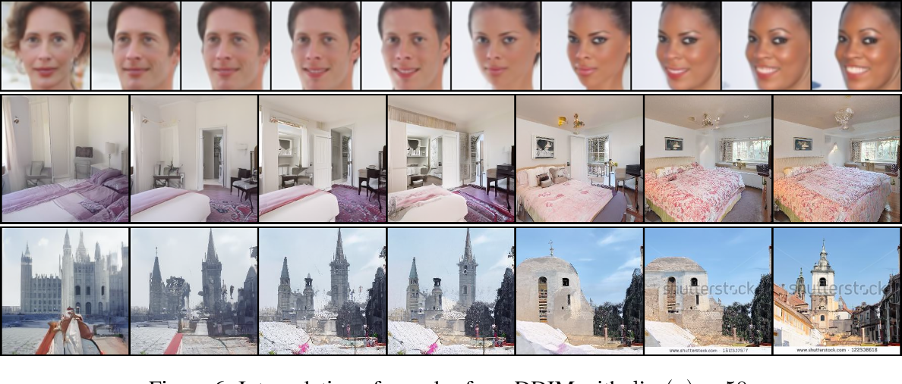

# Denoising Diffusion Implicit Models

## 核心问题是什么？

DDPM的生成速度太慢，其本质原因是：在对\\(p_{\theta}(x_{t-1}|x_t)\\)的推导中，DDPM用到了一阶马尔可夫假设，使得\\(p(x_t|x_{t-1},x_0)=p(x_t|x_{t-1})\\) 。  
在DDPM中往往需要较大的T才能得到较好的结果(论文中 )，这导致需要T次采样步长。因此重建的步长非常长，导致速度慢。  

## 核心贡献是什么？

### DDPM为什么这么慢

DDPM速度慢的本质原因是对马尔可夫假设的依赖，导致重建需要较多的步长。那么不用一阶马尔可夫假设，有没有另一种方法推导出\\(p(x_{t-1}|x_{t},x_0)\\) 。  
前面我们提到，DDPM的前向过程主要是用于构造数据集，来训练噪声预测模型。在实际优化过程中，其实并没有用到前向过程的马尔可夫假设，只用到了推理分布 \\(q(x_t|x_0)\\) ，因此如果DDIM也能满足这个推理分布的话，那么直接就可以复用DDPM的噪声预测模型了

> &#x2705; 马尔可夫假设认为，\\(x_{t}\\)只与\\(x_{t-1}\\)有关。但前向过程中\\(x_{t}\\)由\\(x_0\\)得到，而不是由\\(x_{t-1}\\)得到，因此不依赖马尔可夫假设。   
> &#x2705; 而反向过程中，\\(x_{t-1}\\)需要\\(x_{t}\\)，因此是依赖马尔可夫假设。  
> &#x2705; 如果找到一种方法，不需要计算通过\\(x_{t}\\)的分布来计算\\(x_{t-1}\\)的分布，那么就是不依赖于马尔可夫假设。  

### DDIM如何不依赖马尔科夫假设

归纳一下DDIM想要做的
- DDIM希望构建一个采样分布\\(p(x_{t-1}|x_{t},x_0)\\)，这个采样分布不依赖一阶马尔科夫假设
- DDIM希望维持这个前向推理分布\\(q(x_t|x_0) = \mathcal{N} (x_t;\sqrt{{\alpha_t}}x_0,(1-{\alpha_t})I)\\)

### DDPM中的\\(p(x_{t-1}|x_{t},x_0)\\)

根据DDPM的结果参考，采样分布\\(p(x_{t-1}|x_{t},x_0)\\)是一个高斯分布，并且均值是\\(x_{0}, x_t\\)的线性函数，方差是一个与时间步有关的函数。

### DDIM中的\\(p(x_{t-1}|x_{t},x_0)\\)

DDIM也假设\\(p(x_{t-1}|x_{t},x_0)\\)是一个高斯分布，并且均值也是\\(x_{0}, x_t\\)的线性函数，方差是时间步t的函数，即:

$$
p(x_{t-1}|x_{t},x_0) = \mathcal{N}(x_{t-1};\lambda x_0 + k x_t, \sigma^2_t I)
$$

这个采样分布有3个自由变量\\(\lambda, k, \sigma_t\\)，理论上有无穷多个解。但DDIM想要维持与DDPM一致的推理分布\\(q(x_t|x_0) = \mathcal{N} (x_t;\sqrt{{\alpha_t}}x_0,(1-{\alpha_t})I)\\) 。这样问题就转化成，找到一组解\\(\lambda^{ * }, k^{ * }, \sigma_t^{ * }\\) ，使得DDIM的推理分布满足\\(q(x_t|x_0) = \mathcal{N} (x_t;\sqrt{{\alpha_t}}x_0,(1-{\alpha_t})I)\\) 。

### 求解DDIM中的未知量

根据\\(q(x_t|x_0)\\)条件，列出方程组并求解未知量\\(\lambda, k, \sigma_t\\)：

$$
p(x_{t-1}|x_{t},x_0) = \mathcal{N}(x_{t-1};\lambda x_0 + k x_t, \sigma^2_t I)\\\\
q(x_{t-1}|x_0) = \mathcal{N} (x_{t-1};\sqrt{{\alpha_{t-1}}}x_0,(1-{\alpha_{t-1}})I)
$$

两个方程，三个未知量。因此把\\(\sigma_t\\)把看作是控制生成过程的超参，只解\\(\lambda, k\\)。  

解方程过程省略，见参考材料[1]。解得：

### DDIM采样分布的使用

解出(\lambda, k\\)，得到DDIM的采样分布：  

不同的\\(\sigma_t\\)对应不同生成过程。由于前向过程没变，故可以直接用DDPM训练的噪声预测模型。其采样过程如下：

### 两个特殊的case

1. 当 \\(\sigma_t = \sqrt{\frac{1-\alpha_{t-1}}{1-\alpha_{t}}}\sqrt{\frac{1-\alpha_{t}}{\alpha_{t-1}}}\\)时，此时的生成过程与DDPM一致。
2. 当\\(\sigma_t = 0\\)时，此时采样过程中添加的随机噪声项为0，当给定初始噪声z时，采样过程是确定的，此时的生成模型是一个隐概率模型(implicit probabilstic model)[1]。作者将此时diffusion model称之为denoising diffusion implicit model（DDIM）。此时的采样递推公式

DDIM，快速地生成且生成结果是确定的。由于生成结果是确定的，可用于latent space插值、编辑等任务。

## 大致方法

DDIM加速采样的思路很简单，假定原本的生成序列为\\(L=[T,T-1,\dots,1]\\) ,其长度为\\(\dim(L)=T\\) ,我们可以从生成序列 中构建一个子序列\\(\tau=[\tau_s,\tau_{s-1},\dots,\tau_1]\\) ，其长度\\(\dim(\tau)=S,S\ll T\\) 。在生成过程，按照构造序列\\(\tau\\)进行采样。此时的采样递推序列为  

### DDPM vs DDIM   

|||
|--|--|
|  | **DDPM cannot skip timesteps**    A few hundreds steps to generate an image |
| |**DDIM can skip timesteps**   Say 50 steps to generate an image | 

## 有效性

1. 论文给出了不同的采样步长的生成效果。可以看到DDIM在较小采样步长时就能达到较好的生成效果。如CIFAR10 S=50就达到了S=1000的90%的效果，与之相对DDPM只能达到10%左右的FID效果。可见DDPM在推导采样分布中用了马尔可夫假设的确限制了它的采样间隔。
2. DDIM将\\(\sigma_t\\) 设置为0，这让采样过程是确定的，只受\\(x_T\\)影响。作者发现，当给定\\(x_T\\) ，不同的的采样时间序列\\(\tau\\) 所生成图片都很相近，\\(x_T\\)似乎可以视作生成图片的隐编码信息。  

## 启发

### 有个小trick

我们在实际的生成中可以先设置较小的采样步长进行生成，若生成的图片是我们想要的，则用较大的步长重新生成高质量的图片。
   
### The task of Inversion

 
> &#x2705; 已有训好的 denoiser，输入干净图像，求它的噪声。   

P17   
#### 前向过程与 DDIM Inverse 的区别

**Forward Diffusion Process**: Add \\(\mathcal{N} (0,\mathbf{I} ) \\) Noise

**DDIM Inversion Process**: Add Noise **inverted** by the trained DDIM denoiser

#### DDIM Inverse的应用

1. DDIM Inverse 可用于图片编辑   

2. \\(x_T\\)可以是生成图片的隐空间编码，且它具备其它隐概率模型(如GAN[2])所观察到的语义插值效应。

> Su et al., “Dual Diffusion Implicit Bridges for Image-to-Image Translation,” ICLR 2023.    
> Mokadi et al., “Null-text Inversion for Editing Real Images using Guided Diffusion Models,” CVPR 2023.    

## 遗留问题

### 不按推理步骤按序预测噪声会不会有问题。

答案是不会。

  
从上图可以看到，在训练时，是从时间序列\\([1,2,\dots,T]\\)进行采样时间步，再从高斯分布采样噪声，直接从\\(x_0\\) 出发计算\\(x_t\\) ，随后传入模型，根据预测噪声与实际噪声计算损失迭代模型。我们可以看到在这个训练pipeline中并没有限制时序信息。**当噪声预测模型充分训练时DDIM的采样序列 也是在训练过程中被充分训练的。**（论文附录C.1给出了更为详尽的解释推导，感兴趣的同学可以看论文）。

## 缺陷

## 验证方法

## 参考材料

[1] https://zhuanlan.zhihu.com/p/639540034

---------------------------------------
> 本文出自CaterpillarStudyGroup，转载请注明出处。  
https://caterpillarstudygroup.github.io/ReadPapers/