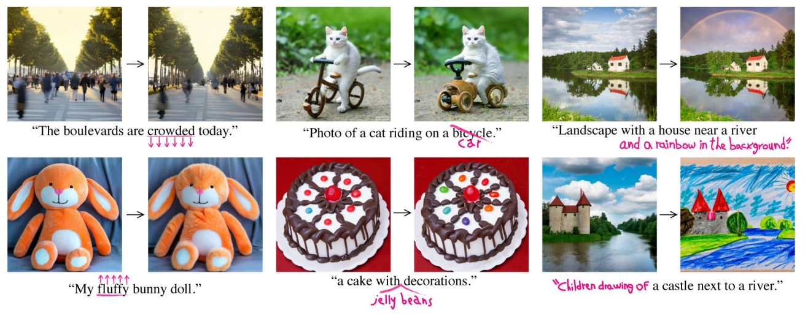
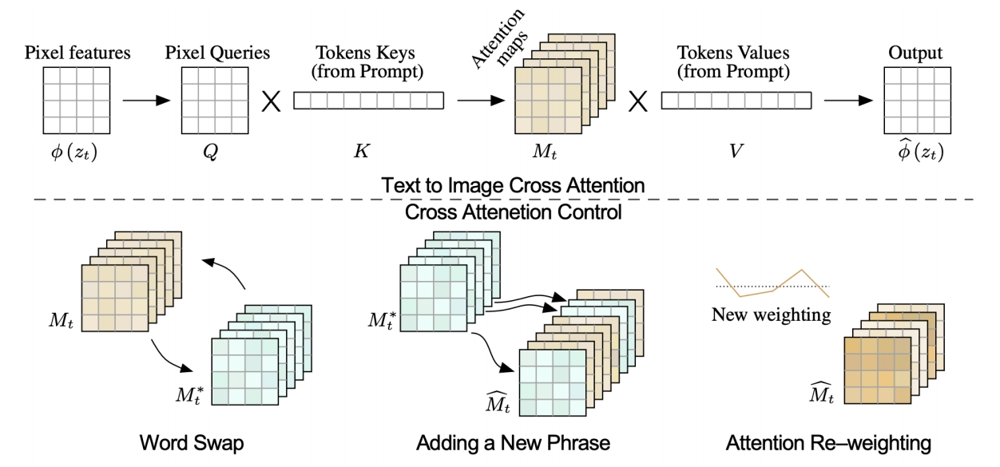
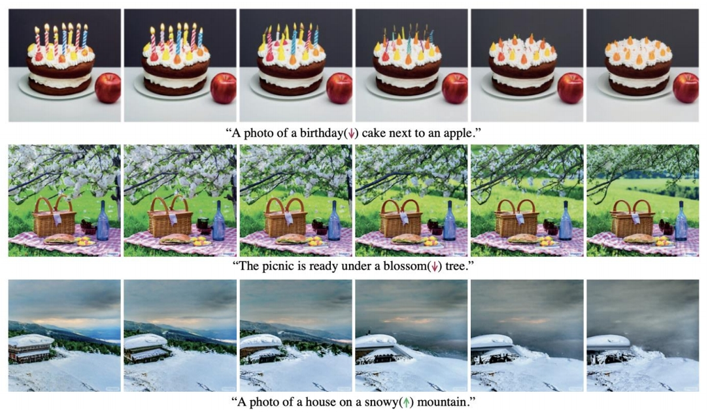

# Prompt-to-Prompt Image Editing with Cross-Attention Control

---

### 要解决的问题

基于标题的图像编辑 (1) 修改某个单词的影响力；(2) 替换单词；(3) 添加单词；而那些不期望改变的部分能够保持不变。 

### 一、核心思想与背景
传统基于文本的图像编辑方法通常需要用户提供空间遮罩（mask）以定位编辑区域，但这种方式忽略了原始图像的结构和内容，且依赖人工标注。本文提出了一种无需遮罩的文本驱动图像编辑框架，**通过直接控制扩散模型中的交叉注意力层（Cross-Attention）来实现编辑**。其核心思想是：交叉注意力层决定了文本提示（prompt）与图像空间布局的关联，通过修改注意力图即可在不破坏原始图像结构的情况下完成编辑。 

#### 传统方法的局限性
1. **依赖掩码标注**：如Inpainting等需用户指定编辑区域，交互成本高。
2. **全局修改受限**：文本微小变动可能导致图像整体结构改变。
3. **复杂语义调整困难**：如替换物体或调整属性时难以保持背景一致。

---

### 二、方法原理
#### 1. **交叉注意力层的关键作用**
扩散模型（如Stable Diffusion）通过交叉注意力层将文本语义映射到图像空间。注意力图 \( M \) 由以下公式计算：
\[
M = \text{softmax}\left(\frac{QK^T}{\sqrt{d}}\right)
\]
其中，\( Q \) 来自图像特征，\( K \) 和 \( V \) 来自文本编码。注意力图 \( M \) 决定了每个文本词对图像像素的影响权重。    

#### 2. **编辑流程**

1. **生成原始图像**：基于初始提示 \( P \) 生成图像 \( I \)，并记录扩散过程中的注意力图序列 \( \{M_t\} \)。
2. **修改提示生成目标注意力图**：输入编辑后的提示 \( P^* \)，生成对应的注意力图 \( \{M_t^*\} \)。
3. **注意力图融合**：通过动态调整原始与目标注意力图的比例，控制编辑强度。例如：
   - **单词替换**：在早期扩散步骤（\( t < \tau \)）使用目标注意力图 \( M_t^* \)，后期保留原始注意力图 \( M_t \)，以平衡内容保留与编辑效果。
   - **添加新短语**：仅对新增文本词应用目标注意力图，共同词沿用原始注意力权重。
   - **注意力重加权**：通过缩放特定词对应的注意力图权重，增强或减弱其影响（如调整物体尺寸或属性）。

#### 3. **算法实现**
- **确定性与随机性控制**：固定随机种子以确保生成一致性。
- **渐进式编辑**：通过阈值 \( \tau \) 控制编辑阶段，早期步骤决定整体结构，后期步骤优化细节。

---

### 三、技术贡献与优势
1. **无需掩码标注**：仅通过修改文本提示即可实现局部或全局编辑，显著降低用户交互成本。
2. **多样化编辑类型支持**：
   - **局部替换**：如将“自行车”替换为“汽车”并保留背景。
   - **属性调整**：如缩放“蓬松度”或调整物体颜色。
   - **风格迁移**：添加“儿童绘画风格”等全局描述词。
3. **兼容性**：适用于多种扩散模型（如Stable Diffusion、Imagen），无需额外训练。
4. **平衡保真度与编辑自由度**：通过调整注意力图注入比例，在保留原始结构与满足新提示之间取得平衡。

---

### 四、实验验证
#### 1. **定性评估**

    

- **复杂场景编辑**：在COCO等数据集上展示多对象替换（如“两只鹦鹉接吻”）和风格迁移（如“梵高风格”）效果，生成结果在结构一致性与文本对齐性上优于CycleGAN和SDEdit。
- **渐进控制**：通过调整 \( \tau \) 值，展示从完全保留原图到完全遵循新提示的连续编辑效果。

#### 2. **定量对比**
- **用户研究**：70%参与者认为P2P生成结果在保真度与编辑质量上优于基线方法。
- **指标分析**：使用CLIP得分衡量文本-图像对齐性，LPIPS评估结构相似性，结果显示P2P在两者间达到最佳平衡。

#### 3. **消融实验**
- **注意力图必要性**：若不注入注意力图，文本微小修改会导致图像全局变化。
- **阈值 \( \tau \) 影响**：\( \tau \) 过小导致编辑不足，过大则引入结构扭曲。

---

### 五、理论分析与局限
1. **理论基础**：  
   交叉注意力机制本质上是文本与图像模态的动态对齐工具。通过干预注意力图，P2P直接操控了文本语义到图像空间的映射过程，这与多模态表征学习的理论一致。
2. **局限性**：
   - **复杂结构修改困难**：如将“汽车”改为“自行车”时，若目标结构差异过大，可能导致生成失真。
   - **计算开销**：高分辨率图像需结合分层扩散模型或加速采样策略（如DDIM子序列采样）。
   - **文本模糊性**：提示歧义可能导致注意力图定位偏差，需结合CLIP等模型增强对齐。

---

### 六、应用与拓展
1. **医学图像编辑**：借鉴P2P思想，实现病灶区域的语义编辑（如肿瘤尺寸调整）。
2. **多任务扩展**：结合InstructPix2Pix等框架，支持指令驱动的细粒度编辑（如“将狗移到左侧”）。
3. **风格-内容解耦**：与LoRA等技术结合，实现风格迁移与内容保留的独立控制。

---

### 七、总结
《Prompt-to-Prompt Image Editing with Cross-Attention Control》通过深入挖掘扩散模型中交叉注意力层的语义控制能力，为文本驱动的图像编辑提供了高效、灵活的解决方案。其核心贡献在于将编辑过程转化为注意力图的动态调整，既保留了原始图像结构，又实现了多样化的语义修改。尽管存在复杂编辑与计算效率的挑战，该方法为后续研究（如可控生成、多模态对齐）提供了重要参考，并在艺术创作、医学影像等领域展现了广阔的应用前景。