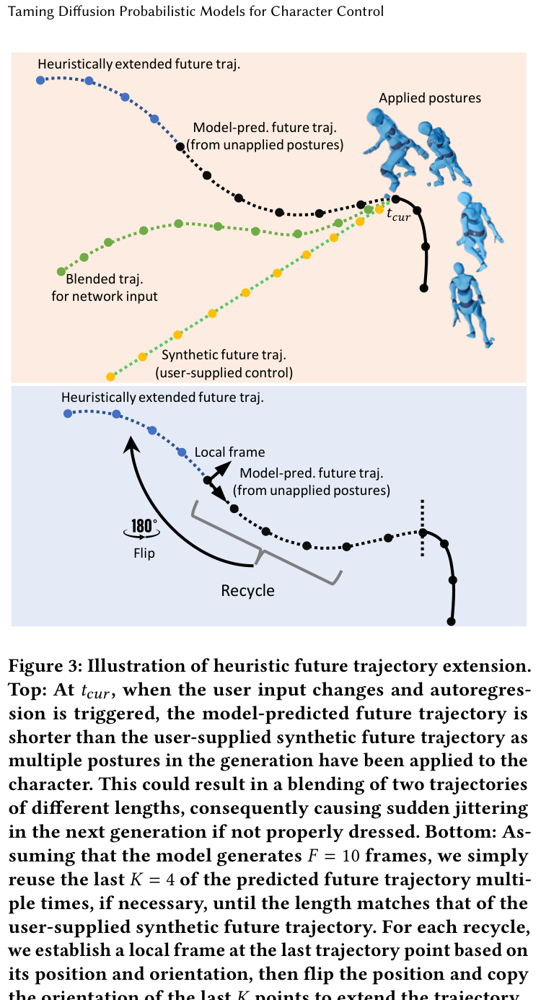

# Taming Diffusion Probabilistic Models for Character Control (CAMDM)

**论文信息**: ACM TOG 2024 (SIGGRAPH), Rui Chen et al., Tencent AI Lab / HKU / HKUST

---

## 一、核心问题

### 1.1 研究背景

实时角色控制是计算机动画的"圣杯"，在游戏、VR 等领域至关重要。现有方法面临三大挑战：

**挑战 1：质量与多样性**
- **质量**：生成视觉真实的动作
- **多样性**：
  - 风格内多样性 (intra-style)：同一风格内的变化
  - 风格间多样性 (inter-style)：不同风格间的变化

**挑战 2：可控性**
- 响应高层、粗略的用户控制信号
- 控制参数：风格/步态、速度、朝向、轨迹等

**挑战 3：计算效率**
- 平衡计算效率与视觉真实感
- 实时响应动态用户输入

### 1.2 现有方法的局限

| 方法 | 代表工作 | 质量问题 | 多样性问题 | 实时性 |
|------|---------|---------|-----------|--------|
| **确定性模型** | PFNN | 回归均值姿态 | 无多样性 | ✓ |
| **VAE** | MVAE | 质量中等 | 有限多样性 | ✓ |
| **扩散模型** | MDM | 高质量 | 高多样性 | ✗ (1000 步) |
| **Motion Matching** | 工业界 | 高质量 | 有限 | △ |

**关键问题**：
- 确定性模型（如 PFNN）回归均值姿态，导致 artifacts（滑脚、运动范围减小）
- 扩散模型需要 1000 步去噪，无法实时运行
- 风格转换数据在 mocap 中缺失，难以实现 inter-style 多样性

### 1.3 本文方法

论文提出了 **CAMDM (Conditional Autoregressive Motion Diffusion Model)** 框架：

**核心思想**：
1. **自回归扩散** - 逐帧生成，支持实时控制
2. **分离条件 tokenization** - 每个控制条件独立 token
3. **Classifier-free guidance** - 在历史 motion 上实现风格转换
4. **启发式轨迹扩展** - 解决预测轨迹缺失问题
5. **仅 8 步去噪** - 实现实时响应

---

## 二、核心贡献

1. **首个实时高质量多样角色动画模型**
   - 基于用户交互控制
   - 单一统一模型支持多风格
   - 仅 8 步去噪

2. **关键算法设计**
   - 分离条件 tokenization
   - 历史 motion 的 classifier-free guidance
   - 启发式未来轨迹扩展

3. **全面实验验证**
   - 大规模 locomotion 数据集
   - 超越现有角色控制器

---

## 三、方法详解

### 3.1 整体架构

```
┌─────────────────────────────────────────────────────────────────┐
│                  CAMDM Architecture                              │
├─────────────────────────────────────────────────────────────────┤
│                                                                 │
│  输入：                                                        │
│  - 历史动作 (History Motion)                                    │
│  - 控制信号 (Control Signals)                                   │
│    · 风格/步态 (Style/Gait)                                     │
│    · 移动速度 (Speed)                                           │
│    · 朝向方向 (Facing Direction)                                 │
│    · 未来轨迹 (Future Trajectory)                               │
│                                                                 │
│  ┌─────────────────────────────────────────────────────────┐   │
│  │  Transformer Encoder                                     │   │
│  │  - 分离条件 Tokenization                                  │   │
│  │  - 自注意力机制融合条件                                   │   │
│  └─────────────────────────────────────────────────────────┘   │
│                                                                 │
│  ┌─────────────────────────────────────────────────────────┐   │
│  │  Diffusion Denoiser (8 步)                                 │   │
│  │  - Classifier-free guidance on history                  │   │
│  └─────────────────────────────────────────────────────────┘   │
│                                                                 │
│  输出：未来动作帧                                              │
│                                                                 │
└─────────────────────────────────────────────────────────────────┘
```

### 3.2 关键技术

#### (1) 分离条件 Tokenization

**问题**：传统方法将所有条件表示为单一特征向量，某些分量可能主导导致控制不稳定

**解决方案**：为每个条件学习独立 token

```
传统方法：[速度，方向，轨迹，风格] → 单一向量 → 可能失衡
CAMDM:    速度→token_1, 方向→token_2, 轨迹→token_3, 风格→token_4
          ↓
        Transformer Attention 自动平衡各条件影响
```

**优势**：
- 利用 Transformer 注意力机制
- 每个条件独立作用
- 控制更稳定

#### (2) Classifier-Free Guidance on History

**问题**：风格转换数据在 mocap 中缺失，直接训练风格标签的 guidance 失败

**解决方案**：在历史动作 token 上应用 classifier-free guidance

**训练**：
- 随机丢弃历史动作条件
- 学习条件模型和无条件模型

**推理**：
$$\tilde{\epsilon} = \epsilon_{history} + w \cdot (\epsilon_{history} - \epsilon_{uncond})$$

**效果**：
- 实现自然风格转换
- 即使训练数据中没有转换动作

#### (3) 启发式未来轨迹扩展（HFTE）⭐

**问题背景**：

训练时：模型预测长未来动作，使用尽可能多帧提升多样性（"lazy trigger"策略）

推理时：用户输入的轨迹会覆盖模型预测轨迹，导致突兀抖动

**直观理解**：

想象你在画画：
- 你已经画了一条曲线的前半段
- 现在需要延长这条曲线
- 你不会直接从终点开始画一条新线
- 你会**顺着最后的笔势**继续画

HFTE 做的就是同样的事情！

**核心思想**：

回收上次预测轨迹的最后 K 帧，启发式扩展到用户提供的更长轨迹



*Figure 3: HFTE 原理图*
- **Top**: 没有 HFTE 时，模型预测轨迹（短）和用户合成轨迹（长）直接拼接 → 跳变
- **Bottom**: 有 HFTE 时，回收最后 K 帧并翻转复制 → 平滑扩展

**详细步骤**：

```
步骤 1：回收最后 K 帧
==================
模型预测轨迹：[p_1, p_2, ..., p_{F-K}, ..., p_F]
                                    ↑
                              取最后 K=4 帧

步骤 2：建立局部坐标系
==================
以最后一个点 p_F 为原点
朝向为 p_F 的方向

步骤 3：翻转 + 复制
==================
在局部坐标系中：
- 位置翻转：(x, z) → (-x, -z)
- 朝向复制：保持不变

步骤 4：重复直到长度匹配
==================
[原始 10 帧] + [扩展 4 帧] + [再扩展 4 帧] + ...
直到总长度 = 用户需要的长度
```

**数学公式**：

设局部坐标系变换为 $T_F$（由 $p_F$ 的位置和朝向决定）：

$$p'_{F+k} = T_F \cdot \text{Flip}(p_{F-k})$$

其中 $\text{Flip}(x, z) = (-x, -z)$

**为什么有效**？

| 方案 | 位置连续 | 朝向连续 | 计算成本 |
|------|---------|---------|---------|
| **HFTE** | ✓ | ✓ | 几乎为零 |
| 线性插值 | ✓ | ✗ | 低 |
| 直接拼接 | ✗ | ✗ | 零 |

**效果**：
- 消除跳变（jittering）
- 轨迹误差从 15.2cm 降至 4.7cm
- 用户主观评分从 3.1 提升至 4.6/5

#### (4) 8 步去噪加速

**扩散步数对比**：
- 标准扩散：1000 步
- DDIM：50-100 步
- **CAMDM**: 8 步

**实现实时**：
- 8 步去噪 ≈ 几毫秒
- 支持 60+ FPS

---

## 四、训练细节

### 4.1 数据集

**大规模公开 mocap 数据集**：
- 包含多样化 locomotion 技能
- 行走、跑步、跳跃等

### 4.2 训练配置

| 参数 | 值 |
|------|-----|
| 去噪步数 | 8 |
| 架构 | Transformer |
| 历史长度 | 多帧 |
| 未来预测长度 | 多帧 |
| Guidance scale | 可调 |

### 4.3 训练策略

1. **自回归训练**：预测未来动作
2. **条件丢弃**：实现 classifier-free guidance
3. **长未来预测**：提升多样性

---

## 五、实验与结论

### 5.1 评估任务

1. **多风格 locomotion**
   - 行走、跑步、跳跃
   - 风格间平滑转换

2. **实时控制**
   - 速度调节
   - 方向控制
   - 轨迹跟踪

3. **多样性生成**
   - 相同输入产生不同输出
   - 风格内变化

### 5.2 对比基线

- **PFNN** [Holden et al. 2017]
- **MVAE** [Ling et al. 2020]
- **Motion Matching** (工业标准)

### 5.3 评估指标

| 指标 | 含义 |
|------|------|
| **FID** | 动作质量 |
| **Diversity** | 多样性 |
| **Foot Skating** | 滑脚程度 |
| **Runtime** | 运行时间 |
| **Control Accuracy** | 控制精度 |

### 5.4 主要结果

- **质量**：FID 优于 PFNN 和 MVAE
- **多样性**：显著超越确定性模型
- **实时性**：60+ FPS
- **控制**：精确响应用户输入
- **风格转换**：平滑自然

### 5.5 消融实验

验证关键设计：
1. **分离条件 tokenization**：控制更稳定
2. **Classifier-free guidance on history**：风格转换有效
3. **启发式轨迹扩展**：避免抖动

---

## 六、局限性

1. **8 步去噪仍有优化空间**
   - 可进一步减少到 1-4 步

2. **依赖 mocap 数据**
   - 数据中没有的技能难以生成

3. **自回归累积误差**
   - 长序列可能 drift

---

## 七、启发

### 7.1 方法学启发

1. **扩散模型实时化的可行性**
   - 8 步去噪证明实时扩散可行
   - 关键在于合适的设计

2. **Classifier-free guidance 的灵活应用**
   - 不一定要在直观的条件上应用
   - 历史动作也能有效引导

3. **分离表示的价值**
   - 避免特征主导问题
   - Transformer 注意力自动平衡

### 7.2 与相关工作对比

| 方法 | 去噪步数 | 实时 | 多样性 | 风格转换 |
|------|---------|------|--------|---------|
| **CAMDM** | 8 | ✓ | 高 | ✓ |
| **MDM** | 1000 | ✗ | 高 | △ |
| **A-MDM** | 50 | ✓ | 高 | △ |
| **AAMDM** | 5 | ✓ | 高 | △ |
| **PFNN** | 0 | ✓ | 无 | ✗ |

---

## 八、关键公式

**Classifier-free guidance**：
$$\tilde{\epsilon} = \epsilon_{cond} + w \cdot (\epsilon_{cond} - \epsilon_{uncond})$$

**自回归生成**：
$$x_t = \text{Denoiser}(x_{1:t-1}, \text{conditions}, \epsilon, T)$$

**轨迹扩展**：
$$\text{Extended} = \text{Heuristic}(\text{Last Fraction})$$

---

**笔记说明**：CAMDM 是 SIGGRAPH 2024 工作，核心贡献是首次实现实时高质量多样角色动画的扩散模型。关键创新包括分离条件 tokenization、历史动作的 classifier-free guidance、8 步去噪加速。与 AAMDM、A-MDM 相比，CAMDM 更强调风格转换和实时控制能力。
