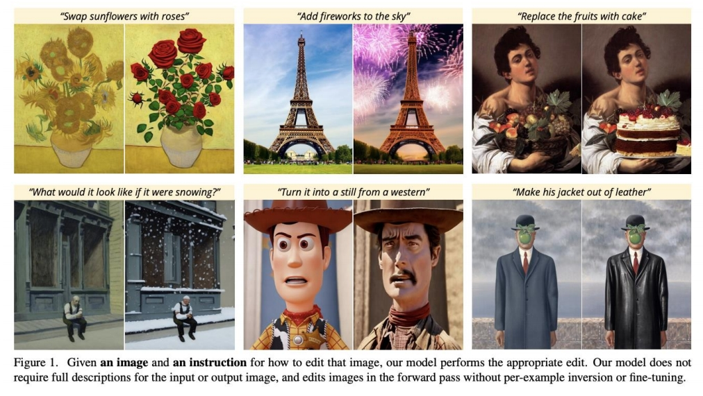
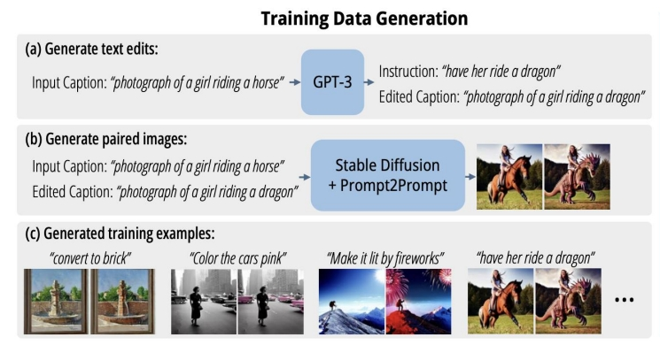
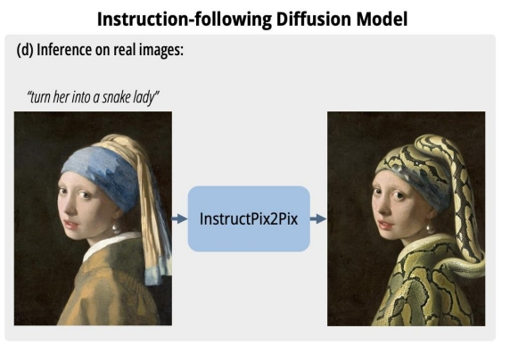

# InstructPix2Pix: Learning to Follow Image Editing Instructions

## 核心问题是什么?

     

> &#x2705; 在已有图片的情况，输入完整的控制文本不符合用户习惯，用户只需要告诉模型要怎么修改图像，通过 Prompt 2 Prompr 转化为完整 prompt.  

## 核心贡献是什么？

## 大致方法是什么？

    

> 生成Image Editing Dataset：  
Step a：微调GPT-3，用于生成Instruction和Edited Caption。  
Step b：使用预训练模型生成pair data。  

    

> &#x2705; [?]只是文本引导方式做了改变，哪里体现 pix 2 呢？     

## 有效

> &#x2705; 优势：只修改推断过程，不需针对图像做 finetune.    

## 缺陷

## 验证

## 启发

## 遗留问题

## 参考材料