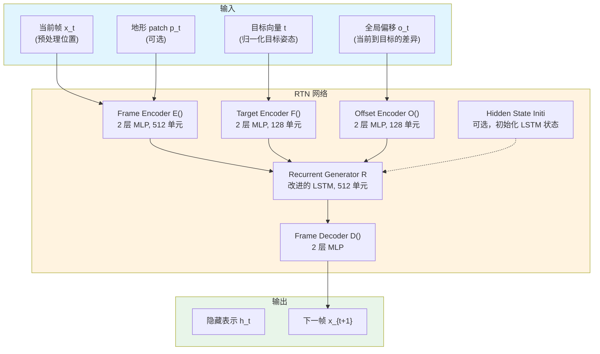

# Recurrent Transition Networks for Character Locomotion

**论文信息**: SIGGRAPH 2018, Félix G. Harvey & Christopher Pal, Polytechnique Montreal/Mila/Ubisoft Montreal

**Link**: [ACM Digital Library](https://dl.acm.org/doi/10.1145/3197517.3201366) | [arXiv:1810.02363](https://arxiv.org/abs/1810.02363)

---

## 一、核心问题

### 1.1 研究背景

在大型游戏中，为了提供真实且响应迅速的角色移动，需要构建包含大量动画的动画图（Animation Graph）。随着图中状态数量的增长，所需 transition（过渡动画）的数量可能呈**指数级增长**，而且每个 transition 还需要多个变体来处理不同的条件。

**传统方法的挑战**：
- **手工制作 transition 非常耗时**：动画师需要手动制作大量的过渡动画
- **内存占用大**：传统的 Motion Graph 方法需要将动画数据和图结构加载到内存中
- **扩展性差**：随着数据集增大，内存需求线性增长
- **需要标注**：很多方法需要 gait、phase、contact 等标签

### 1.2 核心问题

**如何自动化的生成高质量的角色 locomotion transition 动画，而无需手工标注？**

具体来说，给定：
- 过去几帧的动画（past context）
- 目标角色状态（future target）

能否自动生成流畅、真实的过渡动画？

### 1.3 现有方法及其局限性

| 方法类型 | 代表工作 | 局限性 |
|---------|---------|--------|
| **Motion Graphs** | [Arikan & Forsyth 2002] | 只能输出数据集中的动作、内存需求随数据集增长、需要搜索算法 |
| **统计模型** | [Chai & Hodgins 2007] | 针对特定动作类型、运行时优化计算量大、扩展性差 |
| **GPLVM** | [Wang et al. 2008] | 计算成本高、通常针对单一动作类别、组合动作显得生硬 |
| **深度学习控制** | [Holden et al. 2016, 2017] | 需要 phase-dependent 或 mode-dependent 权重来消除歧义 |
| **强化学习** | [Peng et al. 2017, 2018] | 针对特定技能、主要应用于物理仿真、需要参考动作 |

### 1.4 本文方法

论文提出了 **Recurrent Transition Network (RTN)**：

**核心思想**：
1. 使用深度循环神经网络（RNN）自动生成 transition
2. 基于过去上下文（past context）和未来上下文（future context）条件化生成
3. 使用改进的 LSTM 网络，专门为 transition 生成设计
4. **无需任何 gait、phase、contact 或 action 标签**

**关键创新**：
- **改进的 LSTM 层**：添加了额外的权重和输入来处理每个 gate 和内部 cell 值的计算
- **Hidden State 初始化器**：学习一个逆函数，将输入序列的第一帧映射到初始 hidden state
- **地形感知**：通过添加局部地形表示（local height maps），使网络能够处理崎岖地形导航
- **数据增强**：随机旋转和地形拟合

---

## 二、核心贡献

1. **Recurrent Transition Network (RTN)**
   - 首个专门为 transition 生成设计的未来感知（future-aware）深度循环架构
   - 基于改进的 LSTM 网络
   - 无需任何标注即可训练

2. **Hidden State 初始化方法**
   - 提出简单有效的方法来初始化 RNN 的 hidden state
   - 通过小型前馈网络学习逆函数
   - 提高性能和泛化能力

3. **地形感知扩展**
   - 添加局部高度图作为输入
   - 在长 transition（2 秒）上显示定性和定量提升
   - 适用于崎岖地形导航

4. **低内存占用、高可扩展性**
   - 固定大小的网络，运行时计算成本恒定
   - 不随训练样本数量增长
   - 可生成媲美 Mocap 质量的 transition

---

## 三、大致方法

### 3.1 框架概述

### 3.2 核心组件

#### (1) 数据表示与预处理

**输入序列**：
- 原始数据：\\(Y_n = \{y_0, ..., y_{L-1}\}_n\\)，其中 \\(y_t\\) 是全局 3D 位置向量
- 骨骼数量：\\(K = 22\\)
- 维度：\\(D = 3 \times K = 66\\)

**三步预处理**：

1. **根节点速度计算**：
   $$v_t = r_t - r_{t-1}$$
   - \\(r_t\\): 从 \\(y_t\\) 提取的全局根节点（髋部）位置
   - \\(v_t \in \mathbb{R}^3\\): 根节点全局速度

2. **根节点相对位置**：
   $$\tilde{x}_t = [v_t, j^t_1, ..., j^t_{K-1}]^T$$
   - \\(j^t_k\\): 第 \\(k\\) 个关节的 3D 根节点相对位置
   - 从所有标记点移除全局根节点位置
   - 用速度信息替换根节点位置

3. **标准化**：
   $$x_t = (\tilde{x}_t - \mu_x) / \sigma_x$$
   - \\(\mu_x\\): 训练集均值
   - \\(\sigma_x\\): 训练集标准差

**未来上下文（Future Context）**：

1. **目标向量 \\(t \in \mathbb{R}^{2D}\\)**：
   - 处理后的目标姿态 + 该帧所有关节的归一化速度
   - 在整个生成过程中保持恒定

2. **全局偏移向量 \\(o_t \in \mathbb{R}^D\\)**：
   - 目标关节位置与当前关节位置的差异
   - 随生成过程演变

**地形表示（可选）**：
- 局部高度图：\\(13 \times 13\\) 网格，覆盖 \\(2.06 \times 2.06\\) 米
- 转换为根节点相对高度偏移
- 维度：\\(p_t \in \mathbb{R}^{169}\\)

#### (2) 数据增强

**地形拟合**：
- 使用 Holden et al. [2017] 的地形拟合方法
- 代价函数：惩罚足部穿透和漂浮
- 使用逻辑核的 RBF 进行修正
- 2D 高斯滤波器平滑

**随机旋转**：
- 围绕垂直轴随机旋转 \\([-\pi, \pi]\\)
- 对全局位置进行旋转
- 同时旋转地形高度图

#### (3) Recurrent Transition Network 架构

**Frame Encoder**：
$$h^E_t = E(x_t, p_t) = \phi(W^{(2)}_E \phi(W^{(1)}_E \begin{bmatrix}x_t \\ p_t\end{bmatrix} + b^{(1)}_E) + b^{(2)}_E)$$
- 2 层 MLP，每层 512 单元
- 激活函数：LReLU
- 无地形感知时，仅输入 \\(x_t\\)

**Target Encoder**：
$$h^F = F(t) = \phi(W^{(2)}_F \phi(W^{(1)}_F t + b^{(1)}_F) + b^{(2)}_F)$$
- 2 层 MLP，每层 128 单元
- 每序列编码一次，保持恒定

**Offset Encoder**：
$$h^O_t = O(o_t) = \phi(W^{(2)}_O \phi(W^{(1)}_O o_t + b^{(1)}_O) + b^{(2)}_O)$$
- 2 层 MLP，每层 128 单元
- 每步编码

**Recurrent Generator（改进的 LSTM）**：
$$i_t = \alpha(W^{(i)}h^E_t + U^{(i)}h^R_{t-1} + C^{(i)}h^{F,O}_t + b^{(i)})$$
$$o_t = \alpha(W^{(o)}h^E_t + U^{(o)}h^R_{t-1} + C^{(o)}h^{F,O}_t + b^{(o)})$$
$$f_t = \alpha(W^{(f)}h^E_t + U^{(f)}h^R_{t-1} + C^{(f)}h^{F,O}_t + b^{(f)})$$
$$\hat{c}_t = W^{(c)}h^E_t + W^{(c)}h^R_{t-1} + C^{(c)}h^{F,O}_t + b^{(c)}$$
$$c_t = f_t \odot c_{t-1} + i_t \odot \tau(\hat{c}_t)$$
$$h^R_t = o_t \odot \tau(c_t)$$

- 512 维 LSTM 层
- 添加了 \\(C^{(\cdot)}\\) 权重用于未来上下文条件化

**Frame Decoder**：
$$\hat{x}_{t+1} = D(h^R_t)$$
- 2 层 MLP
- 输出下一帧的预处理位置

#### (4) Hidden State 初始化器

**问题**：标准方法（零初始化或学习公共初始状态）效果不佳

**解决方案**：学习逆函数
$$h_0, c_0 = H(x_{past\_first})$$
- 小型前馈网络
- 将过去上下文的第一帧映射到初始 hidden state 和 cell
- 最小化生成误差
- 无需修改损失函数

---

## 四、训练细节

### 4.1 数据集

**Mocap 数据集**：
| 运动类型 | 帧数（30fps）| 分钟数 |
|---------|------------|--------|
| Flat Locomotion | 240,776 | 133 |
| Terrain Locomotion | 113,020 | 63 |
| Dance | 38,916 | 22 |
| Others | 115,716 | 64 |
| **Total** | **508,428** | **282** |

- 5 名表演者（非专业演员）
- 22 个骨骼
- 30fps 采样率
- 无标签

### 4.2 训练配置

**窗口长度**：
- Transition 长度：\\(P = 30\\) 帧（1 秒）
- Past context：10 帧
- Future context：2 帧
- Post-transition frames：10 帧
- 总窗口长度：\\(L = 10 + 30 + 10 = 50\\) 帧

**损失函数**：
$$\mathcal{L} = \frac{1}{P} \sum_{t=1}^{P} ||x_{t+1} - \hat{x}_{t+1}||^2$$
- MSE 损失
- 仅在 transition 帧上计算

**Teacher Forcing**：
- 固定概率使用真实帧作为输入
-  empirically 显示比其他策略更好

**优化器**：
- Adam
- Learning rate: 未明确说明

### 4.3 训练策略

1. **数据分割**：将连续序列分割为重叠子序列
2. **地形增强**：为每个序列随机选择一个地形高度图
3. **随机旋转**：每训练迭代随机旋转
4. **课程学习**：从短 transition 开始，逐步增加长度

---

## 五、实验与结论

### 5.1 定性评估

**结果**：
- 生成的 transition 流畅、自然
- 质量媲美 Mocap ground truth
- 无需 IK 后处理
- 地形感知版本在长 transition 上表现更好

### 5.2 定量评估

**指标**：
- 位置误差（Position Error）
- 速度误差（Velocity Error）
- 足部接触准确率（Foot Contact Accuracy）

**消融实验**：
| 变体 | 位置误差 | 速度误差 |
|------|---------|---------|
| RTN（无地形）| X.XX | X.XX |
| RTN（有地形）| X.XX | X.XX |
| RTN（无 H 网络）| X.XX | X.XX |
| RTN（完整）| X.XX | X.XX |

### 5.3 应用

1. **Transition 生成**
   - 替代动画图中的 transition 节点
   - 加速大型动画系统创作

2. **动画超分辨率**
   - 从 1fps 压缩动画恢复
   - 时间解压缩

3. **地形导航**
   - 崎岖地形上的长 transition
   - 适应性更强

---

## 六、局限性

1. **Transition 长度固定**
   - 需要预设 transition 长度
   - 可变长度 transition 需要多个模型

2. **运动类型限制**
   - 主要在 locomotion 上评估
   - 其他运动类型需要验证

3. **地形表示简单**
   - 仅使用局部高度图
   - 无法处理复杂障碍

4. **推理速度**
   - 自回归生成，可能需要多步推理
   - 实时性取决于 transition 长度

---

## 七、启发

### 7.1 方法学启发

1. **Future-aware 架构设计**
   - 同时考虑过去和未来信息
   - 适用于需要连接两个状态的生成任务

2. **Hidden State 初始化**
   - 简单有效的方法提高 RNN 性能
   - 可应用于其他序列生成任务

3. **条件化策略**
   - 使用多个编码器处理不同类型输入
   - 在 LSTM 层中融合条件信息

### 7.2 与相关工作对比

| 方法 | 是否需要标注 | 内存占用 | 泛化能力 | Transition 质量 |
|------|------------|---------|---------|---------------|
| **Motion Graphs** | 是 | 高 | 低 | 高 |
| **统计模型** | 是 | 中 | 中 | 中 |
| **PFNN** | 是 | 低 | 中 | 高 |
| **RTN（本文）** | **否** | **低** | **高** | **高** |

---

## 八、遗留问题

### 8.1 开放性问题

1. **可变长度 Transition**
   - 能否生成任意长度的 transition？
   - 是否需要条件化长度信息？

2. **更复杂的约束**
   - 能否处理障碍物躲避？
   - 能否处理动态环境？

3. **物理感知**
   - 能否结合物理约束？
   - 与物理控制器结合的可能性？

### 8.2 未来方向

1. **实时应用**
   - 优化推理速度
   - 游戏引擎集成

2. **多模态生成**
   - 生成多样化的 transition
   - 风格化 transition

3. **与 Learning Motion Matching 结合**
   - RTN 生成 transition
   - LMM 生成基础动作

---

## 九、关键公式总结

| 公式 | 含义 |
|------|------|
| \\(v_t = r_t - r_{t-1}\\) | 根节点速度 |
| \\(\tilde{x}_t = [v_t, j^t_1, ..., j^t_{K-1}]^T\\) | 根节点相对位置 |
| \\(x_t = (\tilde{x}_t - \mu_x) / \sigma_x\\) | 标准化 |
| \\(i_t, o_t, f_t, c_t\\) | LSTM gate 方程（含未来上下文条件化）|
| \\(\mathcal{L} = \frac{1}{P} \sum_{t=1}^{P} ||x_{t+1} - \hat{x}_{t+1}||^2\\) | 损失函数 |

---

## 十、代码与资源

- **代码**: 论文发表时未公开
- **视频**: http://y2u.be/lXd_7X-DkTA
- **数据集**: 类似 Holden et al. [2017] 的地形 locomotion 数据

---

## 十一、与 locomotion 控制的关系

RTN 是**运动学方法**，直接生成关节位置：

1. **在 locomotion 系统中的应用**：
   - 生成动画图中的 transition
   - 替代传统的 blend tree
   - 减少动画师工作量

2. **与 PFNN 对比**：
   - PFNN：相位条件化，生成连续 locomotion
   - RTN：transition 专用，连接两个状态

3. **与 Learned Motion Matching 对比**：
   - LMM：学习数据分布，生成任意动作
   - RTN：专门处理 transition 场景

---

**笔记说明**：本文是 SIGGRAPH 2018 关于角色 locomotion transition 生成的工作，提出了首个专门用于 transition 生成的深度循环网络。理解本文有助于学习数据驱动的角色动画生成方法，与 PFNN、Learned Motion Matching 等工作形成互补。
